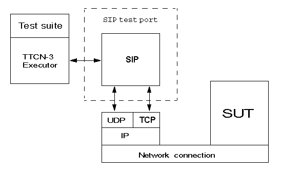

= Protocol Modules

== Overview

The SIPmsg test port provides a connection between the executable test suite and the system under test. The test port opens IPv4 sockets, closes the sockets, encodes and sends SIPmsg messages through the socket and decodes the received SIPmsg messages.

See the overview of the test system using SIPmsg test port below:

== Installation

Since the SIPmsg test port is used as a part of the TTCN-3 test environment this requires TTCN-3 Test Executor to be installed before any operation of the SIPmsg test port.

The package contains:

* one or more TTCN-3 files with the messages and attributes supported by the test port

* one or more C++ header and source files using the test port template

The packages include the following files:

* __SIPmsg_Types.ttcn__
* __SIPmsg_PortTypes.ttcn__
* __SIP_parse.h__
* __SIP_parse.l__
* __SIP_parse.y__
* __SIP_parse_.tab.c__
* __SIP_parse_.tab.h__
* __lex.SIP_parse_.c__
* __SIPmsg_PT.hh__
* __SIPmsg_PT.cc__

NOTE: All files need to be added to the _.prj_ project file in TITAN GUI, except the _.l_ and _.y_ files.

=== Description of the Files in the Package

[[sipmsg-types-ttcn-and-sipmsg-porttype-ttcn]]
==== __SIPmsg_Types.ttcn__ and __SIPmsg_PortType.ttcn__

Contains the TTCN-3 structure of the SIP messages, the definitions of message types, attributes, parameters, types and ports. The user should never change this file.

[[sipmsg-pt-hh-sip-parse-h]]
==== __SIPmsg_PT.hh__, __SIP_parse.h__

C++ header file of the SIPmsg test port. The user should never change this file.

[[sipmsg-pt-cc-sip-parse-tab-c-sip-parse-tab-h-lex-sip-parse-c]]
==== __SIPmsg_PT.cc__, __SIP_parse_.tab.c__, __SIP_parse_.tab.h__, __lex.SIP_parse_.c__

The files containing the implementation of the SIPmsg test port. The user should never change these files.

[[sip-parse-l-sip-parse-y]]
==== __SIP_parse.l__, __SIP_parse.y__

Parser and lexer source files. Not needed for the compilation of the test port. Used to generated __SIP_parse_.tab.c__, __SIP_parse_.tab.h__, __lex.SIP_parse_.c__ files. The user should never change these files.

== Configuration

The executable test program behavior is determined via the run-time configuration file. This is a simple text file, which contains various sections (e.g. `[TESTPORT_PARAMETERS]`) after each other. The usual suffix of configuration files is _.cfg_.

=== SIP Parameters in the Configuration File

The test port parameters section is introduced by the keyword `[TESTPORT_PARAMETERS]`.

In this section you can specify parameters that are passed to the SIPmsg test port. Each parameter definition consists of a component name, a port name, a parameter name and a parameter value. The component name can be either an identifier or a component reference (integer) value. The port and parameter names are identifiers while the parameter value must be always a charstring (with quotation marks). Instead of component name or port name (or both of them) the asterisk ("*") sign can be used, which means "all components" or "all ports of the component".

All parameters are optional. Because the listening is not enabled by default it should be enabled with parameter `listen_enabled`.

The following parameters are allowed:

[[local-sip-port]]
==== `local_sip_port`

The UDP/TCP port number used for incoming SIP messages. Default value is `_"5061"_`.

[[default-local-adress]]
==== `default_local_adress`

The address of the local network interface on which the local UDP or TCP port is opened. If it is not specified the test port will use any of the interfaces.

[[default-sip-protocol]]
==== `default_sip_protocol`

The default transport protocol used by SIP. Allowed values: `_TCP_`, `_UDP_`. It can be changed during the test. Default value is `_UDP_`.

[[default-dest-port]]
==== `default_dest_port`

The default UDP/TCP port number of the remote host, used for outgoing SIP messages. It can be changed during the test. Default value is `_"5060"_`.

[[default-dest-address]]
==== `default_dest_address`

The name or the IP address of the remote host. If it is supplied the test port automatically connects to the host when mapped.

[[length-calculation]]
==== `length_calculation`

If enabled the test port automatically calculates the value of the *_Content-Length_* header if the original value of the header is zero. There is no automatic calculation of the *_Content-Length_* header if the sent value is differing from zero or the length calculation is disabled.

Allowed values:

* `_"disabled"_`
* `_"enabled"_`

Default value is `_"enabled"_`

[[listen-enabled]]
==== `listen_enabled`

If enabled the test port opens a listening socket and ready to accept incoming requests after mapped. The parameter has only effect during mapping. The listening ports can be opened and closed in advanced mode with `ASP_SIP_open` regardless of the value of the `listen_enabled` parameter.

Allowed values in basic mode:

* `__"enabled"__`
* `_"disabled"_`

Default value is `_"disabled"_`.

Allowed values in advanced mode:

* `_"disabled"_`
* `_"enabled"_` - The listening is enabled on both UDP and TCP.
* `_"TCP_only"_` - The listening is enabled only on TCP.
* `_"UDP_only"_` - The listening is enabled only on UDP.

Default value is `_"disabled"_`.

==== `debug`

If enabled the test port will log some debug and miscellaneous information.

Allowed values:

* `_"enabled"_`
* `_"disabled"_`.

Default value is `_"disabled"_`.

[[asp-or-msg]]
==== `ASP_or_MSG`

Determines the usage of test port interface. If it is set to `_"ASP"_` the test port will use the ASP interface and if it is set to `_"MSG"_` the test port will use the MSG interface.

The default value is `_"MSG"_`

[[error-mode]]
==== `error_mode`

Determines the error behavior of the test port.

Possible values:

* `_"ignore"_` - The test port ignore any erroneous messages and discard them without notice.
* `_"warning"_` - The test port will issue a warning if erroneous message received and pass the message as RAW message to the test case.
* `_"error"_` - The test port will generate error if erroneous message received.

Default value: `_"error"_`

[[header-format]]
==== `header_format`

Determines if the test port use the long or the sort format of the SIP header during encoding. Possible values:

* `_"short"_` - The test port will use the short format of the SIP header.

* `_"long"_` - The test port will use the long format of the SIP header.

The default value is `_"long"_`

[[raw-mode]]
==== `raw_mode`

In raw mode the decoding of the message is disabled and all received SIP messages are passed to the test case as raw messages.

Allowed values:

* `_"enabled"_`
* `_"disabled"_`

Default value is `_disabled_`.

[[port-mode]]
==== `port_mode`

Determines the network handling of the port.

* `_"basic"_`
+
In the basic mode the test port can handle only one TCP connection or one UDP socket. It is not possible to send and receive the messages using both protocols at the same time, but the test port can switch between protocols and remote hosts.

* `_"advanced"_`
+
In advanced mode the test port can handle several TCP connections and listen on both UDP and TCP at the same time.

The default mode is the `basic` mode.

[[multiple-headers]]
==== `multiple_headers`

Multiple header fields can be encoded as a comma separated list or several header rows.

* `_"enabled"_` - The multiple header fields encoded as several header rows.

* `_"disabled"_` - The multiple header fields encoded as comma separated list.

The default value is `_"disabled"_`.

[[mtu-size]]
==== `MTU_size`

Defines the used MTU size. The MTU size checking can be disabled if the `MTU_size` is set to `_"disabled"_`.

The default value is `_"1300"_`.

[[random-udp-sending-port]]
==== `random_udp_sending_port`

When the SIP test port sends UDP packets the source port number can be either the listening port number or a random port number chosen by the operating system.

* `_"enabled"_` - The UDP source port is selected by the operating system.

* `_"disabled"_` - The UDP source port is the listening port.

The default value is `_"disabled"_`.

[[transport-error-reporting]]
==== `transport_error_reporting`

This parameter controls the transport error reporting behavior of the test port.

* `_"enabled"_` - The test port use `ASP_SIP_error` ASP to report transport errors.

* `_"disabled"_` - The test port will generate TTCN error in the case of the transport error.

The default value is `_"disabled"_`.

==== `IPv6enabled`

When set to `_false_`, IP addresses are handled as is. Otherwise, IPv6 addresses are enclosed in [].The default value of the parameter is `_true_`

[[wildcarded-uri]]
==== `wildcarded_uri`

Enables or disables the support of the wildcarded URI format.

* `_"enabled"_` The wilcarded URI support is enabled.

* `_"disabled"_` The wilcarded URI support is disabled.

The default value is `_disabled_`.

[[sipmsg-binary-body-mode]]
==== `SIPmsg_binary_body_mode`

It controls where the body is decoded when using the decoder function `f_SIP_decode_binary`.

* `_"COMPATIBLE"_` - The body is always returned in field `messageBody` regardless of the presence of 8 bit binary octets.

* `_"AUTOMATIC"_` - The `messageBody` is used if the body does not contain binary octets. The payload is used if the body contains any binary octets.

*` _"PAYLOAD"_` - The body always returned in field payload regardless the presence of 8 bit binary octets.

* `_"BOTH"_` - The body is copied into the both fields.

=== SIPmsg Module Parameters

[[tsp-sipmsg-ipv6enabled]]
==== `tsp_SIPmsg_ipv6enabled`

The module parameter is used in the standalone encoding/decoding functions and controls the IPv6 support when transforming the messages. Default value is `_true_`.

== Upgrading From Previous Versions

Few changes are possibly needed on the existing test suites to upgrade to the new version of the test port if a new headers have been added to the new version.

In order to avoid the continuous update of the templates, the SIP test port provides a template (`t_SIP_msgHeader_any`) and a constant (`c_SIP_msgHeader_empty`) which can be used as a base of the template structure of the test suite.
