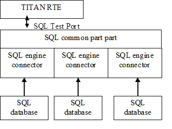

= The Test Port

== Overview

The communication between the SQL test port and the TITAN RTE is done by using the API functions described in <<7-references.adoc#_2, [2]>>. The SQL test port then transfers the SQL messages to the SUT.

The test port supports several parallel database connection.

See the overview of the system below:

== SQL Test Port API

The SQL test port is a procedure based test port with the following procedures:

* `S_SQL_connect` - Open a connection towards the SQL database.

* `S_SQL_Query` - Execute the SQL query.

* `S_SQL_disconnect` - Close the connection.

== Installation

Since the SQL test port is used as a part of the TTCN-3 test environment this requires TTCN-3 Test Executor to be installed before any operation of the SQL test port. For more details on the installation of TTCN-3 Test Executor see the relevant section of <<7-references.adoc#_2, [2]>>.

In order to use different SQL engines the runtime and development libraries of the SQL engine should be installed.

== Configuration

The executable test program behavior is determined via the run time ASPs

=== SQL Test Port Parameters in the RTE Configuration File

None.

== SQL Engine Connectors

=== MySQL Connector

Provides an interface towards the MySQL database via the MySQL C API. See <<7-references.adoc#_4, [4]>>.

==== Requirements

The MySQL C API libraries should be installed. See <<7-references.adoc#_4, [4]>>.

==== Parameters

* `host` +
The value of host may be either a host name or an IP address. If host is "localhost", a connection to the local host is assumed. For Windows, the client connects using a shared-memory connection, if the server has shared-memory connections enabled. Otherwise, TCP/IP is used. For Unix, the client connects using a Unix socket file. For a host value of "." on Windows, the client connects using a named pipe, if the server has named-pipe connections enabled. If named-pipe connections are not enabled, an error occurs.

* `user` +
The `user` parameter contains the user's MySQL login ID. If user is NULL or the empty string "", the current user is assumed. Under Unix, this is the current login name. Under Windows ODBC, the current user name must be specified explicitly.

* `password` +
The `password` parameter contains the password for user. If password is empty, only entries in the user table for the user that have a blank (empty) `password` field are checked for a match.

* `database` +
`database` is the database name.

* `port` +
If `port` is not `_0_`, the value is used as the port number for the TCP/IP connection.

NOTE: The host parameter determines the type of the connection.

* `unix_socket` +
If `unix_socket` is not empty, the string specifies the socket or named pipe to use.

NOTE: The host parameter determines the type of the connection.

* `client_flag` +
The value of this flag is usually 0 but can be set to a combination of the following flags to enable certain features. Please see flag descriptions in <<7-references.adoc#_6, [6]>>.

* `char_set` +
The name of the character set to use as the default character set.

* `auto_reconnect` +
Enable or disable automatic reconnection to the server if the connection is found to have been lost. Reconnect has been off by default since MySQL 5.0.3; this option is new in 5.0.13 and provides a way to set reconnection behavior explicitly.

=== SQLite Connector

Provides an interface towards the SQLite database via the SQLite C API. See <<7-references.adoc#_5, [5]>>.

[[requirements-0]]
==== Requirements

The SQLite C API libraries should be installed. See <<7-references.adoc#_5, [5]>>.

[[parameters-0]]
==== Parameters

* `database` +
Path to the SQLite database file. It is a mandatory field.
* `type` +
The type of the database. There are three open methods available on the database: `utf8`, `utf16`, `v2`. Use these three values with the `type` parameter. If the parameter is not specified the default value is used.

The default value is `_utf8_`.

* `flags` +
Sets how to open the database (read/write access). For more details about flags see <<7-references.adoc#_5, [5]>>.
* `max_busy_retries` +
When the database is busy, the SQLite engine can stop after `max_busy_retries`.

The default behavior: do while database is busy.

=== Oracle SQL Connector

The Oracle SQL connector provides an interface for Oracle SQL database using the Oracle OCCI

[[requirements-1]]
==== Requirements

The Oracle Insta Client SDK should be installed.

[[parameters-1]]
==== Parameters

* `connection_string` T- he Oracle SQL connection string. For details see the Oracle manual. It’s mandatory field.
* `user` - The name of the database user.
* `password` - The password of the user.

== Rollback

The SQL testport can run and rollback your SQL queries specified in a separated SQL file. We can support some limited SQL functionality in our product. See the supported SQL syntax in the following chapters. SELECT statement is not supported in the feature and in the SQL file.

Both MySQL and SQLite syntax is available.

=== CREATE DATABASE

CREATE DATABASE _database_name_

=== CREATE TABLE

CREATE TABLE _table_name_ (_create_definition_)

_create_definition: column_name column_definition_

_column_definition: data_type_ [NOT NULL | NULL] [DEFAULT _default_value_] [AUTO_INCREMENT|AUTOINCREMENT] [UNIQUE [KEY]] [[PRIMARY] KEY]

_data_type: data_type:_ BIT optional_length

[verse]
--
TINYINT optional_length
--

[verse]
--
SMALLINT optional_length
--

[verse]
--
MEDIUMINT optional_length
--

[verse]
--
INT optional_length
--

[verse]
--
DTINTEGER optional_length
--

[verse]
--
BIGINT optional_length
--

[verse]
--
REAL optional_length
--

[verse]
--
DOUBLE optional_length
--

[verse]
--
DTFLOAT optional_length
--

[verse]
--
DECIMAL optional_length
--

[verse]
--
NUMERIC optional_length
--

[verse]
--
DATE
--

[verse]
--
TIME
--

[verse]
--
TIMESTAMP
--

[verse]
--
DATETIME
--

[verse]
--
YEAR
--

[verse]
--
DTCHAR optional_length
--

[verse]
--
VARCHAR optional_length
--

[verse]
--
BINARY optional_length
--

[verse]
--
VARBINARY optional_length
--

[verse]
--
TINYBLOB
--

[verse]
--
BLOB
--

[verse]
--
MEDIUMBLOB
--

[verse]
--
LONGBLOB
--

[verse]
--
TINYTEXT
--

[verse]
--
TEXT
--

[verse]
--
MEDIUMTEXT
--

[verse]
--
LONGTEXT
--

[verse]
--
ENUM enum_list
--

[verse]
--
SET enum_list
--

_optional_length:_ (INTNUM)

_|_ (INTNUM, INTNUM)

=== DELETE

Only the single table format supported.

DELETE FROM _table_reference optional_where optional_orderby optional_limit_

_optional_where_: WHERE _expression_

_optional_orderby_: ORDER BY [_column_name, column_number, column_name_list, column_number_list_] [ASC, DESC]

_optional_limit:_ LIMIT _limit_number_

=== INSERT

Only the single table format supported

INSERT INTO _table_reference_ (_column_list_) VALUES (_value_list_)

[verse]
--
INSERT INTO _table_reference_ VALUES (_value_list_)
--

=== UPDATE

UPDATE _table_reference_ SET _expression_list optional_where optional_orderby optional_limit_

_optional_where_: WHERE _expression_

optional_orderby: ORDER BY [_column_name, column_number, column_name_list, column_number_list_] [ASC, DESC]

_optional_limit_: LIMIT _limit_number_

=== Function List

[[substr-ing-value-list]]
==== SUBSTR(ING)(_value_list_)

[verse]
--
SUBSTR(ING)(_expression_ FROM _expression_ )
--

[verse]
--
SUBSTR(ING)( _expression_ FROM _expression_ FOR _expression_)
--

==== ASCII (expression)

[[bin-expression]]
==== BIN(expression)

[[bit-length-expression]]
==== BIT_LENGTH(expression)

[[concat-expression]]
==== CONCAT(expression)

==== CURDATE()

[[current-date]]
==== CURRENT_DATE()

[[current-time]]
==== CURRENT_TIME()

==== CURTIME()

==== DATE()

[[date-add-expression-interval-expression]]
==== DATE_ADD(expression, interval_expression)

_interval_expression_: INTERVAL _expression interval_value_list_

interval_value_list: YEAR

[verse]
--
MICROSECOND
--

[verse]
--
SECOND
--

[verse]
--
MINUTE
--

[verse]
--
HOUR
--

[verse]
--
DAY
--

[verse]
--
WEEK
--

[verse]
--
MONTH
--

[verse]
--
QUARTER
--

[verse]
--
SECOND_MICROSECOND
--

[verse]
--
MINUTE_MICROSECOND
--

[verse]
--
MINUTE_SECOND
--

[verse]
--
HOUR_MICROSECOND
--

[verse]
--
HOUR_SECOND
--

[verse]
--
HOUR_MINUTE
--

[verse]
--
DAY_MICROSECOND
--

[verse]
--
DAY_SECOND
--

[verse]
--
DAY_MINUTE
--

[verse]
--
DAY_HOUR
--

[verse]
--
YEAR_MONTH
--

[[date-sub-expression-interval-expression]]
==== DATE_SUB(expression, interval_expression)

[[hex-expression]]
==== HEX(expression)

[[lcase-expression]]
==== LCASE(expression)

[[lower-expression]]
==== LOWER(expression)

[[length-expression]]
==== LENGTH(expression)

==== NOW()

[[reverse-expression]]
==== REVERSE(expression)

[[space-expression]]
==== SPACE(expression)

[[time-expression]]
==== TIME(expression)

[[trim-value-list]]
==== TRIM(value_list)

[verse]
--
TRIM(_trim_ltb_ _expression_ FROM _value_list)_
--

_trim_ltb_: LEADING

[verse]
--
TRAILING
--

[verse]
--
BOTH
--

[[uhex-expression]]
==== UHEX(expression)

[[upper-expression]]
==== UPPER(expression)

=== Environment Variables

The SQL file, used in the Rollback process, can also contain environment variables declared by the user. Both `$VARIABLE_NAME` and `$\{VARIABLE_NAME}` format are accepted and the parser will replace the variables with their values. The environment variables can be used as table names, column names and as attribute values.

== _Makefile_

The _Makefile_ has to include the SQL related linking instructions:

[source]
----
$(TARGET): $(OBJECTS)
           $(CXX) $(LDFLAGS) -o $@ latexmath:[$^ \ -L$](TTCN3_DIR)/lib -Llatexmath:[$(OPENSSL_DIR)/lib -L$](XMLDIR)/lib -llatexmath:[$(TTCN3_LIB) -lcrypto *-lmysqlclient -lz -lsqlite3*
           \$]($(PLATFORM)_LIBS)  || if [ -f
$(TTCN3_DIR)/bin/titanver ]; then $(TTCN3_DIR)/bin/titanver $^; else : ; fi
----

== Examples

The "demo" directory of the deliverable contains the file __SQL_demo.ttcn__. It contains the test cases *_MySQL_Test_Demo_* and *_SQLite_Test_Demo_* which demonstrate the SQL "SELECT" query.

The __SQL_Parser.ttcn__ shows how to use the rollback feature.
