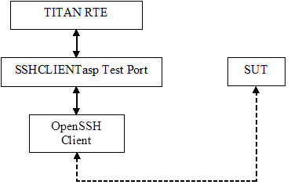

= General

The purpose of the SSHCLIENTasp test port is to adapt TITAN abstract test components using SSH connections to the real test system interface. The SSHCLIENTasp test port makes it possible to use remote SSH login from TTCN-3 via the OpenSSH client utility that is present in Unix systems. The test port offers SSH primitives to the test suite and communicates with the SUT.

The communication between the SSHCLIENTasp test port and the TITAN RTE is done by using the API functions described in <<6-references.adoc#_3, [3]>>.

The test port supports only client mode.

See the overview of the system below:

