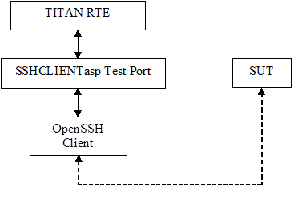
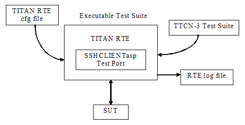

= Introduction

== About This Document

=== How to Read This Document

This is the User’s Guide for the SSHCLIENTasp test port. The SSHCLIENTasp test port is developed for the TTCN-3 Toolset with TITAN. This document should be read together with Function Specification <<7-references.adoc#_5, [5]>>.

=== Presumed Knowledge

The knowledge of the TITAN TTCN-3 Test Executor <<7-references.adoc#_2, [2]>> and the TTCN-3 language <<7-references.adoc#_1, [1]>> is essential.

== System Requirements

In order to operate the SSHCLIENTasp test port the following system requirements must be satisfied:

* TITAN TTCN-3 Test Executor R7A (1.7.pl0) or higher installed. For installation guide see <<7-references.adoc#_4, [4]>>.

NOTE: This version of the test port is not compatible with TITAN releases earlier than R7A.

* Any operating system supported by TITAN, while only tested on Solaris 8, SUSE Linux 9.1 and Cygwin 1.5.18-1.
* OpenSSH utility is present.

== Fundamental Concepts

The test port establishes SSH connection between the TTCN-3 test executor and SUT. The test port transmits and receives SSH messages between the TITAN RTE and the SUT.

The SSHCLIENTasp test port has many ASPs to control the behavior of the test port and to provide information about internal events. For details see <<2-using_the_test_port_in_ttcn3.adoc#abstract_service_primitives, Abstract Service Primitives>>

== Overview

The purpose of the SSHCLIENTasp test port is to adapt TITAN abstract test components using SSH connections to the real test system interface.

See the overview of a test system using SSHCLIENTasp test port below:

The SSHCLIENTasp test port forks a pseudo terminal and starts the OpenSSH client. After the connection is established it can send and receive abstract service primitives.

== Installation

Since the SSHCLIENTasp test port is used as a part of the TTCN-3 test environment this requires TTCN-3 Test Executor to be installed before any operation of the SSHCLIENTasp test port. For more details on the installation of TTCN-3 Test Executor see the TITAN Installation Guide ‎<<7-references.adoc#_4, [4]>>.

The test port is built on the SSH client utility. So it must be present for proper functioning.

NOTE: The test port files shall be added to the project or to the _Makefile_. On Linux systems the `-lutil` linker option shall be added to the _Makefile_, for example, `LINUX_LIB = -lutil`.

== Configuration

The executable test program behavior is determined via the RTE configuration file. This is a simple text file, which contains various sections (e.g. `[TESTPORT_PARAMETERS]`) after each other. The usual suffix of the RTE configuration file is _.cfg_. For further information about the configuration file see <<7-references.adoc#_2, [2]>>.

See the overview of the configuration process below:

[[SSHCLIENTasp_Test_Port_Parameters_in_the_RTE_Configuration_File]]
=== SSHCLIENTasp Test Port Parameters in the RTE Configuration File

In the `[TESTPORT_PARAMETERS]` section you can specify parameters that are passed to the test ports. Each parameter definition consists of a component name, a port name, a parameter name and a parameter value. The component name can be either an identifier or a component reference (integer) value. The port and parameter names are identifiers while the parameter value must always be a charstring (with quotation marks). Instead of component name or port name (or both of them) the asterisk ("*") sign can be used, which means "all components" or "all ports of the component". More information about the RTE configuration file can be found in ‎<<7-references.adoc#_2, [2]>>.

In the `[TESTPORT_PARAMETERS]` section the following parameters can be set for the SCTPasp test port. If the corresponding parameter is mandatory an (M), if it is optional an (O) and if it is conditional a (C) is shown after its name:

`debug` (O)

The parameter is optional, and can be used to enable debug logging. Available values: `_"yes"_`/`_"no"_`.

The default value is `_"no"_`.

`statusOnSuccess` (O)

The parameter is optional, and can be used to enable status messages (`ASP_SSH_Status`) when operations affecting a remote host is successful. Available values: `_"yes"_`/`_"no"_`.

The default value is `_"no"_`.

`remote_host` (O)

The parameter can be used to specify the remote host to connect to.

The default value is `_"localhost"_`.

`remote_port` (O)

The parameter can be used to specify the remote port to connect to.

The default value is `_"22"_`.

`additional_parameters` (O)

The parameter can be used to specify one arbitrary SSH parameter to the underlying OpenSSH client e.g. ``-c3des''.

The default value is ``''.

For more information about the possible parameters read the OpenSSH client man pages.

`ip_version` (O)

The parameter can be used to specify the version of the IP protocol that is used. Available values: `_"4"_` and `_"6"_`.

The default value is `_"4"_`.

`EOL` (O)

The parameter can be used to specify the end of line type of the outgoing messages. Available values: `_"WINDOWS"_`, `_"UNIX"_` and `_"MAC"_`.

The default value is `_"UNIX"_`.

NOTE: It only affects the result if assignEOL is set to `_"yes"_`.

`assignEOL` (O)

The parameter can be used to attach end of line signs to the outgoing messages. The type of the attached end of line sign is determined by the EOL test port parameter. Available values: `_"yes"_`/`_"no"_`.

The default value is `_"yes"_`.

`supressEcho` (O)

The parameter can be used to suppress the echos received in reply to an `ASP_SSH` message. Available values: `_"yes"_`/`_"no"_`.

The default value is `_"no"_`.

`supressPrompt` (O)

The parameter can be used to suppress the prompts received from the remote host. Available values: `_"yes"_`/`_"no"_`.

The default value is `_"no"_`.

`pseudoPrompt` (O)

The parameter can be used to change every prompt received from the SUT to `ASP_SSH_PseudoPrompt`. Available values: `_"yes"_`/`_"no"_`.

The default value is `_"no"_`.

NOTE: This parameter is introduced in order to simplify detecting prompts in test cases where several kinds of prompts can occur.

`readmode` (O)

The parameter can be used to specify when to pass incoming messages to the TITAN RTE. There are three read modes:

BUFFERED: the test port waits until prompt arrives and data received before the prompt is passed to the TITAN RTE in one `ASP_SSH` message.

UNBUFFERED: the test port waits until new line character is received and pass the whole received line to the TITAN RTE in one `ASP_SSH` message. If prompt is received before the line boundary then data before the prompt is passed to the TITAN RTE.

In buffered and unbuffered read modes the prompt is passed to the TITAN RTE according to the test port parameters `supressPrompt` and `pseudoPrompt`.

RAW: the test port does not wait. It passes incoming messages to the TITAN RTE as they are received. In this case the incoming messages always contain the prompt and the test port parameters `supressPrompt` and `pseudoPrompt` do not affect it.

Available values: `_"BUFFERED"_`, `_"UNBUFFERED"_` and `_"RAW"_`.

The default value is `_"BUFFERED"_`.

`detectServerDisconnected` (O)

The parameter can be used to specify the behavior of the test port if the remote SSH connection is lost. If this parameter is set to `_"yes"_` connection loss is indicated by an incoming `ASP_SSH_Close` message. If it is set to "no" a TTCN error will be generated. Available values: `_"yes"_`/`_"no"_`.

The default value is `_"yes"_`.

`prompt<prompt_id>` (C)

The parameter can be used to specify the exact prompt strings used on the remote host. It is mandatory that at least one prompt or `regex_prompt` string must always be present. Several prompt strings can be added with different `prompt_ids`. The `prompt_id` is a positive integer and shall be assigned with strictly monotonic increasing values starting with `_"1"_`.

here is no default value.

`regex_prompt<prompt_id>` (C)

The parameter can be used to specify the prompt strings used on the remote host as TTCN-3 style regular expressions. It is mandatory that at least one prompt or `regex_prompt` string must always be present. Several `regex_prompt` strings can be added with different `prompt_ids`. The `prompt_id` is a positive integer and shall be assigned with strictly monotonic increasing values starting with `_"1"_`.

There is no default value.

`raw_regex_prompt<prompt_id>` (C)

The parameter can be used to specify the prompt string used on the remote host as regcomp supported POSIX regexp. It should have at least two subexpressions. The second subexpression selects the prompt. The regexp should match the entire buffer as it received.

`empty_echo` (C)

The `empty_echo` parameter determines whether the test port sends an empty charstring if the issued command has no printout. If the parameter is set to `_"yes"_` the test port sends an empty charstring to the test case before the prompt. If the value is set to `_"no"_` the test port do not send the empty charstring before the prompt.
