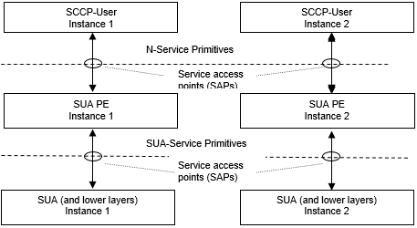

= General

The SUA protocol emulation (PE) implements the SUA protocol specified by IETF <<5-references.adoc#_6, ‎[6]>>. The emulation is performed in TTCN-3 <<5-references.adoc#_1, ‎[1]>> and it requires the TTCN-3 Test Tool with TITAN test executor ‎<<5-references.adoc#_2, [2]>> as environment.

The SUA PE is developed for testing implementations of SCCP Users using TTCN and it uses the services of the underlying SUA layer (see figure below). It is assumed that the SUA layer of the peer conforms to the same specifications as SUA PE does.

See service primitives in SUA_PE below:name: value

The SUA PE itself is situated between the SUA and the SCCP-User (see figure above). SCCP user can communicate using SCCP ASP service primitives.
