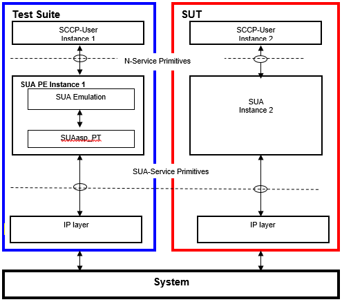

= The Protocol Emulation

== Overview

The SUA PE is developed for testing implementations of SCCP Users using TTCN-3 and it uses the services of the underlying SUA layer. It is assumed that the SCCP layer of the peer conforms to the same specifications as SUA PE does.

See service primitives in SS7 below:

Generally, SUA PE is designed to supply the same interfaces and services for the SCCP user layer as in the previous product SCCP PE.

== The User Interface: the N-Service Primitives

SUA PE communicates with its user by means of N-Service primitives.

These primitives are implemented as TTCN-3 records. Any SCCP User inserts its message in the field `"User Data"`. Their implementation can be found in file __SCCPasp_Types.ttcn__.

== Installation

Since SUA PE is used as a part of the TTCN-3 test environment this requires TTCN-3 Test Executor to be installed before any operation of the implementation. For more details on the installation of TTCN-3 Test Executor see ‎<<7-references.adoc#_4, [4]>>.

An implementation of the SUA test port is also needed for execution.

=== Description of Files Implementing the SUA PE

The SUA PE is implemented in the file __SUA_Emulation.ttcn__

To build an executable test suite with TITAN ‎<<7-references.adoc#_2, [2]>> that is using SUA PE the following files from other products shall be added to the related project:

* __General_Types.ttcn__
* __SCCPasp_Types.ttcn__
* __SUA_EncDec.ccSUA_Types.ttcnSUAasp_EncDec.cc__
* __SUAasp_PortType.ttcn__
* __SUAasp_PT.cc__
* __SUAasp_PT.hh__
* __SUAasp_Types.ttcn__

Their functionality is the following:

* `Abstract_Socket` - This is the implementation of the Abstract_Socket (CNL 113 384).

* __General_Types.ttcn__ - General type definitions (CNL 113 368).

* __SCCPasp_Types.ttcn__ - This file contains the interface between the SUA PE and the SCCP User. It contains the abstract service primitives implemented as TTCN-3 messages, templates and it contains the port definitions between the SCCP User and SUA.

* __SUA_Emulation.ttcn__ - This file contains the dynamical part.

* __SUA_EncDec.cc__ - This file contains functions for RAW encoding-decoding. For details see [*Error! Bookmark not defined.*].

* __SUA_Types.ttcn__ - This file contains all other definitions used in SUA PE. It contains definitions of types, ports used between components SUA and SUA_EncDec and between SUA_EncDec and the IP layer.

* __SUAasp_EncDec.cc__, __SUAasp_PT.cc__, __SUAasp_PT.hh__, __SUAasp_Types.ttcn__, __SUAasp_PortType.ttcn__ - These files contain the implementation of the lower SUA layer of the PE. Including test port, type definitions and port type definition (CNL 113 516).

== Configuration

The SUA PE uses module parameters for runtime configuration that can be set in the `[MODULE_PARAMETERS]` section of a TITAN RTE configuration file. On one hand side a few user configurable module parameters are defined, while on the other hand side there are a few timer settings that are not advised to be altered by the user.

A list of configurable parameters is provided below.

* `tsp_maxLocalReference`:

-type: float

-meaning: Max value of the field Local Reference .Local Reference = 0 .. (SUA.tsp_maxLocalReference-1).

-possible values: 0-16777216

-default value: 16777216.0

-OPTIONAL

* `tsp_maxConnectionId`:

-type:float

-meaning: max value of ASP field `Connection Identification`. More exactly Connection Identification `=0.. (SCCP.tsp_maxConnectionId –1)`.

-possible values: `_0-16777216_`

-default value: `_16777216.0_`

-OPTIONAL

* `tsp_SUA_data_maxlen`:

-type: integer

-meaning: On one hand the data reassembler buffer’s size for each connection is determined as 16 times this value, and on the other hand buffered transmission of user layer data is performed taking this setting into account.

-possible values: any integer

-default value: `_261_`

-OPTIONAL

* `tsp_SSN` :

-type: integer

-meaning: If present, it is used in the examination of SUA CLDT message payload content.

-possible values:= `_8..1532_`

-default value: `_0_`

-OPTIONAL

The additional parameters are used for the configuration of internal timers. Modification of their values is not recommended. The list of timer parameters follows:

`tspc_timer_T_conn_est`, `tspc_timer_T_ias`, `tspc_timer_T_iar`, `tspc_timer_T_rel`, `tspc_timer_T_repeat_rel`, `tspc_timer_T_int`, `tspc_timer_T_guard`, `tspc_timer_T_reset`, `tspc_timer_T_internal_reset`, `tspc_timer_guard`
