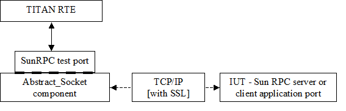

= General

The SunRPC Test Port makes possible to execute test suites towards an IUT. The test port allows sending and receiving Sun RPC messages between the test suite and IUT via a TCP/IP socket connection.

If there are link:1-introduction.md#881135120756544-multiple_connection[multiple connections] established every connection gets an 'id' when it is established. When sending `SunRPC_message_multiple_client` messages, the `client_id` parameter selects the connection on which the message should be sent.

If there is only a single connection established, the `SunRPC_message` can be sent and received by the test suite.

The communication between the SunRPC test port and the TITAN RTE is done by using the API functions described in <<6-references.adoc#_2, [2]>>. The SunRPC test port transfers the Sun RPC protocol messages to the IUT through a network connection.

See the overview of the protocol message transfer network below:

