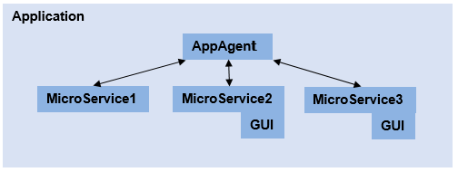

= Functionality

== General

EPTF Service Framework (ESF) can be used to build different applications by implementing and selecting the appropriate microservices to fulfill the application’s requirements. ESF itself also provides built-in microservices which are the following:

* DataSource
* Authenticator
* Playlist

The framework comes with a set of tools to help microservices serve basic or `DsRestAPI` HTTP requests.

For more information on `DsRestAPI` see https://erilink.ericsson.se/eridoc/erl/objectId/09004cff8b30d663?docno=39/15516-CNL113512Uen&action=current&format=msw8[DsRestAPI Function Description]

Microservices implementing `DsRestAPI` may also implement user interfaces with the help of EPTF Web GUI (EWG). If so, the application needs to implement a GUI configuration handler microservice to provide the EWG a GUI configuration descriptor. This microservice should implement a `createConfig()` function, returning a valid EWG configuration descriptor in JSON format. The function has access to the user groups of the user accessing a web application, therefore it could decide whether the user specific user has access to the web application or not.

The descriptor should also contain EWG specific customization descriptors and HTTP resource directory information.

For more information on the structure of the EPF Web GUI descriptors and on how to write a web application based on EWG, see the https://erilink.ericsson.se/eridoc/erl/objectId/09004cff8cd8deec?docno=1551-CNL113864Uen&action=current&format=msw8[EPTF Web GUI] documentation.

Overview of the ESF:

ESF’s central component is the `AppAgent` module, which loads the microservices located in directory, and also serves as an HTTP server to serve microservice’s API, and the possible web application resources (html, js and other files).

The microservices should provide an API extension (a string value), which is unique in the application’s context, and has the role of an address for a specific microservice in the application. The microservices may implement HTTP handlers (a function named `handleMessage`), where HTTP requests will be forwarded. If the function is implemented, `AppAgent` will forward the requests with the appropriate extension to the addressed microservice.

All the microservices are running on the same python context, therefore the application’s performance is limited. If one of the microservices is performance-critical, it is advised to handle its critical tasks in separate threads (separate real system threads –not python threads; or separate python contexts). It is not advised to block a request handler in any circumstances, because it will affect the whole application’s performance.

[[esf-s-built-in-microservices]]
== ESF’s Built-In Microservices

=== DataSource

Serves a `DsRestAPI`. The API can return the source names registered as data sources, and the following basic operators (also as data source elements):

* not
* ==
* !=
* >
* >=
* <
* <=
* and
* or
* match
* not match
* sum
* exists
* forAll
* dataElementPresent
* sizeOf

=== Authenticator

Handles user groups and users. A user can be part of multiple user groups. If authenticated, the user and group information of a request is forwarded to the microservice’s handler functions, and the microservice can decide whether to serve the request as an authenticated request or not.

=== Playlist

Can issue scheduled, potentially conditional requests to any microservice which serves a `DSRestAPI` compatible interface. The scheduled commands and their relations are described by a JSON file matching the Playlist’s schema.

This microservice comes with a user interface part, in order to let the user edit the JSON descriptors graphically.
