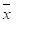
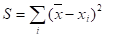
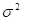
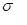

= General Description

This document specifies the `StatHandler` feature of the TitanSim Core Library.

StatHandler feature makes it possible to collect global, aggregated statistics via the existing EPTF Variable (see <<5-references.adoc#_5, [5]>>) interface.

The `StatHandler` feature consists of master and client components. Users of the `StatHandler` feature can declare aggregated statistics with certain statistics methods (For example, Sum), and register local or third party data sources (EPTF Variables). The client component serves as a control interface for the master component.

== `StatHandlerClient`

The primary purpose of the `StatHandlerClient` component is to provide a remote or local control interface for the `StatHandler` master component type.

The `StatHandlerClient` can control a default `StatHandler` master component, or multiple masters. If there is only a default master, its component reference shall be passed to the init function of the `StatHandlerClient` and the default parameter used in the controlling functions. Otherwise, the component reference of the `StatHandler` master shall be passed to these functions.

The data aggregation for statistics is performed using the EPTF Variable feature. The data source component provides the Variables to which the `StatHandler` subscribes when it receives a data source registration message from the controlling `StatHandlerClient`.

The `StatHandlerClient` can instruct the `StatHandler` master component to subscribe to a Variable that is either on the same component as the client, or on a different component (e.g. legacy code). The latter is called third party registration.

In case of third party registration, the controlling client is still responsible for the reset of the statistics/variable on the data source component. This can be done, for example, by setting a callback for the statistics reset event and adjusting the EPTF Variables of the data sources from within that callback function.

[[stathandler_master_component]]
== `StatHandler` Master Component

The `StatHandler` master component performs the aggregation of statistics. Declared stats are stored in an internal database, the EPTF Variable storing the aggregated value is created upon declaration of the stat.

The master component subscribes to provider variables of the data sources registered by the `StatHandlerClient`. Whenever provider variables change, the related statistic value is calculated.

Although the `StatHandler` master component is configured via the client interface, it provides some public API functions for extensibility (e.g. GUI handling, initialization of statistics capture, etc.)

The `StatHandler` supports the following statistics methods and statistics types:

* `Min` calculates the minimum of all the sources. The sources shall consist of a single variable with the same type as the reset value of the statistics: integer or float.

* `Max` calculates the maximum of all the source variables. Supports integer and float data types.

* `Sum` calculates the sum of all the data sources with type integer or float.

* `Mean` calculates the global mean value of the sources. The supported statistics type is float, the sources shall consist of a local mean and a number-of-samples variable.

* `StandardDev` calculates the standard deviation of the sources. The statistics type is float, the sources shall consist of a local mean, a number-of-samples and the local variable S that is part of the calculation of standard deviation performed by StatMeasure. This statistics also calculates and stores the mean (m or ) of the sources as auxiliary variable, with name `<statName>.mean`. The resulting value of the statistics is the following function:

The variance (V or ) can be calculated from this value by dividing it with the number of samples (N). The standard deviation () is the square root of the variance.

* `GlobalAverage` is the average of the data sources. Statistics type is float, sources shall consist of a sum and an element number variable.

* `Density` is the piecewise sum of the distribution bin values of measured local density statistics. The boundaries of each data sources must be the same. The statistics type is `EPTF_IntegerList`, data sources shall consist of local density and boundaries variables.

* `Percentile95` calculates the global 95 percentile statistics from locally measured stats. It declares two aux stats density and max, with name `<statName>.density` and `<statName>.max` respectively. Boundaries are stored in the auxiliary `EPTF_FloatList` variable `<statName>.boundaries`. The type of the statistics is float, data sources shall consist of an `EPTF_IntegerList` density, an `EPTF_FloatList` boundaries and a float max variable.

* `PercentileP` calculates the global pth percentile statistics from locally measured stats. It declares two aux stats density and max, with name `<statName>.density` and `<statName>.max` respectively. Boundaries are stored in the auxiliary `EPTF_FloatList` variable `<statName>.boundaries`. The p value is stored in an auxiliary variable `<statName>.pValue`. The type of the statistics is float, data sources shall consist of an `EPTF_IntegerList` density, an `EPTF_FloatList` boundaries and a float max variable. The `p` value can be between `_0.0_` and `_1.0_`. The statistics with value `_0.5_` is called median.
