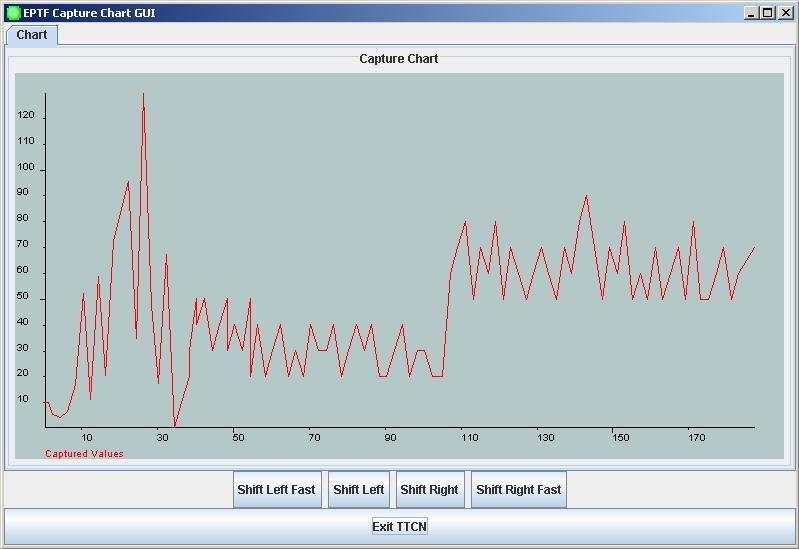

= Statistics Replay

== Overview

The EPTF CLL `StatReplay` component is a fundamental component providing an implementation for statistics replay control in a load test environment.

The Statistics are captured by the EPTF Statistics Capture Control feature. Statistics can be grouped to capture groups and this capture groups can be printed to file.

The Statistics Replay feature provides us to display a given captured variable from the captured log files. The values will be visualized on the Runtime GUI.

[[description_of_files_in_this_feature]]
== Description of Files in This Feature

The EPTF CLL StatReplay API includes the following files:

* __EPTF_CLL_StatReplay_Definitions.ttcnpp__ - This TTCN-3 module contains common type definitions that should be used in all Statistics Replay Controlling Components.
* __EPTF_CLL_StatReplay_Functions.ttcnpp__ - This TTCN-3 module contains the implementation of Statistics Replay Control functions.
* __EPTF_CLL_Stat_Capture_ExternalFunctions.cc__ - This TTCN-3 module contains external functions for Statistics Replay Control.

[[description_of_required_files_from_other_features]]
== Description of Required Files From Other Features

The Statistics Replay feature is part of the TitanSim EPTF Core Load Library (CLL). It relies on several features of the CLL and the TCC Useful Functions. The user has to obtain the following products/files to use the Statistics Replay:

* Abstract Socket:
** __Abstract_Socket.cc__;
** __Abstract_Socket.hh__;
* Base:
** __EPTF_CLL_Base_Definitions.ttcnpp__;
** __EPTF_CLL_Base_Functions.ttcnpp__;
** __EPTF_CLL_Base_ExternalFunctions.cc__;
* Common:
** __EPTF_CLL_Definitions__
** __EPTF_CLL_Admin_Macros.ttcnin__;
* FreeBusyQueue:
** __EPTF_CLL_QueueMgmt_Definitions.ttcn__;
** __EPTF_CLL_QueueMgmt_Functions.ttcnpp__;
** __EPTF_CLL_QueueMgmt_PrivateFunctions.ttcnpp__;
* HashMap:
** __EPTF_CLL_oct2int_HashMap_external.cc__;
** __EPTF_CLL_oct2int_HashMap.ttcn__;
** __EPTF_CLL_str2int_HashMap_external.cc__;
** __EPTF_CLL_str2int_HashMap.ttcn__;
* RedBlackTree
** __EPTF_CLL_FloatRBtree_Functions.ttcnpp__
** __EPTF_CLL_FloatRBtree_PrivateFunctions.ttcnpp__
** __EPTF_CLL_IntegerRBtree_Functions.ttcnpp__
** __EPTF_CLL_IntegerRBtree_PrivateFunctions.ttcnpp__
** __EPTF_CLL_RBtree_Definitions.ttcn__
** __EPTF_CLL_RBtree_Functions.ttcnpp__
** __EPTF_CLL_RBtree_PrivateFunctions.ttcnpp__
* RingBuffer:
** __EPTF_CLL_GenericRingBuffer_Definitions.ttcnin__;
** __EPTF_CLL_GenericRingBuffer_Functions.ttcnin__;
* Semaphore
** __EPTF_CLL_Semaphore_Definitions.ttcn__
** __EPTF_CLL_Semaphore_Functions.ttcn__
* UDP testport:
** __UDPasp_PortType.ttcn__;
** __UDPasp_PT.cc__;
** __UDPasp_PT.hh__;
** __UDPasp_Types.ttcn__;
* UIHandler:
** __EPTF_CLL_UIHandlerClient_Definitions.ttcn__;
** __EPTF_CLL_UIHandlerClient_Functions.ttcn__;
** __EPTF_CLL_UIHandler_Definitions.ttcn__;
** __EPTF_CLL_UIHandler_Widget_Functions.ttcn__;
** __EPTF_CLL_UIHandler_XTDPTemplateDefinitions.ttcn__;
* Variable:
** __EPTF_CLL_Variable_Definitions.ttcnpp__;
** __EPTF_CLL_Variable_Functions.ttcnpp__;
** __EPTF_CLL_Variable_ExternalFunctions.cc__;
* XSD:
** _XSD.asn_;
* XTDP testport:
** _lex.xtdp.c_
** _xtdp.l_
** __XTDP-EXER-EncDec.cc__
** __XTDP_PDU_Defs.asn__
** __XTDPasp_PortType.ttcn__
** __XTDPasp_PT.cc__
** __XTDPasp_PT.hh__
** __XTDPasp_Types.ttcn__
** __XUL_XTDL.asn__

From the TCC Useful Functions:

** _TCCFileIO.cc_;
** _TCCFileIO_Functions.ttcn_;

== Installation

Since EPTF_CLL_ `StatReplay` is used as a part of the TTCN-3 test environment this requires TTCN-3 Test Executor to be installed before any operation of these functions. For more details on the installation of TTCN-3 Test Executor see the relevant section of ‎<<7-references.adoc#_2, [2]>>.

If not otherwise noted in the respective sections, the following are needed to use `EPTF_CLL_StatReplay`:

* Copy the files listed in sections <<description_of_files_in_this_feature, Description of Files in This Feature>> and <<description_of_required_files_from_other_features, Description of Required Files From Other Features>> to the directory of the test suite or create symbolic links to them.
* Import the `StatReplay` demo or write your own application using `StatReplay`.
* Create __Makefile__ or modify the existing one. For more details see the relevant section of ‎<<7-references.adoc#_2, [2]>>.
* Edit the config file according to your needs, see following section <<configuration, Configuration>>.

== Configuration

The executable test program behavior is determined via the run-time configuration file. This is a simple text file, which contains various sections. The usual suffix of configuration files is _.cfg._ For further information on the configuration file see <<7-references.adoc#_2, ‎[2]>>.

This set of protocol modules defines TTCN-3 module parameters as defined in <<7-references.adoc#_2, ‎[2]>>, clause 4. Actual values of these parameters – when no default value or a different from the default actual value wished to be used – shall be given in the `[MODULE_PARAMETERS]` section of the configuration file.

This protocol module defines the following module parameters:

`tsp_EPTF_CLL_StatReplay_debug`

This boolean type module parameter is defined in module `EPTF_CLL_StatReplay_Functions`. It is used to enable the debug logging. This parameter is optional. By default, this parameter is set to `_false_`.

`tsp_EPTF_CLL_StatReplay_captureFile`

This charstring type module parameter is defined in module `EPTF_CLL_StatReplay_Functions`. It is used to define the log file name, what the user want to visualize. This parameter is mandatory

`tsp_EPTF_CLL_StatReplay_groupName`

This charstring type module parameter is defined in module `EPTF_CLL_StatReplay_Functions`. It is used to define the group name, where the visualized variable is. This parameter is mandatory.

`tsp_EPTF_CLL_StatReplay_variableName`

This charstring type module parameter is defined in module `EPTF_CLL_StatReplay_Functions`. It is used to define the name of the variable, what we would like to display. This parameter is mandatory.

`tsp_EPTF_CLL_StatReplay_startLayout`

This charstring type module parameter is defined in module `EPTF_CLL_StatReplay_Functions`. It is used to define Runtime GUI start layout. This parameter is mandatory.

`tsp_EPTF_CLL_StatReplay_windowSize`

This integer type module parameter is defined in module `EPTF_CLL_StatReplay_Functions`. It is used to define the size of the slider window. This parameter is optional. By default, this size is set to `_5_`.

There are three obligations to the `tsp_EPTF_CLL_StatReplay_startLayout`

1.  All of the buttons have to be enabled.
2.  The `maxPoints` of the trace have to be the same as the `tsp_EPTF_CLL_StatReplay_windowSize`.
3.  The id of the buttons and the trace are fixed. These are the following:

* The Shift Left Button Id: `shift_left`
* The Shift Right Button Id: `shift_right`
* The Shift Left Fast Button Id: `shift_left_fast`
* The Shift Right Fast Button Id: `shift_left_fast`
* The Trace Id: `trace`

== Usage

See The StatReplay feature on the Runtime GUI in the figure below:

If we run the `StatReplay` feature on the Runtime GUI, after the start we will see the initialization screen [Figure above]. There are 5 buttons on the GUI.

The functionality of the buttons is the following:

* The `exit` button: If the user presses the exit button, then the execution of the Statistics Replay will be ended.
* The `Shift Left` button: With this button can the user sliding the window one step left.
* The `Shift Left Fast` button: With this button can the user sliding the window more steps left (slider window size).
* The `Shift Right` button: With this button can the user sliding the window one step right.
* The `Shift Right Fast` button: With this button can the user sliding the window more steps right (slider window size).
