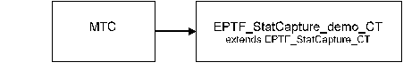

= Statistics Capture Control

== Overview

The EPTF CLL Statistics Capture Control feature consists of two fundamental components providing an implementation for statistics capture control in a load test environment.

Statistics are calculated belonging to EPTF Variables <<7-references.adoc#_7, ‎[7]>> by the EPTF Statistics Measure Feature <<7-references.adoc#_8, [8]>>. For each EPTF Variable, several statistics can be defined containing different type of values: for example variable content, minimum, maximum, delta, etc. Statistics can be reset independently, without changing the original Variable value.

These Statistics are captured by the EPTF Statistics Capture Control feature. Statistics can be grouped to capture groups, defining a certain sampling period, when the capture group is printed to file. Each capture group can be printed to `logfiles` of a format defined by the user. The feature implements a mechanism to handle large `logfiles` for meeting the requirements of a typical load test use case.

[[basic_usage]]
== Basic Usage

The EPTF Statistics Capture Control feature is implemented by more components. The previously described functionality is implemented on the `EPTF_StatCapture_CT` component that provides the statistics capture functionality and offers an API for starting/stopping statistics capture. This component itself can be used as a stand-alone application for statistics capture and statistics capture control. The following figure (see ‎<<basic_configuration, Basic Configuration>>) shows the test configuration. In this case the demo application is based on the `EPTF_StatCapture_CT` and the two belonging modules only (i.e. the optional modules are not needed).

[[basic_configuration]]
=== Basic Configuration

The `EPTF_StatCapture_demo_CT` is the user application, it extends the `EPTF_StatCapture_CT` component. Statistics Capture is carried out by the functionality of the `EPTF_StatCapture_CT` component and it is controlled by function calls according to its API. That means, that the statistics capture can be started or stopped by calling the belonging API functions in the user application.

== Extended Usage

The second component implemented in the EPTF Statistics Capture Control feature is the `EPTF_StatCaptureControl_CT,` it extends the `EPTF_StatCapture_CT` component and it is an optional, add-on component, that provides extended functionality by implementing _automatic_ statistics capture control based on external variables (see <<extended_configuration, Extended Configuration>>), for example defining certain capture start/stop criteria based on load stability in the system or user interaction.

=== Capture Control Modes

There are three different Capture Control Modes offered by the `EPTF_StatCaptureControl_CT_`(they can be selected by the configuration file): Manual, Load-based and Complete Capture Control Mode.

==== Manual (or User) Capture Control Mode

If this capture control mode is selected by the user, statistics capture can be started and stopped any time (after the execution has been started) by user interaction (for example a button is pressed on the TitanSim GUI). An EPTF Variable of type boolean should be defined in the configuration file, which shows user interaction (value change from false->true initiates start capture). By default, this control mode is selected.

==== Load-Based Capture Control Mode

If this capture control mode is chosen by the user, statistics capture is controlled according to load stability and user-specified timer intervals (module parameters: `tsp_EPTF_StatCaptureControl_loadStableToStart`, `tsp_EPTF_StatCaptureControl_loadStableCapturePeriod` and the `tsp_EPTF_StatCaptureControl_loadCaptureDelay` in the config file, see Section ‎<<modules-eptf-cll-statcapturecontrol, Modules `EPTF_CLL_StatCaptureControl`>>.

For convenience reasons, in the further description the "*" abbreviation is used instead of the string `tsp_EPTF_StatCaptureControl`.

The Load-based mode continuously monitors an EPTF Variable which signals whether the load is stable in the system. Note that this Variable is a boolean variable (specified by the user with the `loadVariable` module parameter) and it can be any regulated load-related parameter supported by the TitanSim tool, for example cps generated by the tool, or CPU load of the IUT, etc.

The Statistics Capture is started after the load has been stable for the time specified by the user in the `loadStableToStart` module parameter. If the load remains stable for a time specified by the `loadStableCapturePeriod` module parameter, then the captured data during this period are considered valid and the capture of information is stopped.

After a successful capture, the user can define a delay to start a new capture by the `loadCaptureDelay` module parameter.

NOTE: Only a fixed delay interval can be specified via this parameter. By default, it is set to `_0.0._`

After the delay period is over, the `loadStableToStart` timer is started again to examine the load stability and to initiate a new capture.

Otherwise, if the load becomes unstable during the `loadStableCapturePeriod` the capture is stopped and the captured data so far during this capture data collection period becomes obsolete and have to be discarded (this is signaled in the capture file as well). In this case, the `loadStableToStart` timer is started again to initiate a new capture.

The maximum number of capture periods (i.e. the number of start capture-stop capture sequences) initiated (in Load-based mode) can be defined via the `nrOfCaptures` module parameter. This counter is increased independently of the success of capture periods. Once the maximum number is reached, no more capture periods can be initiated. The load generation is allowed to be stopped before the maximum number of capture periods is reached (see Figure below).

The example scenario depicted in the figure shows the timers and the statistics capture control according to the load Variable.

See Example of Load-based Capture Control in the figure below:

==== Complete (or Execution) Capture Control Mode

If this capture control mode is selected, the capture of statistics is automatically started as soon as the test execution is started and automatically stopped when the test execution has been finished.

[[extended_configuration]]
=== Extended Configuration

In this configuration, the user application runs on the `EPTF_StatCaptureControl_demo_CT` which extends the `EPTF_StatCaptureControl_CT` component. This latter contains additional functionality to the `EPTF_StatCapture_CT` component (extends it), for example the automatic capture control functionality. Thus the starting or stopping of statistics can be bound to the fulfillment of certain conditions for values of Variables defined by the user, and the statistics capture can be controlled automatically.

The Capture Control Mode can be selected via the configuration file and the Variables belonging to the Capture Control Modes can be described here as well with the owner component name and their variable name. Note that all these Control Variables must be of type Boolean.

For example, the `Execution_CT` component contains a boolean Variable which signals that the load test execution has been started or stopped. The `User_CT` component contains a boolean Variable which shows whether the user has pressed the `Start Capture`/`Stop Capture` button on the TitanSim GUI. The `Load_CT` component contains a boolean Variable which shows whether load is stable or not. The demo application automatically controls statistics capture according to the selected Capture Control Mode and the values of these Variables.

For accessing these Variables in the user application, an `EPTF Name Service Server` must be running in the system, and the demo application must extend a belonging EPTF Name Service Client `EPTF_NS_Client_CT` component.

[[description_of_files_in_this_feature]]
== Description of Files in This Feature

The EPTF CLL Statistics Capture Control API includes the following files:

* StatCapture
** __EPTF_CLL_StatCapture_Definitions.ttcnpp__ - This TTCN-3 module contains common type definitions that should be used in all Statistics Capture Controlling Components.
** __EPTF_CLL_StatCapture_Functions.ttcnpp__ - This TTCN-3 module contains the implementation of Statistics Capture Control functions.
** __EPTF_CLL_StatCapture_External.cc__ - This TTCN-3 module contains external functions for Statistics Capture Control.
* `StatCaptureControl` (extends `StatCapture`)
** __EPTF_CLL_StatCaptureControl_Definitions.ttcnpp__ - This TTCN-3 module is optional, it contains common type definitions that should be used in all Statistics Capture Controlling Components if _automatic_ statistics capture control is needed.
** __EPTF_CLL_StatCaptureControl_Functions.ttcnpp__ - This TTCN-3 module is optional, it contains the implementation of Statistics Capture Control functions for _automatic_ statistics capture control.

NOTE: The `StatCaptureControl` component and the belonging modules are optional. If the user application only needs programmable statistics capture control, these files are not necessary to include. This case the user application should extend the `EPTF_StatCapture_CT` component and include the files listed in the `StatCapture` bullet point. On the other hand, if automatic statistics capture control functionality is needed, the user application should include all files of the EPTF CLL Statistics Capture Control feature (both `StatCapture` and `StatCaptureControl` bullet points), and extend the `EPTF_StatCaptureControl_CT` component.

[[description_of_required_files_from_other_features]]
== Description of Required Files From Other Features

The Statistics Capture Control feature is part of the TitanSim EPTF Core Library (CLL). It relies on several features of the CLL and the TCC Useful Functions. The user has to obtain the products/files to be found under the respective feature names:

* `Base`
* `Common`
* `FBQScheduler`
* `FreeBusyQueue`
* `HashMap`
* `Scheduler`
* `StatMeasure`
* `Variable`
* `NameService` (for the optional `StatCaptureControl`)

From the TCC Useful Functions <<7-references.adoc#_8, ‎[8]>>:

** _TCCFileIO.cc_
** __TCCFileIO_Functions.ttcn__
** _TCCMaths.cc_
** __TCCMaths_Functions.ttcn__
** __TCCMaths_GenericTypes.ttcn__

== Installation

Since EPTF CLL Statistics Capture Control is used as a part of the TTCN-3 test environment this requires TTCN-3 Test Executor to be installed before any operation of these functions. For more details on the installation of TTCN-3 Test Executor see the relevant section of <<7-references.adoc#_2, [2]>>.

If not otherwise noted in the respective sections, the following are needed to use `EPTF_CLL_StatCapture`:

* Copy the files listed in section <<description_of_files_in_this_feature, Description of Files in This Feature>> and <<description_of_required_files_from_other_features, Description of Required Files From Other Features>> to the directory of the test suite or create symbolic links to them.
* Import the Statistics Capture Control demo or write your own application using `StatCapture`.
* Create _Makefile_ or modify the existing one. For more details see the relevant section of <<<<7-references.adoc#_2, [2]>>.
* Edit the config file according to your needs, see following section <<configuration, Configuration>>.

[[configuration]]
== Configuration

The executable test program behavior is determined via the run-time configuration file. This is a simple text file, which contains various sections. The usual suffix of configuration files is _.cfg_. For further information on the configuration file see <<7-references.adoc#_2, [2]>>.

This feature defines TTCN-3 module parameters as defined in <<7-references.adoc#_2, [2]>>, clause 4. Actual values of these parameters – when there is no default value or a different from the default actual value to be used – shall be given in the `[MODULE_PARAMETERS]` section of the configuration file.

[[module-parameters-of-the-eptf-cll-statcapture]]
=== Module Parameters of the `EPTF_CLL_StatCapture`

`tsp_EPTF_StatCapture_def_capture file`

This charstring type module parameter is defined in module `EPTF_CLL_StatCapture_Functions`. It is used to define the name of the default capture file, where those capture groups, which are created without any assigned `logfiles` are dumped. The default value for this parameter is set to `DefaultFile_<selfname>__<component id>__<date>_<time>.txt` where `selfname` is the test component self name and the component id the component identifier.

`tsp_EPTF_StatCapture_max_file_size`

This integer type module parameter is defined in module `EPTF_CLL_StatCapture_Functions`. It is used to define the maximum file size of the `logfiles`, where the capture is dumped. By default, this file size is set to 1 GB (`1000000000` is the default value).

NOTE: 2 GB can be a critical size for some OS.

`tsp_EPTF_StatCapture_max_nrof_files`

This integer type module parameter is defined in module `EPTF_CLL_StatCapture_Functions`. It defines the maximum number of files that can be opened for one data stream. That means, if a `logfile` is full, how many new files can be opened after to continue dumping. By default, this parameter is set to `_100_`.

`tsp_EPTF_StatCapture_fileFormat`

This enumerated type module parameter is defined in module `EPTF_CLL_StatCapture_Functions`. It defines the output file format for the `logfiles`. Possible values are: _readable_ or _gnuplot_. By default, this parameter is set to the _readable_ format. Both formats are aimed to be post-processed easily. The _readable_ format is easier to read and it is inherited from a previous project and the _gnuplot_ format is aimed for use with Gnuplot.

`tsp_EPTF_StatCapture_captureGroups`

This module parameter is of type `EPTF_StatCapture_CaptureGroupsConfig`, and it is defined in module `EPTF_CLL_StatCapture_Functions`. With this module parameter it is possible to define Capture Groups (and belonging statistics) from the configuration file. In this case, to process this parameter, the function `f_EPTF_StatCapture_parseConfigGroup()` should be called _after_ the local Variables (for which Statistics are captured) are available/created/subscribed for on the user application component. By default, this parameter is set to an empty record.

`tsp_EPTF_StatCapture_headerSeparator`

This module parameter specifies the separator character (or string) that the `StatCapture` is use when writing a statistics header line containing the name of the stats. The default value is a single space.

`tsp_EPTF_StatCapture_statNameSeparatorSubstitute`

This module parameter specifies the character or string that is to be substituted instead of the separator character in statistics names when writing a header line. The default value is a single underscore ("_").

[[modules-eptf-cll-statcapturecontrol]]
=== Modules `EPTF_CLL_StatCaptureControl`

`tsp_EPTF_StatCaptureControl_captureControlMode`

This enumerated type module parameter is defined in module `EPTF_CLL_StatCaptureControl_Functions`. It defines the desired Capture Control Mode for automatic statistics capture control. Possible values are: `_manual_`, `_loadBased_`, `_complete_`. By default, the parameter is set to `_manual_` control mode.

`tsp_EPTF_StatCaptureControl_nrOfCaptures`

This integer type module parameter is defined in module `EPTF_CLL_StatCaptureControl_Functions`. It specifies the number of periods of starting-stopping capture, and its value is only considered if the `loadBased` Capture Control Mode has been selected. Its default value is set to `_100_`.

`tsp_EPTF_StatCaptureControl_loadStableToStart`

This float type module parameter is defined in module `EPTF_CLL_StatCaptureControl_Functions`. It specifies the time interval, for which the load Variable must be stable in order to start capture. By default, it is set to `_10.0_` (seconds).

`tsp_EPTF_StatCaptureControl_loadStableCapturePeriod`

This float type module parameter is defined in module `EPTF_CLL_StatCaptureControl_Functions`. It specifies the time interval, for which statistics capture is carried out. By default, it is set to `_600.0_` (seconds).

`tsp_EPTF_StatCaptureControl_loadCaptureDelay`

This float type module parameter is defined in module `EPTF_CLL_StatCaptureControl_Functions`. It defines the time delay, which is started after a successful capture. By default, its value is set to `_0.0_` (seconds).

`tsp_EPTF_StatCaptureControl_userVariable`

This module parameter is defined in module `EPTF_CLL_StatCaptureControl_Functions`. It is an internal record type containing the following fields of type charstring: `\{componentName, varName}`. In the `componentName` field the owner component's name should be specified and to the `varName` field the name of the capture controlling EPTF Variable should be assigned.

For example: `tsp_EPTF_StatCaptureControl_userVariable := \{componentName := "User_CT", varName := "UserVar"}.`

`tsp_EPTF_StatCaptureControl_loadVariable`

This module parameter is defined in module `EPTF_CLL_StatCaptureControl_Functions`. It is an internal record type containing the following fields of type charstring: `\{componentName, varName}.` In the `componentName` field the owner component's name should be specified and to the `varName` field the name of the capture controlling EPTF Variable should be assigned.

For example: `tsp_EPTF_StatCaptureControl_loadVariable := \{componentName := "Load_CT", varName := "LoadStableVar"}.`

`tsp_EPTF_StatCaptureControl_executionVariable`

This module parameter is defined in module `EPTF_CLL_StatCaptureControl_Functions`. It is an internal record type containing the following fields of type charstring: `\{componentName, varName}`. In the `componentName` field the owner component's name should be specified and to the `varName` field the name of the capture controlling EPTF Variable should be assigned.

For example: `tsp_EPTF_StatCaptureControl_executionVariable := \{componentName := "Execution_CT", varName := "ExecutionVar"}`.
