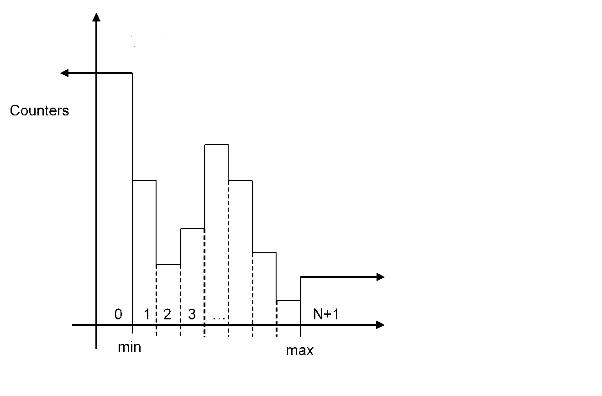
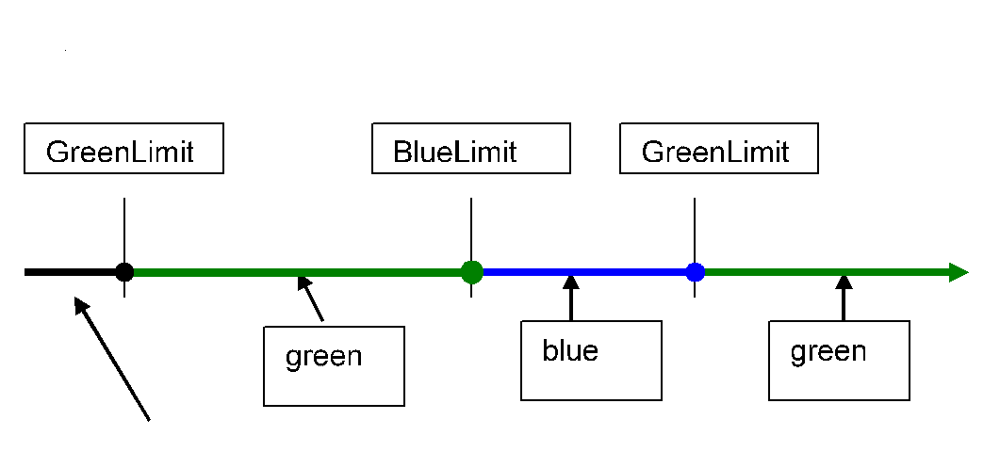

= General Description

This document specifies the Statistics Measure feature of the TITANSim CLL.

The EPTF Statistics Measure feature makes it possible to

* Create stand-alone Statistics or Statistics belonging to a given Variable
* Measure statistical data and update the value of Statistics
* Reset Statistics
* Enable/Disable Statistics
* Create an EPTF Variable from a given Statistics

EPTF Statistics can be created in two different ways. The first case is when the Statistics is created belonging to an EPTF Variable. In this case, a certain type of Statistics is created for the given EPTF Variable, and this Statistics is always updated by Statistics Measure if the value of the EPTF Variable changes. Thus, the value of Statistics is available according to push model.

The second case is, if the user creates a stand-alone Statistics of a given type. In this case, no Variable is assigned, it is the user`s responsibility to update the value of this Statistics and add new data to it, when required.

Statistics can have different types:

* `content`: The value of a Variable (it cannot be a stand-alone Statistics)
* `delta`: The new value – the old value (last measured)
* `deltaSum`: The new value – the initial value (first measured)
* `min`: minimal value ever
* `max`: maximal value ever
* `mean`: mean value
* `standardDev`: contains both standard deviation and mean
* `EPS`: measures the number of events during a measurement period (events/sec) and the length of the measurement period (sec). For Variables the events are the refresh events
* `chrono`: measures the time
* `density`: counts the number of values that fall between user defined boundaries. The scale of the boundaries can be set to linear or logarithmic between a minimal and maximal boundary value.
* `percentile95`: statistics values are ordered into increasing order and percentile95 statistics value is calculated as the element at the number of elements * 0.95 position (position is rounded upwards if it is not an integer value). The user should set boundary intervals to quantify the measurement space. The final statistics value will be the upper boundary of the interval in which the percentile95 element falls or the maximum of elements if the percentile95 element is above the higher boundary.
* `percentileP`: this statistic is the general version of percentile95 statistics. The statistics values are ordered into increasing order and p^th^ percentile statistics value is calculated as the element at the number of elements * p^th^ position. The user should set boundary intervals to quantify the measurement space. The final statistics value will be the upper boundary of the interval in which the p percentile element falls.
* `limits`: calculates a `statusLED` based on predefined threshold for certain colors. Also, relative difference to a reference value can be used for the calculation.
* `custom`: provides the ability to the user to create own statistics. The user should register its on custom statistics functions consistently with existing structure of EPTF Statistics Measure feature. The registered custom statistic then can be applied like other statistic type.

The aim of the EPTF Statistics Measure feature is to calculate and handle all these type of Statistics in one component.

To be able to use EPTF Statistics Measure, the user component should extend the `EPTF_StatMeasure_CT` component.

== Detailed Description of Supported Statistics

The statistics that are created for an EPTF Variable updated with a new measured data when the value of Variable is refreshed by the refresh mechanism.

New measured data can be added manually to stand-alone statistics and statistics that belong to an EPTF Variable by the `addData` functions.

=== `Content`

The content statistics is defined to be able to interpret the value of an EPTF Variable as a statistics. This statistics does not contain any data, only the reference to the EPTF Variable.

This statistics cannot be defined for stand-alone statistics, and cannot be reset.

=== `Delta`

The delta statistics measures the difference between the last measured value and the current value.

=== `DeltaSum`

This statistics measures the difference between the current value and the first value after the statistics was reset.

=== `Min`

This statistics measures the minimal value since reset.

[[max]]
=== `Max`

This statistics measures the maximal value since reset.

=== `Mean`

This statistics measures the mean, i.e. the arithmetic average of the data values added since reset.

=== `StandardDev`

This statistics measures the mean and standard deviation, i.e. the arithmetic average and the variance of the data values added since reset.

=== `EPS`

This statistics measures how many new values were added during the measurement period and also the length of the measurement period. Before the value of the statistics is read out the update function should be called. The length of the measurement period can be specified in seconds, or if not specified the time since addition of the first data is used. This statistics can be used to measure the number of events during a certain time (if 1 sec is used for the duration), the average events/sec during the measurement period, or the time during a period.

=== `Chrono`

This statistics measures the time during a user given period, or the elapsed time since the start of the measurement.

[[density]]
=== `Density`

This statistics can measure the number of data falling between user given boundaries. Also the number of data below the minimal and above the maximal boundary is measured.

It is possible the set automatically calculated boundaries between a minimal and maximal value on a linear or a logarithmic scale.

This statistics corresponds to the density function without normalization. If all measured counter is divided by the sum of all counters we will get the density function.

An example measured density statistics is shown on the figure below:

A data value falls into a coloumn if:

* Lower boundary `<= Value < Upper boundary`
* The 0^th^ column measures the number of values that falls below the minimal boundary: `value < min boundary`
* The last column measures the values that larger or equal the maximal boundary: `value <= max boundary`

If there is N boundary specified the number of intervals measured will be N+1.

[[percentile_95]]
=== `Percentile95`

`Percentile95` statistic provides the lowest element from a sequence of numbers that is bigger then the 95 percent of all the elements.

`Percentile95` statistic is based on density (‎<<density, `Density`>>) and max (‎<<max, `Max`>>) statistics. Values are categorized by density statistic. The position of the required element and its boundary is computed incrementally. If the computed boundary is the highest boundary where no upper limit exists, the statistic value will be the maximum of the elements, otherwise statistic value will be the highest limit of the computed boundary.

The precision of the statistic can be improved by defining boundaries more frequently however it results in performance loss. It is recommended that the user creates the boundaries for the necessary precision only.

=== `PercentileP`

`PercentileP` statistic provides the lowest element from a sequence of numbers that is bigger then the p^th^ percent of all the elements. This is a general version of `percentile95` statistics (<<percentile_95, ‎`Percentile95`>>), where p value is set to `_95_`.

`PercentileP` statistic is based on density (<<density, `Density`>>) and max (‎<<max, `Max`>>) statistics. Values are categorized by density statistic. The position of the required element and its boundary is computed incrementally. If the computed boundary is the highest boundary where no upper limit exists, the statistic value will be the maximum of the elements, otherwise statistic value will be the highest limit of the computed boundary.

The precision of the statistic can be improved by defining boundaries more frequently however it results in performance loss. It is recommended that the user creates the boundaries for the necessary precision only.

=== `Limits`

The limits statistics provides a `StatusLED` with the color and the text determined from the last measured data. Each color have a lower limit value. The color of the limits statistics LED will be set to the color whose limit is the highest below the last measured data. If no such limit is found, the color is set to the default color of the limits statistics.

The limits statistics can be calculated from a source variable. The type of the variable can be integer or float. The value of the variable is compared to the limit values and the color of the LED will be set accordingly.

The limits statistics can also have a reference value variable. The type of the reference variable can be integer or float. If specified the value that is compared to the specified LED color limits in this case is the relative difference from the reference value in percentage:

`100*(data-reference)/reference`

The limit values for different colors can be changed anytime. When they are changed, the limits statistics is reset. It is possible to set different limit for the same color more than once.

See the color of the limits statistics in the figure below:

=== `Custom`

Custom statistic enables the user to create her/his own statistics. The functions realizing the new statistic must be registered by the user by providing the statistic name, the previously mentioned custom statistic functions with their current argument list to the `f_EPTF_StatMeasure_newStat` function.

Provided argument list is type of `EPTF_IntegerList` which can be used as a number of pointers to TTCN databases.

Custom statistics and registered functions can be used trough the following interface:

[[new-statistics-function-f-eptf-statmeasure-newstat-custom]]
==== New Statistics Function (`f_EPTF_StatMeasure_newStat_custom`)

Registers the new statistics and creates the statistics also based on provided statistic name, statistic functions and current argument list.

Like other statistics, custom statistic can be created from a variable or can be created stand alone. If statistics is created from a variable, the add data function is called automatically on value changes.

The function also resets and enables the statistic, then calls user defined new statistic function.

[[enable-statistics-function-f-eptf-statmeasure-enabledata-custom]]
==== Enable Statistics Function (`f_EPTF_StatMeasure_enableData_custom`)

Change the state of statistics to enabled. Statistic can only be updated when its state is set to enabled.

If the statistic has been created from a variable, the value changes of its variable will trigger the statistic.

Also user defined enable statistic function is applied here.

[[disable-statistics-function-f-eptf-statmeasure-disabledata-custom]]
==== Disable Statistics Function (`f_EPTF_StatMeasure_disableData_custom`)

Change the state of statistics to disabled. Statistic can not be updated when its state is set to disabled.

If the statistic has been created from a variable, the value changes of its variable will not trigger the statistic.

Also user defined disable statistic function is applied here.

[[reset-statistics-function-f-eptf-statmeasure-resetstat-custom]]
==== Reset Statistics Function (`f_EPTF_StatMeasure_resetStat_custom`)

Reset the statistic.

By default the function only set the statistic state to reset enabled, but doesn’t perform its resetting. It is recommended to act on reset from add data function.

Also user defined reset statistic function is applied here which can override previous behavior if necessary.

[[create-variable-from-statistics-function-f-eptf-statmeasure-createvarfromstat-custom]]
==== Create Variable From Statistics Function (`f_EPTF_StatMeasure_ createVarFromStat_custom`)

The function creates a variable from the statistic by applying user defined create variable from statistics function.

The type of custom statistic is not fixed, therefore user must fix its type and create this function according to it.

The created variable is synchronized automatically to the statistic value of its custom statistic.

[[add-data-function-f-eptf-statmeasure-adddata-custom]]
==== Add Data Function (`f_EPTF_StatMeasure_addData_custom`)

If statistic is enabled, it updates statistics (optionally using the provided new statistic value) and also updates the variable created from the given statistic (if one exists).

It is recommended to act on statistics reset within this function.

[[get-value-function-f-eptf-statmeasure-getstat-custom]]
==== Get Value Function (`f_EPTF_StatMeasure_getStat_custom`)

The function acquires the current value of the custom statistic.

[[stat-value-to-string-function-f-eptf-statmeasure-custom2str]]
==== Stat Value to String Function (`f_EPTF_StatMeasure_custom2str`)

The function converts the current statistic value to string.
