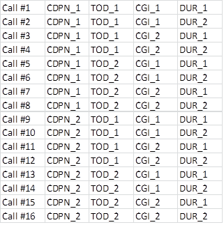

= Permutated Parameters Handling

== Overview

Permutated parameters functions enable you to determine permutations of multiple parameters. Parameters are assigned with their types and values in assignment lists. Permutation of the parameters are calculated with the available functions.

Permutation example:

Types and values:

* `OPN` (other party number): `_OPN_1_`, `_OPN_2_`

* `TOD` (Time Of Day): `_TOD_1_` (Monday morning), `_TOD_2_` (Saturday noon)

* `CGI` (Cell Global Identifier): `_CGI_1_`, `_CGI_2_`

* `DUR` (Call Duration): `_DUR_1_`, `_DUR_2_`

See generated permutations below:

Permutated parameters handling Functions are implemented in the following files:

* __TCCPermutatedParameters_Definitions.ttcn__
* __TCCPermutatedParameters_Functions.ttcn__

== Function Definitions

[source]
----
 function f_PP_getPermutatedParams(
   in integer pl_permutationIdx,
   in EPTF_CharstringList pl_paramTypes,
   in PP_ParamSet pl_assignmentList
) return PP_ParamSet
----

Returns a parameter set calculated from the index of the permutation. The values of the parameters are composed into the prefix field.

[source]
----
function f_PP_countPermutations(
  in EPTF_CharstringList pl_paramTypes,
  in PP_ParamSet pl_assignmentList
) return integer
----

Calculates the permutations of the parameters, using the parameter types as filters. Permutations are calculated by multiplying the number of parameters belonging to different types.

[source]
----
function f_PP_divideValuesOfTypes(
  in EPTF_CharstringList pl_paramTypes,
  in PP_ParamSet pl_assignmentList,
  in integer pl_LGenIdx,
  in integer pl_noOfLGens) return PP_ParamSet
----

Function returns a portion of parameters. The portion is calculated from the portion (ie LGen) index and number of portions (ie number of LGens).

[source]
----
function f_PP_countValuesOfTypes(
  in EPTF_CharstringList pl_paramTypes,
  in PP_ParamSet pl_assignmentList
  ) return integer \{
----

Returns the number of values present in the assignment list, filtered for the types requested.

[source]
----
public function f_PP_normalizeParams(
  in PP_ParameterAssignmentList pl_assignmentList,
  out PP_ParamSet pl_normalizedParams)
----

Function to be used on assignment list to group the values belonging to the same type together. The functions below can only work on normalized parameters.

[source]
----
public function f_PP_getParamValueFromSet(
  in PP_ParamSet pl_paramSet,
  in EPTF_CharstringList pl_typeList
) return EPTF_CharstringList
----

Function returns the single parameter value if its parameter types matches one of the given types.

== Error Messages

None.

== Warning Messages

None.

== Examples

None.

Please contact 'ttcn3 (ETH)' mailing list to get advice on usage.
