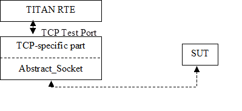

= General

The TCP Test Port makes it possible to execute test suites towards an SUT. The test port offers TCP primitives to the test suite and communicates with the SUT.

The communication between the TCP test port and the TITAN RTE is done by using the API functions described in <<5-references.adoc#_2, [2]>>. The TCP test port then transfers the TCP messages to the SUT.

See the overview of the system below:

