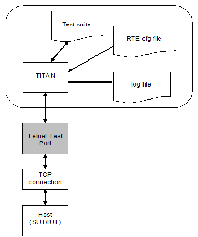

= The Test Port

== Overview

The Telnet test port is an adaptation between the TITAN RTE and the SUT/IUT using standard telnet protocol. The telnet protocol is described in <<7_References.adoc#_5, [5]>>.

See the overview of a test system using Telnet test port below:

In client mode operation the Telnet test port works as a telnet terminal. It can send and receive charstring values. The test port does telnet login automatically on executing the TTCN-3 map operation, unless the test port parameter `CTRL_LOGIN_SKIPPED` is set to `_"yes"_`. (This parameter is case-insensitive.)

In server mode operation the Telnet Test Port works as a telnet server. It can receive commands, in charstring format, from the SUT and it can send the answers received from the test suite back to the SUT. The Test Port automatically sends the prompt with the answer set in Test Port parameter `CTRL_SERVER_PROMPT`, see <<telnet_test_port_parameters_in_the_test_port_configuration_file, Telnet Test Port Parameters in the Test Port Configuration File>>. The Test Port, on executing the TTCN-3 map operation, is waiting for connections on port set in `CTRL_PORTNUM` and does telnet login automatically. The connection to the client can be closed with the appropriate ASP, see <<7_References.adoc#_4, [4]>>.

NOTE: The Test Port never closes the connection to the client automatically.

== Installation

Since the Telnet test port is used as a part of the TTCN-3 test environment this requires TTCN-3 Test Executor to be installed before any operation of the Telnet test port. For more details on the installation of TTCN-3 Test Executor see the relevant section of <<7_References.adoc#_3, [3]>>.

The following is needed to use the Telnet test port:

* Copy the source files (__TELNETasp_PT.cc__, __TELNETasp_PT.hh__) and the definition module (__TELNETasp_PortType.ttcn__) into the directory of the test suite or create symbolic links to them.
* Import the module _TELNETasp_PortType_ (TTCN-3 language, defines the test port) to the module(s) where the Telnet test port is used.
* Generate _Makefile_ and compile the test suite according to <<7_References.adoc#_2, [2]>>.
* Add the required test port parameters to the runtime configuration file as described in section <<telnet_test_port_parameters_in_the_test_port_configuration_file, Telnet Test Port Parameters in the Test Port Configuration File>> of this document.

Do not modify the files supplied otherwise we will not be able to give technical support.

== Configuration

The executable test program behavior is determined via the run-time configuration file. This is a simple text file, which contains various sections (e.g. `[TESTPORT_PARAMETERS]`) after each other. The usual suffix of configuration files is _."cfg"_. For further information on the configuration file see <<7_References.adoc#_2, [2]>>.

[[telnet_test_port_parameters_in_the_test_port_configuration_file]]
=== Telnet Test Port Parameters in the Test Port Configuration File

General parameter:

`DEBUG`

Set to `_"YES"_` if you need to debug the test port, otherwise set to `_"NO"_`.

`MAP_RECV_TIMEOUT`

The receive timeout during map operation in milliseconds. The default value is `_10000 (10 sec)_`. Negative value disables the timeout.

Parameters used by the Telnet test port in client mode operation:

[width="100%",cols="34%,33%,33%",options="header",]
|===============================================================================================================================
|*Type* |*Name* |*Description*
|charstring |`CTRL_HOSTNAME` |Name of the host (IUT)
|integer |`CTRL_PORTNUM` |TCP port number of the host (IUT)
|charstring |`CTRL_USERNAME` |Username used for telnet login
|charstring |`CTRL_PASSWORD` |Password used for telnet login
|charstring |`CTRL_DOMAIN` |Domain used for telnet login
|charstring |`CTRL_READMODE` |When to pass an incoming message to ttcn
|charstring |`PROMPTx` |Prompt string
|charstring |`REGEX_PROMPTx` |Prompt containing wildcards
|charstring |`CTRL_LOGIN_SKIPPED` |User authentication is skipped
|charstring |`CTRL_TERMINAL_TYPE` |Telnet terminal type
|charstring |`CTRL_ECHO` |Telnet echo option
|charstring |`CTRL_CRLF` |Determines if CR should be sent before line feed.
|Integer |`CTRL_WINDOW_WIDTH` |Width for telnet window size option
|integer |`CTRL_WINDOW_HEIGHT` |Height for telnet window size option
|charstring |`CTRL_DETECT_SERVER_DISCONNETED` |Setting test port behaviour when the server terminates the connection
|charstring |`CTRL_DETECT_CONNECTION_` |Setting test port behaviour regarding the handling the result of a connection attempt
|charstring |`CTRL_CLIENT_CLEANUP_LINEFEED` |Enabling the filtering of linefeeds directly preceding prompts from incoming messages
|charstring |`empty_echo` |Enabling send empty message if the command doesn’t have output
|charstring |`raw_regex_prompt`<id> |regcomp based prompt
|===============================================================================================================================

The parameter `CTRL_HOSTNAME` is the hostname of the remote workstation to which the test port will connect. This parameter is mandatory.

The parameter `CTRL_PORTNUM` is the port number of the remote host (specified by `CTRL_HOSTNAME`) that the test port tries to connect to. The value `_"7"_` means the test port will attempt to connect through telnet echo login. In this case the login procedure is skipped. This parameter is mandatory.

The `CTRL_USERNAME` and `CTRL_PASSWORD` parameters are mandatory and are used to authenticate the user on the remote machine.

The parameter `CTRL_DOMAIN` is only used if the host is asking for the domain in the login procedure. This parameter is optional, but a dynamic test case error occurs if the host requests the domain and this parameter is not set.

The parameter `CTRL_READMODE` controls when to pass incoming messages to TTCN. The possible values are:

* `_"buffered"_`
* `_"unbuffered"_`

If it is set to `_"buffered"_` then the test port waits until the prompt arrives and every message received before the prompt is passed to TTCN in one message.

If it is set to `_"unbuffered"_` then the test port passes data received between two new line sequences (or until the prompt) to TTCN.

The default value is `_"buffered"_`.

The parameters `PROMPT` and `REGEX_PROMPT` are of type charstring. `PROMPT` is used to specify the exact prompt strings that are used on the remote machine. `REGEX_PROMPT` serves the same functionality but it can contain wildcards. Multiple `PROMPT` and `REGEX_PROMPT` parameters can be given in the configuration file, but each has to have a number (ID) concatenated to the parameter name (for an example see chapter <<5_examples.adoc#configuration_file, Configuration Fil8>>). Specifying two prompts (either normal or with wildcards) with the same ID results in the latter overriding the former. At least one `PROMPT` or `REGEX_PROMPT` parameter must be provided that is not an empty string.

The `CTRL_LOGIN_SKIPPED` parameter is used when user authentication (username and password) is not required. The possible values are `_"yes"_` and `_"no"_`. The default value is `_"no"_`. The values are case-insensitive.

The parameter `CTRL_TERMINAL_TYPE` specifies the telnet terminal-type option that is described in <<7_References.adoc#_8, [8]>>.

The parameter `CTRL_ECHO` sets telnet echo option, see <<7_References.adoc#_6, [6]>>. Possible values are `_"yes"_` for enabling echo and `_"no"_` for disabling it. Echo is disabled by default. The values are case-insensitive. The telnet echo option (if enabled) is sent to the server regardless of the filter settings.

The term "echo option" is used for the Telnet echo option used during the negotiation of the set up of a Telnet session as defined in <<7_References.adoc#_6, [6]>>.

Parameter `CTRL_CRLF` specifies whether to send CR before LF (as new line) after sending a command. It might be needed to enable this option when connecting to a host running Windows. Possible values are the same as for the parameter `CTRL_ECHO`.

The parameters `CTRL_WINDOW_WIDTH` and `CTRL_WINDOW_HEIGHT` specify the (initial) telnet window size option (see <<7_References.adoc#_7, [7]>>).

The `CTRL_DETECT_SERVER_DISCONNETED` parameter determines the behavior of the test port if the test port detects that the server terminates the communication. If this parameter is set to `_"yes"_`, the test port indicates the connection termination by passing an integer value `_0_` to the test suite. After this the test port has to be unmapped and mapped again if the user wants to use the test port in the actual test case further. If this value is set to `_"no"_`, dynamic test case error occurs when the server terminates the connection. The default value is `_"no"_`. The values are case-insensitive.

The `CTRL_DETECT_CONNECTION_ESTABLISHMENT_RESULT` parameter determines whether the test port should provide feedback to the user in case of a connection attempt. If this parameter is set to `_"yes"_` the test port indicates the result of the connection by passing an integer value `_2_` to the test suite if the attempt succeeded and `_0_` if failed. Thus the user can decide whether to attempt another mapping or discard further communication and neither does a failed connection attempt necessarily result in a dynamic test case error. If this value is set to `_"no"_`, dynamic test case error occurs after a failed connection attempt. The default value is `_"no"_`. The values are case-insensitive.

The table below summarizes the responses to a connection attempt. "CDSD" and "CDCEF" stand for `CTRL_DETECT_SERVER_DISCONNETED` and CTRL_ `DETECT_CONNECTION_ESTABLISHMENT_RESULT`, respectively. The prefix "¬" stands for a value `_"no"_`, omitting the prefix implies the opposite. A dash in each cell separates the successful and failed connection attempts; the integer above the dash means a success, whereas the integer below indicates a failure. Finally a "D" stands for a dynamic test case error and a hyphen means no response.

[cols=",,",options="header",]
|===================
| |CDCER |¬ CDCER
|CDSD |2 / 0 |- / D
|¬CDSD |2 / D |- / D
|===================

The `CTRL_CLIENT_CLEANUP_LINEFEED` parameter determines whether the test port in client mode should filter out linefeeds directly preceding the prompt from the incoming messages received by the client. If this parameter is set to `_"yes"_`, the test port will filter out all such linefeeds. If this value is set to `_"no"_` the messages remain unchanged. The default value is `_"yes"_`. The values are case-insensitive.

NOTE: Only linefeeds between the real message and the prompt are filtered. The mechanism only searches for linefeeds until the first non-linefeed character.

The `empty_echo` parameter determines whether the test port sends an empty charstring if the issued command has no printout. If the parameter is set to `_"yes"_` the test port sends an empty charstring to the test case before the prompt. If the value is set to `_"no"_` the test port does not send the empty charstring before the prompt.

The `raw_regex_prompt<prompt_id>` is used for specify the prompt string used on the remote host as regcomp supported POSIX regexp. It should have at least two subexpressions. The second subexpression selects the prompt. The regexp should match the entire buffer as it received.

Parameters used by the Telnet Test Port in server mode operation:

[width="100%",cols="34%,33%,33%",options="header",]
|=================================================================================================================
|*Type* |*Name* |*Description*
|integer |`CTRL_PORTNUM` |TCP port number to listen for incoming connections(IUT)
|charstring |`CTRL_USERNAME_CLIENT` |Username used for telnet login
|charstring |`CTRL_PASSWORD_CLIENT` |Password used for telnet login
|charstring |`CTRL_LOGIN_SKIPPED` |User authentication is skipped
|charstring |`CTRL_MODE` |Use the Test Port in client or server mode operation
|charstring |`CTRL_SERVER_PROMPT` |Prompt string
|charstring |`CTRL_LOGINNAME_PROMPT` |Prompt string
|charstring |`CTRL_PASSWORD_PROMPT` |Prompt string
|charstring |`CTRL_SERVER_ATTACH_PROMPT` |Enabling attaching of prompts to outgoing messages
|charstring |`CTRL_CLIENT_SERVER_DISCONNETED` |Setting test port behavior when the client terminates the connection
|charstring |`CTRL_SERVER_FAILSAFE_SENDING` |Setting test port behavior when a message sending fails
|=================================================================================================================

The parameter `CTRL_PORTNUM` is the port number of the local host on which the Test Port is listening for new connection from the SUT. This parameter is mandatory.

The Test Port accepts connection from a client which sent a username and password set in the `CTRL_USERNAME_CLIENT` and `CTRL_PASSWORD_CLIENT` parameters.

The `CTRL_LOGIN_SKIPPED` parameter is used when user authentication (username and password) is not required. The possible values are `_"yes"_` and `_"no"_`. The default value is `_"no"_`. The values are case-insensitive.

The `CTRL_MODE` parameter is to choose during run time between client and server mode of operation. Acceptable values are: `_"client"_` or `_"server"_` Default value is `_"client"_`.

The parameter `CTRL_SERVER_PROMPT` is of type charstring and here must be specified the exact prompt string. The Test Port will send this prompt to the client after every message. One `CTRL_SERVER_PROMPT` parameter must be provided.

The `CTRL_LOGINNAME_PROMPT` parameter is the charstring to send to prompt the client for the login name. The default value is: `_"login"_`:

The `CTRL_PASSWORD_PROMPT` parameter is the charstring to send to prompt the client for the password. The default value is: `_"password"_`:

The `CTRL_DETECT_CLIENT_DISCONNECTED` parameter determines the behavior of the test port if the test port detects that the client terminates the communication. If this parameter is set to `_"yes"_`, the test port indicates the connection termination by passing an integer value `_3_` to the test suite. If this value is set to `_"no"_`, the user of the test port in server mode will not receive any notification, and a dynamic test case error might occur (depending on the `CTRL_SERVER_FAILSAFE_SENDING` parameter) when a new message is attempted to be sent. The default value is `_"no"_`. The values are case-insensitive.

The `CTRL_SERVER_ATTACH_PROMPT` parameter determines whether the test port in server mode should attach the server prompt to every outgoing messages sent by the server. If this parameter is set to `_"yes"_`, the test port will attach the prompt to every such message. If this value is set to `_"no"_`, the message remains unchanged. The default value is `_"yes"_`. The values are case-insensitive.

NOTE: Enabling the parameter and setting the prompt to a ``'' string will result in passing a linefeed to the user. This is especially important when it is sent to the client on a connection attempt.

The `CTRL_SERVER_FAILSAFE_SENDING` parameter determines whether the test port in server mode should return and error or a warning in case a message sending fails. If this parameter is set to `_"yes"_`, the test port will return a warning after such sending attempts. If this value is set to `_"no"_`, , an error is returned. The default value is `_"no"_`. The values are case-insensitive.

The `empty_echo` parameter determines whether the test port sends an empty charstring if the issued command has no printout. If the parameter is set to `_"yes"_`, the test port sends an empty charstring to the test case before the prompt. If the value is set to `_"no"_`, the test port do not send the empty charstring before the prompt.
