= Use

For the first time run the Time Profile Editor has to be compiled and configured as described in sections <<2-time_profile_editor.adoc#installation, Installation>> and <<configuration, Configuration>>. TPE can be compiled as a single mode test suite.

The user has to maintain a main TPE configuration file which includes (as a reference in the `[INCLUDE]` section) the generated configuration file. See section <<examples.adoc, Examples>>, for example.

TPE is to be started with the main configuration file, and then a Runtime GUI <<6-references.adoc#_9, ‎[9]>> must be connected to it. The appropriate command format to start the Runtime GUI:

[source]
java –jar TitanRuntimeGUI.jar –c localhost:7331

TPE will initialize the layout as shown in figure below:

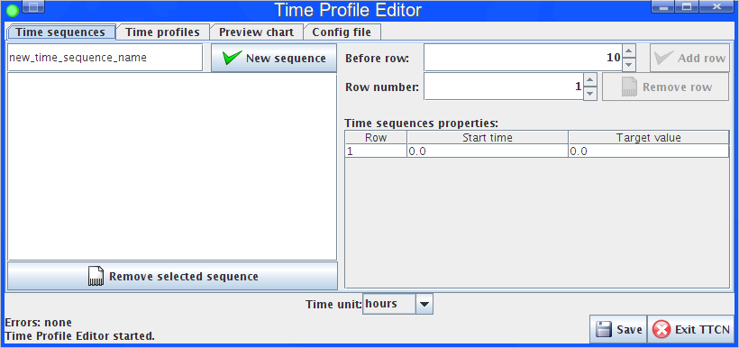

== Creating and Editing Time Sequences

Time profiles are made of time sequences. As the first step the user has to define time sequences. A unique name has to be specified on the left of `New sequence` button.

Figure below shows some time sequences:

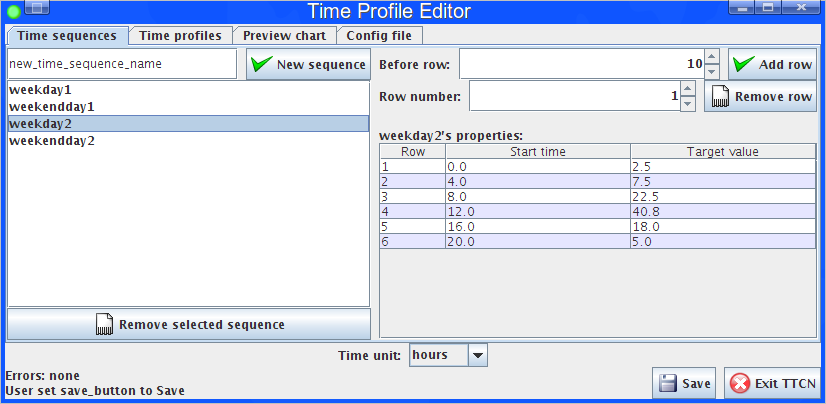

Each time sequence is configurable with a number of "Start time" and "Target value" pairs. The "Target value" is a float value that a traffic case gets as a parameter from the Execution Control. Typical example for the target value is the call per seconds to be reached. The "Start time" specifies the time when the value of the traffic case parameter is changed. The "start time" is counted from the start of the time sequence.

On the right side of the Time sequences tab the user can add and remove rows from the selected time sequence. Each row has to be filled with a start time and a target value.

== Creating and Editing Time Profiles

With at least one time sequence specified, the user can define a time profile. This can be done on the Time Profiles tab.

See Example of time profile in the figure below:

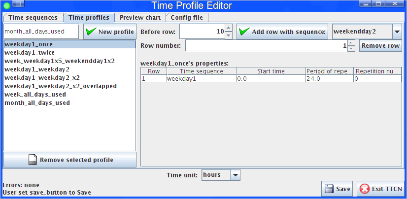

The figure shows the "weekday1_once" profile using the "weekday1" time sequence.

* A time profile consists of a sequence of the following attributes:

* Time sequence: name of the time sequence to use

* Start time: when to start the time sequence within the profile

* Period of repetition: the time sequence is repeated after the specified delay

* Number of repetitions: the time sequence is repeated the given times

The "Preview chart" shows a preview of the selected time profile as shown in Figure below:

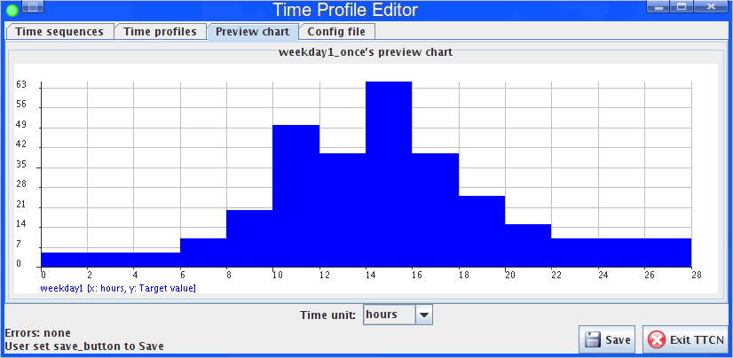

=== Configuring Time Sequence Repetitions

By setting the "Number of repetitions" to `_1_`, the chart shows the time profile program with the two (1 original and 1 repetition) time sequences:

See Simple time profile with a repeating time sequence below:

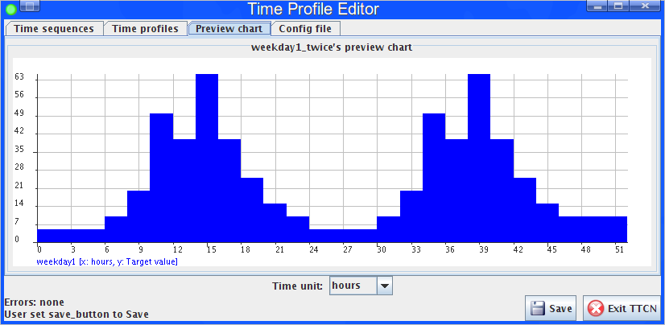

The user can add another time sequence to the time profile. Figure6 shows the added "weekday2" time sequence:

See Time profile with two non-conflicting time sequence below:

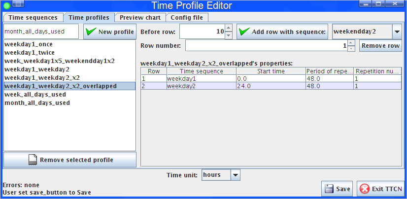

The preview chart shows:

See Preview chart of a time profile with two non-conflicting time sequence below:

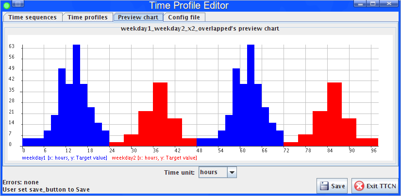

Every time sequence is displayed with a unique color.

If the user leaves the start time at the default `_0.0_` for each time sequence, the two time sequence will conflict with each other. Figure below shows the conflicting settings:

See Time profile with two time conflicting sequences below:

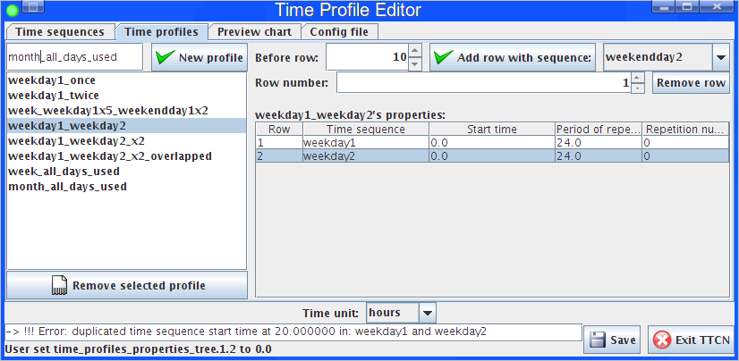

The time profile above shows an error above the status label about duplication in the time profile program. Both "weekday1" and "weekday2" begins at start time `_"0.0"_` in the profile and have a target value setting at `_20.0_` in the time sequences.

NOTE: The time sequences also have conflicting start times at `_0.0_`, `_8.0_`, `_12.0_` and `_16.0_` but the TPE GUI highlights only the last conflicting one.

The preview chart of the conflicting case visualizes the problem:

See Preview chart with two conflicting time sequences below:

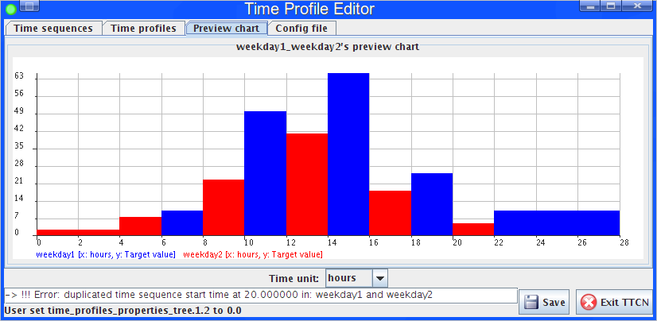

If a conflicting time profile is saved and used in the Execution Control, the actual choice of the target values at the conflicting start times cannot be predicted. If both time sequences have a target value setting at `_"20.0"_` time, the target value actually set in the traffic case can vary between values of the two time sequences between two different test runs.

To solve the conflict between the two time sequences, user must specify the "Start time" and "Period of repetition". In the figure below both "weekday1" and "weekday2" are repeated once, but with "24.0" delay between each other.

=== Creating a Monthly Profile

An example of a monthly profile:

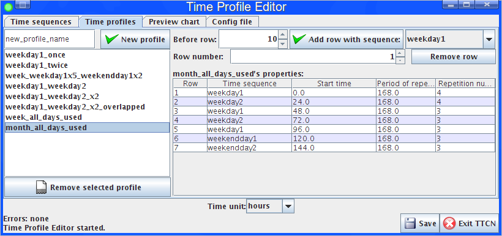

In the profile program above, seven days are distinguished. Two different weekdays are mixed, and there are two different weekend days. Each day is repeated weekly (168 hours). Each day is delayed from the previous with 24 hours. The first two days of the week are repeated 4 times, the other days are repeated 3 times. This profile contains a program for 30 days.

The preview of the monthly profile below:

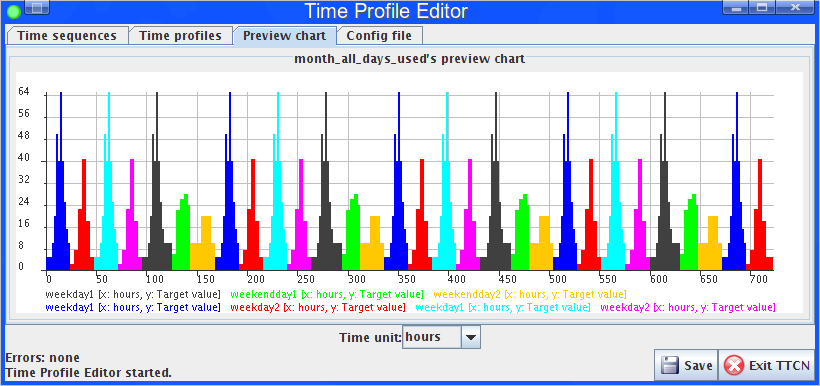

When a time profile program expires (all target value settings are performed) the traffic case runs with the last target value setting.

=== Time Units

The user can change the time unit on the TPE. This causes the generated time sequences and time profiles to last for the chosen time unit. If the user changes the time unit of the monthly profile shown above to "seconds", the time profile would last for `_720_` seconds.

The time unit setting sets the time units globally. It is not possible in this version to define time values with mixed time units.

The saved configuration file must contain the time values in seconds. The Execution Control feature takes the time values always in seconds.

=== Configuration File Preview

The user can also preview the time profile setting to be saved on the "Config file" tab:

See Configuration file preview below:

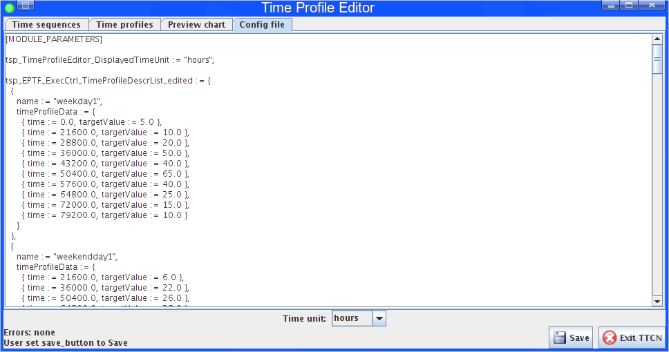

The text widget contains the configuration file data to be saved by the TPE.

=== Saving the Edited Time Sequences and Time Profiles

The `Save` button saves the time sequences and time profiles to the configured file.

=== Exiting the Time Profile Editor

The "Exit TTCN" button orders the TTCN side of the TPE to exit. Until the button is not used, the user can close the GUI part and reconnect to the TTCN part of the TPE. If a Runtime GUI reconnects to the TPE, the GUI is initialized with the current time sequence and time profile model.
