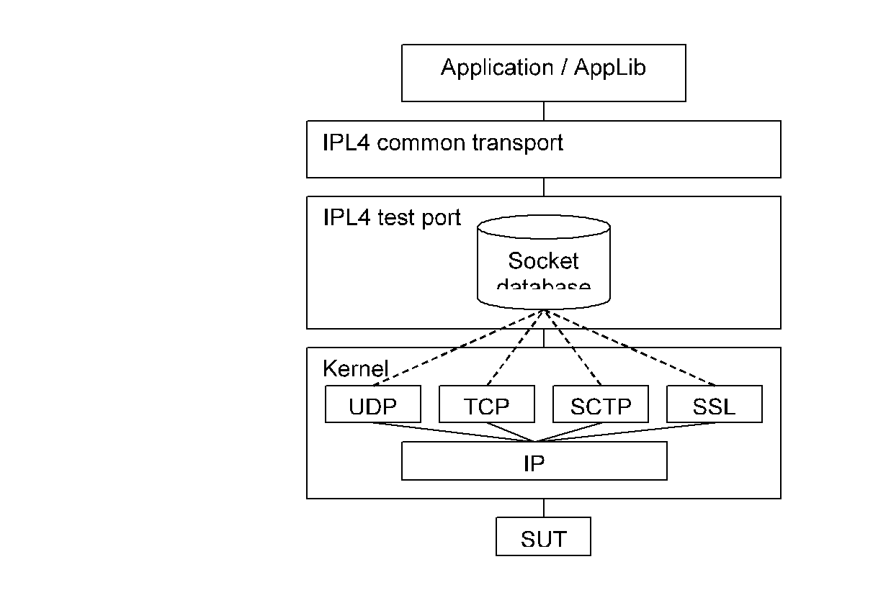
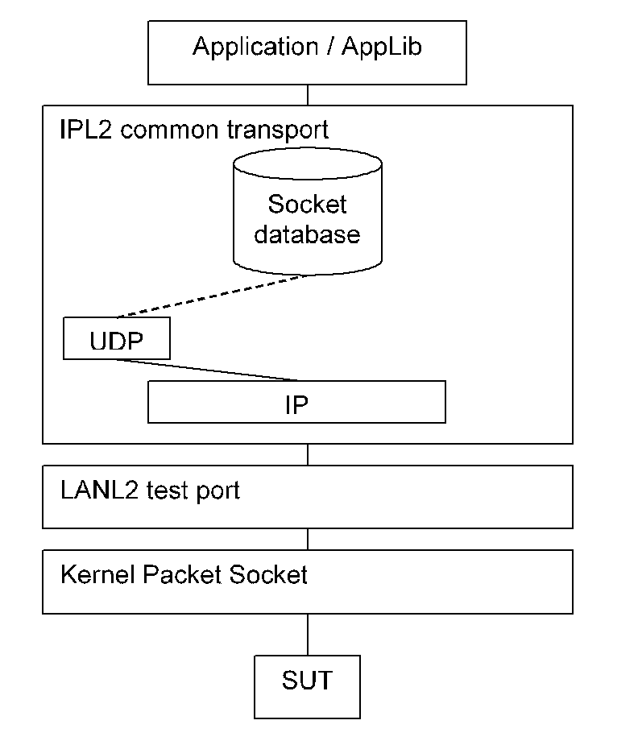

= General Description

This document specifies the Transport control features of the EPTF Core Library.

The EPTF Transport feature makes it possible to:

* Route the incoming and outgoing messages between the components
* Store messages and information in a `FreeBusyQueue`
* Provides unified interface for different testports

== Transport Types

There are component types which implement the unified interface for the different testports.

To be able to use these features, the user component should extend the right EPTF Transport component(s).

[[eptf-transport-ct]]
=== `EPTF_Transport_CT`

This component type is testport-independent. The used testport can be specified runtime by socket.

[[eptf-transportipl4-ct]]
=== `EPTF_TransportIPL4_CT`

This component type uses the IPL4asp testport. It is kernel-based to make the solution simple.

Figure below shows how the functionalities are distributed using the IPL4 transport type:

[[eptf-transportipl2-ct]]
=== `EPTF_TransportIPL2_CT`

The IPL2 transport type moves the socket handling into the user space in order to make it possible to optimize the socket handling independently from the kernel.

Figure below shows how the functionalities are distributed using the IPL2 transport type.

