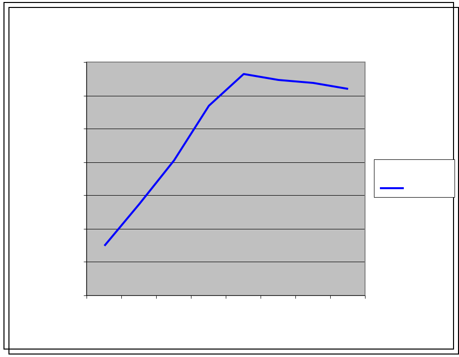
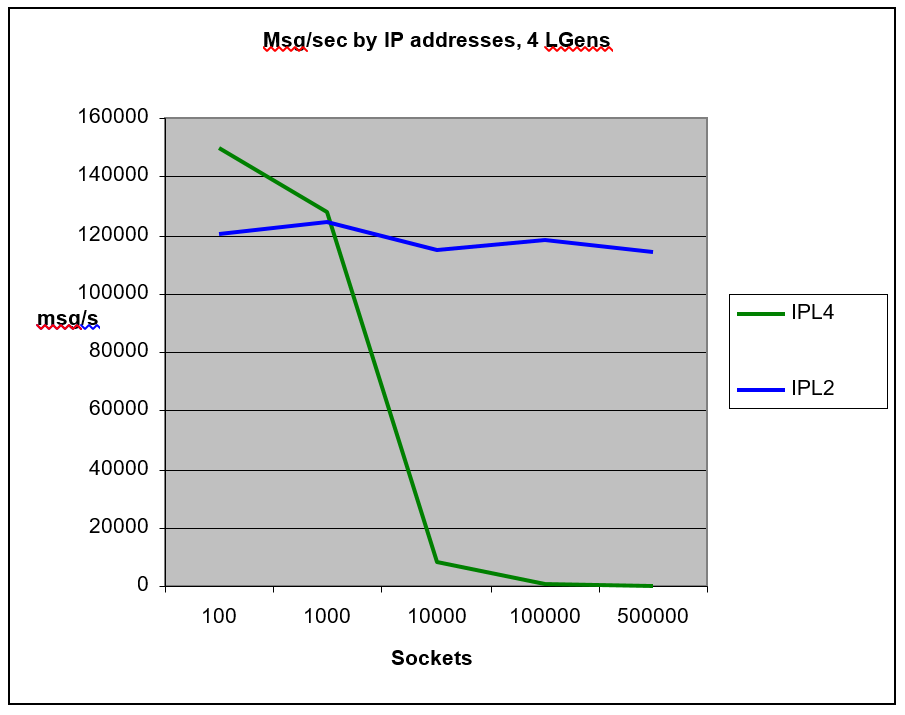
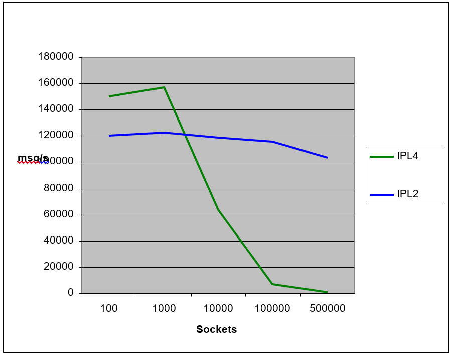

= Transport

== Overview

The EPTF Transport provides many features to help the development of a new transport component. The features are implemented in components. The features are the following:

* The `Routing` feature

With the use of this feature the user can register two call-back functions, which can be used to route the incoming and outgoing messages between the `LoadGen` components.

* The `MessageBufferManager` feature

With this feature the user can store octetstring messages and charstring information. It can be used to store messages until the connection is not alive.

* The `Transport` feature

This feature gives a common layer to send and receive messages in a testport-independent way. It contains also testport-specific transport features. All types implement the same functionality. The testport-independent feature can use any of the implemented testport-specific transports, such as IPL4 transport, IPL2 transport, and so on. The functions of this layer call the functions of the appropriate testport-specific layer.

* The `IPL4` transport feature

This testport-specific transport provides functions to send and receive messages via the IPL4 testport. We can create and delete dynamically interfaces and we can set up in runtime receive altsteps and call-back functions.

* The `IPL2` Transport feature

It supports the communication through the `LANL2` testport.

* `IPsecHandler` feature: With this feature the, user can create secure connections over IP (IPsec) using the IPL4 transport. `IPL2` is not supported.

[[description_of_files_in_this_feature]]
== Description of Files in This Feature

The EPTF Core Library Transport API includes the following files:

* __EPTF_CLL_TransportRouting_Definitions.ttcn__ - This TTCN-3 module contains the type definitions of the EPTF routing feature.
* __EPTF_CLL_TransportRouting_Functions.ttcn__ - This TTCN-3 module contains the implementation of the EPTF routing feature.
* __EPTF_CLL_TransportMessageBufferManager_Definitions.ttcn__ - This TTCN-3 module contains the type definitions of the EPTF `MessageBufferManager` feature
* __EPTF_CLL_TransportMessageBufferManager_Functions.ttcn__ - This TTCN3 module contains the implementation of the EPTF `MessageBufferManager` feature.
* __EPTF_CLL_TransportIPL2_Definitions.ttcn__ - This TTCN-3 module contains the type definitions of the EPTF `IPL2` Communication Transport feature
* __EPTF_CLL_TransportIPL2_Functions.ttcn__ - This TTCN-3 module contains the implementation of the EPTF `IPL2` Communication Transport feature.
* __EPTF_CLL_TransportIPL2_ExternalFunctions.cc__ - This C++ module contains the external C++ function implementations of the EPTF `IPL2` Communication Transport feature.
* __EPTF_CLL_Transport_Definitions.ttcn__ - This TTCN-3 module contains the type definitions of the `EPTF_CLL_Transport` feature
* __EPTF_CLL_Transport_Functions.ttcn__ - This TTCN-3 module contains the implementation of the `EPTF_CLL_Transport` feature.
* __EPTF_CLL_Transport_CommonDefinitions.ttcn__ - This TTCN-3 module contains the common type definitions of the `EPTF_CLL_Transport` feature. These data types are used by all transport types.
* __EPTF_CLL_TransportIPL4_Definitions.ttcn__ - This TTCN-3 module contains the type definitions of the EPTF `IPL4` Communication Transport feature
* __EPTF_CLL_TransportIPL4_Functions.ttcn__ - This TTCN-3 module contains the implementation of the EPTF `IPL4` Communication Transport feature.
* __EPTF_CLL_Transport_IPsecHandler_Definitions.ttcn__ - This TTCN-3 module contains the type definitions of the IPsec support over the EPTF `IPL4` Communication Transport feature
* __EPTF_CLL_Transport_IPsecHandler_Functions.ttcn__ - This TTCN-3 module contains the implementation of the `IPsec` support over the EPTF `IPL4` Communication Transport feature

There are files which remained for backward compatibility purposes only.

* __EPTF_Transport_CommPort_IPL4_Definitions.ttcn__ - This TTCN-3 module contains the obsolete type definitions of the EPTF `IPL4` Communication port feature
* __EPTF_Transport_CommPort_IPL4_Functions.ttcn__ - This TTCN-3 module contains the implementation of the obsolete functions of the EPTF `IPL4` Communication port feature.

[[description_of_required_files_from_other_features]]
== Description of Required Files From Other Features

The EPTF Transport feature is part of the EPTF Core Library (CLL). It relies on several features of the CLL, the TCC Useful Functions, and other TCC products. The user has to obtain different products or files to use the Transport feature, depending on the used transport type.

=== `IPL4` Transport:

[cols=",,",options="header",]
|===================================================================
.47+<|CLL .4+<|Base |__EPTF_CLL_Base_Functions.ttcn__
|__EPTF_CLL_Base_ExternalFunctions.cc__
|__EPTF_CLL_Base.grp__
|__EPTF_CLL_Base_Definitions.ttcn__
.9+<|Common |__EPTF_CLL_Common_Functions.ttcn__
|__EPTF_CLL_Common.grp__
|__EPTF_CLL_Common_RndDefinitions.ttcn__
|__EPTF_CLL_Common_RndFunctions.ttcn__
|__EPTF_CLL_Common_IndexArrayDefinitions.ttcn__
|__EPTF_CLL_Common_ExternalFunctions.cc__
|__EPTF_CLL_Common_Definitions.ttcn__
|__EPTF_CLL_Common_IndexArrayFunctions.ttcn__
|__EPTF_CLL_Common_PrivateDebugDefinitions.ttcnpp__
.4+<|FreeBusyQueue |__EPTF_CLL_FBQ_Definitions.ttcn__
|__EPTF_CLL_FreeBusyQueue.grp__
|__EPTF_CLL_FBQ_PrivateFunctions.ttcn__
|__EPTF_CLL_FBQ_Functions.ttcn__
.7+<|HashMap |EPTF_CLL_HashMap.grp
|__EPTF_CLL_HashMapOct2Int_ExternalFunctions.cc__
|__EPTF_CLL_HashMapInt2Int_Functions.ttcn__
|__EPTF_CLL_HashMapStr2Int_Functions.ttcn__
|__EPTF_CLL_HashMapInt2Int_ExternalFunctions.cc__
|__EPTF_CLL_HashMapOct2Int_Functions.ttcn__
|__EPTF_CLL_HashMapStr2Int_ExternalFunctions.cc__
.3+<|Logging |__EPTF_CLL_Logging_Functions.ttcn__
|__EPTF_CLL_Logging.grp__
|__EPTF_CLL_Logging_Definitions.ttcn__
.16+<|Transport |__EPTF_CLL_TransportMessageBufferManager_Functions.ttcn__
|__EPTF_CLL_TransportRouting_Functions.ttcn__
|__EPTF_CLL_TransportCommPortIPL4_Functions.ttcn__
|__EPTF_CLL_TransportCommPortIPL4_Definitions.ttcn__
|__EPTF_CLL_TransportRouting_Definitions.ttcn__
|__EPTF_CLL_Transport_CommonDefinitions.ttcn__
|__EPTF_CLL_TransportMessageBufferManager_Definitions.ttcn__
|__EPTF_CLL_Transport_IPsecHandler_Definitions.ttcn__
|__EPTF_CLL_Transport_IPsecHandler_Functions.ttcn__
|__EPTF_CLL_Transport_IPsecHandler_Logging_Client_Definitions.ttcn__
|__EPTF_CLL_Transport_IPsecHandler_Logging_Client_Functions.ttcn__
|__EPTF_CLL_Transport_IPsecHandler_Logging_CommonDefinitions.ttcn__
|__EPTF_CLL_Transport_IPsecHandler_Logging_Definitions.ttcn__
|__EPTF_CLL_Transport_IPsecHandler_Logging_Functions.ttcn__
|__EPTF_CLL_Transport_IPsecHandler_Logging_Server_Definitions.ttcn__
|__EPTF_CLL_Transport_IPsecHandler_Logging_Server_Functions.ttcn__
.4+<|Variable |EPTF_CLL_Variable.grp
|__EPTF_CLL_Variable_Definitions.ttcn__
|__EPTF_CLL_Variable_Functions.ttcn__
|__EPTF_CLL_Variable_ExternalFunctions.cc__
.15+<|TCCUsefulFunctions .15+^.^| |_TCCInterface.cc_
|__TCCFileIO_Functions.ttcn__
|_TCCFileIO.cc_
|__TCCDateTime_Functions.ttcn__
|__TCCInterface_Functions.ttcn__
|__TCCInterface_ip.h__
|_TCCDateTime.cc_
|__TCCIPsec_Definitions.ttcn__
|__TCCIPsec_Functions.ttcn__
|_TCCIPsec.cc_
|__TCCIPsec_XFRM.hh__
|__TCCIPsec_XFRM_SA.cc__
|__TCCIPsec_XFRM.cc__
|__TCCIPsec_XFRM_Definitions.ttcn__
|__TCCIPsec_XFRM_SP.cc__
.8+<|TestPorts .7+^.^|IPL4asp |__IPL4asp_PT.hh__
|__IPL4asp_PortType.ttcn__
|__IPL4asp_discovery.cc__
|__IPL4asp_PT.cc__
|__IPL4asp_Types.ttcn__
|__IPL4asp_protocol_L234.hh__
|__IPL4asp_Functions.ttcn__
|Socket_API |__Socket_API_Definitions.ttcn__
|===================================================================

=== IPL2 Transport:

[cols=",,",options="header",]
|==================================================================
.47+^.^|CLL .3+^.^|Base |EPTF_CLL_Base_Functions.ttcn
| |__EPTF_CLL_Base_ExternalFunctions.cc__
| |__EPTF_CLL_Base_Definitions.ttcn__
| .8+^.^|Common |__EPTF_CLL_Common_Functions.ttcn__
| |__EPTF_CLL_Common_RndDefinitions.ttcn__
| |__EPTF_CLL_Common_RndFunctions.ttcn__
| |__EPTF_CLL_Common_IndexArrayDefinitions.ttcn__
| |__EPTF_CLL_Common_ExternalFunctions.cc__
| |__EPTF_CLL_Common_Definitions.ttcn__
| |__EPTF_CLL_Common_IndexArrayFunctions.ttcn__
| |__EPTF_CLL_Common_PrivateDebugDefinitions.ttcnpp__
| .3+^.^|FreeBusyQueue |__EPTF_CLL_FBQ_Definitions.ttcn__
| |__EPTF_CLL_FBQ_PrivateFunctions.ttcn__
| |__EPTF_CLL_FBQ_Functions.ttcn__
| .6+^.^|HashMap |__EPTF_CLL_HashMapOct2Int_ExternalFunctions.cc__
| |__EPTF_CLL_HashMapInt2Int_Functions.ttcn__
| |__EPTF_CLL_HashMapStr2Int_Functions.ttcn__
| |__EPTF_CLL_HashMapInt2Int_ExternalFunctions.cc__
| |__EPTF_CLL_HashMapOct2Int_Functions.ttcn__
| |__EPTF_CLL_HashMapStr2Int_ExternalFunctions.cc__
| .2+^.^|Logging |E__PTF_CLL_Logging_Functions.ttcn__
| |__EPTF_CLL_Logging_Definitions.ttcn__
| .7+^.^|RedBlackTree |__EPTF_CLL_RBtree_Definitions.ttcn__
| |__EPTF_CLL_RBtreeFloat_Functions.ttcn__
| |__EPTF_CLL_RBtree_Functions.ttcn__
| |__EPTF_CLL_RBtree_PrivateFunctions.ttcn__
| |__EPTF_CLL_RBtreeInteger_Functions.ttcn__
| |__EPTF_CLL_RBtreeFloat_PrivateFunctions.ttcn__
| |__EPTF_CLL_RBtreeInteger_PrivateFunctions.ttcn__
| .5+^.^|Scheduler |__EPTF_CLL_RBTScheduler_Functions.ttcnpp__
| |__EPTF_CLL_Scheduler_Functions.ttcnin__
| |__EPTF_CLL_RBTScheduler_Definitions.ttcnpp__
| |__EPTF_CLL_Scheduler_Definitions.ttcnin__
| |__EPTF_CLL_Scheduler_Definitions.ttcn__
| .2+^.^|Semaphore |__EPTF_CLL_Semaphore_Definitions.ttcn__
| |__EPTF_CLL_Semaphore_Functions.ttcn__
| .8^.^|Transport |__EPTF_CLL_TransportMessageBufferManager_Functions.ttcn__
| |__EPTF_CLL_TransportRouting_Functions.ttcn__
| |__EPTF_CLL_TransportCommPortIPL2_Functions.ttcn__
| |__EPTF_CLL_TransportCommPortIPL2_Definitions.ttcn__
| |__EPTF_CLL_TransportCommPortIPL2_ExternalFunctions.cc__
| |__EPTF_CLL_TransportRouting_Definitions.ttcn__
| |__EPTF_CLL_Transport_CommonDefinitions.ttcn__
| |__EPTF_CLL_TransportMessageBufferManager_Definitions.ttcn__
| .3+^.^|Variable |__EPTF_CLL_Variable_Definitions.ttcn__
| |__EPTF_CLL_Variable_Functions.ttcn__
| |__EPTF_CLL_Variable_ExternalFunctions.cc__
|TCCUsefulFunctions | |_TCCInterface.cc_
| .13+^.^| |__TCCFileIO_Functions.ttcn__
| |__TCCMaths_GenericTypes.ttcn__
| |__TCCConversion_Functions.ttcn__
| |_TCCFileIO.cc_
| |_TCCConversion.cc_
| |_TCCMaths.cc_
| |_TCCSystem.cc_
| |__TCCSystem_Functions.ttcn__
| |__TCCDateTime_Functions.ttcn__
| |__TCCInterface_Functions.ttcn__
| |__TCCInterface_ip.h__
| |__TCCMaths_Functions.ttcn__
| |_TCCDateTime.cc_
|TestPorts .4+^.^|LANL2asp |__LANL2asp_PT.hh__
| |__LANL2asp_PT.cc__
| |__LANL2asp_Types.ttcn__
| |__LANL2asp_PortType.ttcn__
| |Socket_API |__Socket_API_Definitions.ttcn__
|ProtocolModules |COMMON |__General_Types.ttcn__
| .2+^.^|IP |__IP_EncDec.cc__
| |IP_Types.ttcn
| |TCP |__TCP_Types.ttcn__
|==================================================================

=== Common Transport

[cols=",,",options="header",]
|===================================================================
|CLL |Base |__EPTF_CLL_Base_Definitions.ttcn__
| | |__EPTF_CLL_Base_ExternalFunctions.cc__
| | |__EPTF_CLL_Base_Functions.ttcn__
| |Common |__EPTF_CLL_Common_Definitions.ttcn__
| | |__EPTF_CLL_Common_ExternalFunctions.cc__
| | |__EPTF_CLL_Common_Functions.ttcn__
| | |__EPTF_CLL_Common_IndexArrayDefinitions.ttcn__
| | |__EPTF_CLL_Common_IndexArrayFunctions.ttcn__
| | |__EPTF_CLL_Common_PrivateDebugDefinitions.ttcnpp__
| | |__EPTF_CLL_Common_RndDefinitions.ttcn__
| | |__EPTF_CLL_Common_RndFunctions.ttcn__
| |FreeBusyQueue |__EPTF_CLL_FBQ_Definitions.ttcn__
| | |__EPTF_CLL_FBQ_Functions.ttcn__
| | |__EPTF_CLL_FBQ_PrivateFunctions.ttcn__
| |HashMap |__EPTF_CLL_HashMapInt2Int_ExternalFunctions.cc__
| | |__EPTF_CLL_HashMapInt2Int_Functions.ttcn__
| | |__EPTF_CLL_HashMapOct2Int_ExternalFunctions.cc__
| | |__EPTF_CLL_HashMapOct2Int_Functions.ttcn__
| | |__EPTF_CLL_HashMapStr2Int_ExternalFunctions.cc__
| | |__EPTF_CLL_HashMapStr2Int_Functions.ttcn__
| |Logging |__EPTF_CLL_Logging_Definitions.ttcn__
| | |__EPTF_CLL_Logging_Functions.ttcn__
| |RedBlackTree |__EPTF_CLL_RBtree_Definitions.ttcn__
| | |__EPTF_CLL_RBtree_Functions.ttcn__
| | |__EPTF_CLL_RBtree_PrivateFunctions.ttcn__
| | |__EPTF_CLL_RBtreeFloat_Functions.ttcn__
| | |__EPTF_CLL_RBtreeFloat_PrivateFunctions.ttcn__
| | |__EPTF_CLL_RBtreeInteger_Functions.ttcn__
| | |__EPTF_CLL_RBtreeInteger_PrivateFunctions.ttcn__
| |Scheduler |__EPTF_CLL_RBTScheduler_Definitions.ttcnpp__
| | |__EPTF_CLL_RBTScheduler_Functions.ttcnpp__
| | |__EPTF_CLL_Scheduler_Definitions.ttcn__
| | |__EPTF_CLL_Scheduler_Definitions.ttcnin__
| | |__EPTF_CLL_Scheduler_Functions.ttcnin__
| |Semaphore |__EPTF_CLL_Semaphore_Definitions.ttcn__
| | |__EPTF_CLL_Semaphore_Functions.ttcn__
| |Transport |__EPTF_CLL_Transport_CommonDefinitions.ttcn__
| | |__EPTF_CLL_Transport_Definitions.ttcn__
| | |__EPTF_CLL_Transport_Functions.ttcn__
| | |__EPTF_CLL_TransportCommPortIPL2_Definitions.ttcn__
| | |__EPTF_CLL_TransportCommPortIPL2_ExternalFunctions.cc__
| | |__EPTF_CLL_TransportCommPortIPL2_Functions.ttcn__
| | |__EPTF_CLL_TransportCommPortIPL4_Definitions.ttcn__
| | |__EPTF_CLL_TransportCommPortIPL4_Functions.ttcn__
| | |__EPTF_CLL_TransportMessageBufferManager_Definitions.ttcn__
| | |__EPTF_CLL_TransportMessageBufferManager_Functions.ttcn__
| | |__EPTF_CLL_TransportRouting_Definitions.ttcn__
| | |__EPTF_CLL_TransportRouting_Functions.ttcn__
| | |__EPTF_CLL_Transport_IPsecHandler_Definitions.ttcn__
| | |__EPTF_CLL_Transport_IPsecHandler_Functions.ttcn__
| | |__EPTF_CLL_Transport_IPsecHandler_Logging_Client_Definitions.ttcn__
| | |__EPTF_CLL_Transport_IPsecHandler_Logging_Client_Functions.ttcn__
| | |__EPTF_CLL_Transport_IPsecHandler_Logging_CommonDefinitions.ttcn__
| | |__EPTF_CLL_Transport_IPsecHandler_Logging_Definitions.ttcn__
| | |__EPTF_CLL_Transport_IPsecHandler_Logging_Functions.ttcn__
| | |__EPTF_CLL_Transport_IPsecHandler_Logging_Server_Definitions.ttcn__
| | |__EPTF_CLL_Transport_IPsecHandler_Logging_Server_Functions.ttcn__
| |Variable |__EPTF_CLL_Variable_Definitions.ttcn__
| | |__EPTF_CLL_Variable_ExternalFunctions.cc__
| | |__EPTF_CLL_Variable_Functions.ttcn__
|TestPorts |IPL4asp |__IPL4asp_discovery.cc__
| | |__IPL4asp_Functions.ttcn__
| | |__IPL4asp_PortType.ttcn__
| | |__IPL4asp_protocol_L234.hh__
| | |__IPL4asp_PT.cc__
| | |__IPL4asp_PT.hh__
| | |__IPL4asp_Types.ttcn__
| |LANL2asp |L__ANL2asp_PortType.ttcn__
| | |__LANL2asp_PT.cc__
| | |__LANL2asp_PT.hh__
| | |__LANL2asp_Types.ttcn__
| |Socket_API |__Socket_API_Definitions.ttcn__
|TCCUsefulFunctions | |_TCCConversion.cc_
| | |__TCCConversion_Functions.ttcn__
| | |TCCDateTime.cc
| | |__TCCDateTime_Functions.ttcn__
| | |TCCFileIO.cc
| | |__TCCFileIO_Functions.ttcn__
| | |_TCCInterface.cc_
| | |__TCCInterface_Functions.ttcn__
| | |__TCCInterface_ip.h__
| | |_TCCMaths.cc_
| | |__TCCMaths_Functions.ttcn__
| | |__TCCMaths_GenericTypes.ttcn__
| | |TCCSystem.cc
| | |__TCCSystem_Functions.ttcn__
| | |__TCCIPsec_Definitions.ttcn__
| | |__TCCIPsec_Functions.ttcn__
| | |_TCCIPsec.cc_
| | |__TCCIPsec_XFRM.hh__
| | |__TCCIPsec_XFRM_SA.cc__
| | |__TCCIPsec_XFRM.cc__
| | |__TCCIPsec_XFRM_Definitions.ttcn__
| | |__TCCIPsec_XFRM_SP.cc__
|ProtocolModules |COMMON |__General_Types.ttcn__
| |IP |__IP_EncDec.cc__
| | |__IP_Types.ttcn__
| |TCP |__TCP_Types.ttcn__
|===================================================================

== Installation

Since EPTF Transport is used as a part of the TTCN-3 test environment this requires TTCN-3 Test Executor to be installed before any operation of these functions. For more details on the installation of TTCN-3 Test Executor see the relevant section of <<8-references.adoc#_2, ‎[2]>>.

If not otherwise noted in the respective sections, the following are needed to use EPTF Transport:

* Copy the files listed in section <<description_of_files_in_this_feature, Description of Files in This Feature>> and <<description_of_required_files_from_other_features, Description of Required Files From Other Features>> to the directory of the test suite or create symbolic links to them.
* Import the Transport demo or write your own application using Transport.
* Create _Makefile_ or modify the existing one. For more details see the relevant section of <<8-references.adoc#_2, [2]>>.
* Edit the config file according to your needs; see following section <<configuration, Configuration>>.

[[configuration]]
== Configuration

The executable test program behavior is determined through the run-time configuration file. This is a simple text file which contains various sections. The usual suffix of configuration files is _.cfg_. For further information on the configuration file, see <<8-references.adoc#_2, [2]>>.

We do not need any configuration parameter to use this features.

== Usage

The user needs only extend and configure the right feature component in the user defined component.

=== Choose Testport

The goal of the transport layer is to provide a testport-independent API. The signatures of the functions of all transport component types are the same. Therefore if you want to change the used testport, you need to change your code minimally, or even do not need to change it.

You can choose from the testports to be used either compile-time, or runtime.

[[using-the-eptf-transport-common-ct]]
==== Using the `EPTF_Transport_Common_CT`

Each function of the transport API has a parameter of type `EPTF_Transport_TransportType`. If you used the `EPTF_Transport_Common_CT` component type as transport layer, this transport type determines the testport-dependent transport layer to be used. The supported testport-dependent transport types are IPL2 and IPL4 now. Implicitly IPL2 means that the `EPTF_CommPort_IPL2_CT` is the used layer, and IPL4 means that the `EPTF_CommPort_IPL4_CT` is.

There `f_EPTF_Transport_init` function of the `EPTF_Transport_Common_CT` is a bit special. If you use IPL2 or IPL4 as the `pl_transportType` parameter, you can use only the same value in each transport function in the following.

However, you can use the element `"ALL"` of the `EPTF_Transport_TransportType` enumerated. This means that you can use all the supported testport-dependent transport types later. In all other functions you must use a testport-specific element of this enumerated.

If you open a `connection` using one testport, e.g. `IPL2`, you must use the same `EPTF_Transport_TransportType` element during the whole process of the connection.

==== Using Testport-Specific Transport Layer

If you know that you do not want to use more than one testport-specific transport layer, and you know which one you want to use, you can use the specific transport layer directly. That is you do not have to use the `EPTF_Transport_Common_CT`, but you can use either the `EPTF_CommPort_IPL2_CT`, or the `EPTF_CommPort_IPL4_CT`. You do not have to change your code, only in the import part you have to import the appropriate testport-specific function modules, and your component must extend the appropriate transport component type.

=== Calculate the Length of a Message

Users can register callback functions to calculate the length of the received messages. The registered function must be the type declared in the `EPTF_Transport_GetMsgLen_FT` function type.

The callback functions can be registered by `LoadGen` types. These `LoadGen` types are identified by a charstring name. To open a connection, the name of the `LoadGen` type must be specified. When a packet arrives, the associated `LoadGen` type is retrieved from the connection ID, and the transport calls the appropriate message length calculating function.

The message length calculating function receives the type of the transport, the available stream in octetstring format, and an integer list, which can be specified at the registration of the callback.

=== Processing the Messages

Users can register callback functions which are called when a whole message arrived.

These callback functions can be registered by `LoadGen` types, just like the message length calculating functions.

It is very important to mention that in the message handler(s) it is forbidden to use any blocking function calls (for example, any functions which are using semaphores or blocking operations like receive and timeout statements). Otherwise it could lead to the corruption of the internal variables (see TR number HN51809)

=== Comparison of the Testport-Specific Transport Layers

There are different transports which use different testports. The reason is that they have different advantages and disadvantages. The following sections contain the comparison of them.

==== Socket Handling

`EPTF_CommPort_IPL4_CT`

The socket handling of the `EPTF_CommPort_IPL4_CT` transport type is based on the kernel.

`EPTF_CommPort_IPL2_CT`

The socket handling of this transport type is moved into the user-space to make it possible to optimize independently from the kernel.

==== Scalability

The LINUX kernel implementations generally use one CPU for routing and packet decoding. Therefore this is not scalable even if we use more CPUs.

One of the reasons of moving the socket handling into user space was to make the transport layer scalable.

Figure below shows the measurement results of the scalability of the IPL2 transport type:

==== Handling Numerous Sockets

Another reason of moving the socket handling into user space was that the general LINUX kernel implementations are optimized for cases when there are few IP addresses in the host machine, and from these few IP addresses we want to open socket connections to several different IP addresses. Therefore if you want to optimize for other cases, the kernel must be changed.

First figure below shows the performance changes when there are many IP addresses to open several sockets. Second figure below shows the performance changes when there are many ports to open several sockets. Both cases the performance of the IPL4 transport downs steeply while the performance of the IPL2 transport remains almost unchanged.

See Performance changes increasing the IP addresses below:

See Performance changes by increasing the amount of ports below:

==== Supported Protocols

* `EPTF_CommPort_IPL4_CT`
** UDP
** TCP
** SSL
** SCTP

* `EPTF_CommPort_IPL2_CT`
** UDP

==== Required Rights

`EPTF_CommPort_IPL4_CT`

This transport type does not require special rights.

`EPTF_CommPort_IPL2_CT`

Since the `EPTF_CommPort_IPL2_CT` is based on the `LANL2` testport, its use requires root permissions.

=== IPL2 Routing

`IPL2` Common Transport provides routing table support. The host routing table can be read into TTCN3 structure by the `f_EPTF_CommPort_IPL2_getHostRoutingTable` function. This function works only on Linux platform, and returns the routing table of the host where the PTC that calls this function is running. On Solaris machines empty routing table is returned.

The returned routing table, or custom routing table can be set into the database of IPL2 Common Transport by the function `f_EPTF_CommPort_IPL2_setRouteTable`. This function clears the previous entries and sets the new routing table. When the Common Transport is initialized, the host routing table is automatically loaded into the database.

Custom entries can be added to existing routing table database by the function `f_EPTF_CommPort_IPL2_addRoute`. The `…setRouteTable` and `…addRoute` functions normalize the routing table automatically by calling the `f_EPTF_CommPort_IPL2_normalizeRoutingTable` function. This means that the routing table will contain entries sorted by the networks mask starting from the smallest network.

The IP address of the next hop can be determined by the `f_EPTF_CommPort_IPL2_getNextHop` function. This function uses the routing table database to find out the next hop IP address. The routing table should be normalized.

=== Getting the Next-Hop MAC for an IP Address in IPL2

The MAC address for the next hop of an IP address can be determined by the `f_EPTF_CommPort_IPL2_ARP_getMac` function. This MAC address is where the Ethernet packet should be sent towards the target IP address. This function maintains a MAC address database and uses ARP protocol to find out the MAC address for the next hop of a given IP address. APR requests are sent out by the LANL2 test port. In order to be able to send out the request, the LANL2 test port has to be configured. The `eth_interface_name` test port parameter has to be set to the interface on which the ARP messages will be sent out. The routing table can be used to determine the interface name towards an IP address. Additionally, the `packet_filter` also has to allow the arp protocol.

Only one ARP request is sent out to determine the MAC address of an IP address. Successive calls which require the MAC for the same IP will use the cached value. This means that changes in routing table during execution will be ignored and MAC address stored for an IP will be the same during execution.

If a lot of IP addresses are configured on the same interface, it is recommended to define a sub-network and a common gateway for these addresses using the same interface. This optimizes the speed and memory usage of `IPL2` Common Transport, because otherwise it should store the next-hop MAC addresses for each and every IP address, because the routing table tells that that these IP addresses are on the same network, and can be connected directly. Actually each MAC address will be the same for all of these IP addresses.

However, when the routing table is updated with a gateway through which these IP addresses can be reached will result in storing only the MAC address of the common gateway (which should be the same MAC address as for the IP addresses). It is not necessary to update the host routing table, just the routing table database of the IPL2 Common Transport. For example for the IP address range `_192.168.10.1-192.168.10.255_` the subnet `_192.168.10.0_` could be used with selecting one IP from the range as the gateway, e.g. `_192.168.10.1_`. The subnet mask would be `_255.255.255.0_`. The `…addRoute` function called with these parameters can be used to add the new route to the database.

If there is no route to the target IP address null MAC address is returned. Messages over L2 will not be sent in this case.

IP addresses created by the LAN2 Common Transport (by listen or connect functions), can be used as target addresses for determining the next-hop MAC address. This means that IPL2 Common Transport will reply ARP-requests for these IP addresses automatically.

When messages are sent over the L2 layer the next MAC address for the destination IP address is automatically determined based on the host routing table when the module parameter tsp_EPTF_CommPort_IPL2_dstMacAddr is set to its default value (null address). If this module parameter specifies a non-null MAC address, that MAC address is used as where the messages should be sent. In this case ARP discovery of IP addresses are turned off.

Source MAC addresses are determined automatically by the LANL2 test port. But for MAC discovery to work, the source MAC address has to be specified in the tsp_EPTF_CommPort_IPL2_srcMacAddr module parameter. This parameter is used in the ARP messages as the source MAC address.

NOTE: The source MAC address specified in the `tsp_EPTF_CommPort_IPL2_srcMacAddr` or used in the `f_EPTF_CommPort_IPL2_ARP_getMac` function should be set according to the `eth_interface_name` test port parameter used by the LAN2 test port. Setting the source MAC address incorrectly will result in erroneous network operation and may affect other network connections by for example closing them down temporarily by diverting ARP replies to the wrong address.

=== `IPsec` Handling

With the Transport IPsec handler, the `IPsec` support is provided for the IPL4 transport. If the Common Transport is used, IPL4 should be specified for the transport type.

The IPsec is only available if the `IPsecHandler` is initialized in Transport. This can be done by calling its initializer function `f_EPTF_Transport_IPsecHandler_init_CT`.

To create a secured TCP connection, the following steps should be followed:

1.  Allocate SPI
2.  Create security policy
3.  Create security association
4.  Create TCP connection with `IPL4` Transport connect
5.  Send messages with `IPL4` Transport send
6.  Close the connection with IPL4 Transport disconnect, or Transport reports the connection closed event
7.  Remove the security association
8.  Remove the security policy

Any message sent after SP/SA is created will be encrypted until SP/SA is deleted. All the SP/SA configuration data should be consistently set on both sides of the communication, otherwise the messages will not be sent or received correctly.

All the messages sent by the Transport before the SP/SA is created or after SP/SA is deleted, will not be encrypted.

To remove all SA/SP data from the kernel, the deleteSA/SP functions can be used respectively.

The IPsec data is logged into a file if IPsec logging is enabled when a SA is created.

To enable IPsec logging:

1.  Start the IPsec logging server
2.  Specify the server component reference to the initializer function of Transport IPsec Handler.

The logging server can be started like this:

[source]
----
var EPTF_CLL_Transport_IPsecHandler_Logging_Server_CT vl_loggingServer := EPTF_CLL_Transport_IPsecHandler_Logging_Server_CT.create;

vl_loggingServer.start(f_EPTF_CLL_Transport_IPsecHandler_Logging_Server_behaviour("./", "IPsec.log"));
----

In this case the server will log the IPsec data into the _IPsec.log_ file in the current directory.

Then this component reference must be passed to the IPsec init function:

[source]
----
f_EPTF_Transport_IPsecHandler_init_CT("TransportIPsecHandler",vl_loggingServer);
----

_Permissions:_

Since the IPsec handler uses the kernel with the XFRM API to create secured connections, its use requires root permissions.
