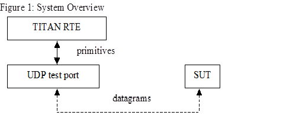

= General

The UDP Test Port makes it possible to execute test suites towards a SUT. The test port offers UDP primitives to the test suite and communicates with the SUT.

The communication between the UDP test port and the TITAN RTE is done by using the API functions described in <<5-references.adoc#_2, [2]>>. The UDP protocol messages are then transferred by the UDP test port to the SUT.

See the overview of the system below:

