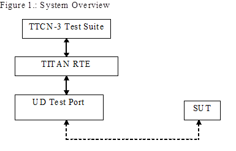

= The Test Port

== Overview

The UD test port offers UD primitives to the test suite in TTCN-3 format. The TTCN-3 definition of the ASPs can be found in a separate TTCN-3 module. This module should be imported into the test suite.

The test port transfers UD primitives towards the TITAN RTE and UD datagrams towards the SUT. The overview of the test system is shown on figure below:

== Installation

Since the UD test port is used as a part of the TTCN-3 test environment this requires TTCN-3 Test Executor to be installed before any operation of the UDP test port. For more details on the installation of TTCN-3 Test Executor see the relevant section of <<6-references.adoc#_2, [2]>>.

When building the executable test suite the libraries provided for the TTCN-3 Test Executor should also be linked into the executable. For more information see also <<6-references.adoc#_2, [2]>>.

== Operation Modes

=== Advanced Mode

==== Description

In advanced mode the test port provides the following functionality:

* open client/server socket
* close client/server socket
* send and receive data

The port can handle several UD sockets.

==== ASP Definition

* `UD_send_data`

* `UD_close`

* `UD_connect`

* `UD_listen`

* `UD_shutdown`

== Configuration

None.

== Start Procedure

=== TTCN-3 Test Executor

Before the executable test suite can be run the TTCN-3 modules and C++ codes should be compiled and linked into an executable program. This process can be automated using the make utility. The way how the _Makefile_ should be generated is described in <<6-references.adoc#_2, [2]>>.

NOTE: The C++ implementation files __UD_PT.hh__ and __UD_PT.cc__ of the test port should be included in the _Makefile_.

If the executable test suite is ready, run it giving the RTE configuration file as argument in your terminal:

[source]
Home> ExecutabletestSuite RTEConfigurationFile.cfg

For more information, see <<6-references.adoc#_2, [2]>>.

== Sending UD ASPs

==== Open a New Server Socket

The opening of a new server socket is requested by the sending of the `UD_listen` message to the test port. The parameter `path` contains the path of the Unix Domain Socket.

The test port answers the listen request with the `UD_listen_result`.

==== Open a New Client Socket

The opening of a new client socket is requested by the sending of the `UD_connect` message to the test port. The parameter `path` contains the path of the Unix Domain Socket.

The test port answers the connect request with the `UD_connect_result`.

The server test port answers the connect request with the `UD_connected`.

==== Sending Data

The data sending is requested with the `UD_send_data` message.

The `data` parameter contains the data to be transmitted.

The `id` specifies the socket used during data sending.

[[close-the-server-socket]]
==== Close the Server Socket.

The close the server socket operation is requested by the `UD_shutdown` message.

The `id` identifies the socket to be closed.

[[close-the-client-socket]]
==== Close the Client Socket.

The close the client socket operation is requested by the `UD_close` message.

The `id` identifies the socket to be closed.

== Receiving UD ASPs

==== Receiving Data

The data receiving is indicated via `UD_send_data` message.

The `data` parameter contains the data to be received.

The `id` specifies the socket used during data sending.

== Stop Procedure

[[ttcn-3-test-executor-0]]
=== TTCN-3 Test Executor

The test port should stop automatically after it finished the execution of all test cases. It closes down the open UD sockets towards the SUT and terminates.

The execution of the test suite can be stopped at any time by pressing `<Cntr>-c`. It will shut down the socket and terminate.
