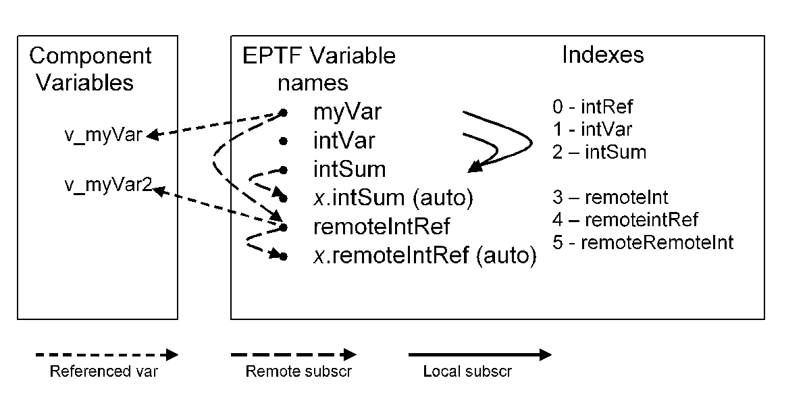

= Examples

The "demo" directory of the deliverable contains the following examples:

* _main.cfg_
* __EPTF_Variable_test.ttcn__

== Configuration File

The used configuration file (_main.cfg_) is for the Variable example is placed in the demo directory.

== Demo Module

The demo module __EPTF_Variable_test.ttcn__illustrates a typical usage of the Variable feature.

There are two main demo configurations. The first configuration uses one component and the second uses several components. The basic behavior of the Variable feature is demonstrated on these test configurations

See Basic Configuration in the figure below:

The left box shows the component variables which are used to create a referenced EPTF Variable. The left column in the right box shows the EPTF Variable names created (auto refers to auto-generated names), and the subscription relation between them. On the right the index of the variables are shown together with the name of the component variable that stores the index.
