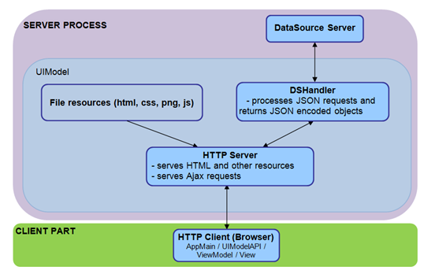
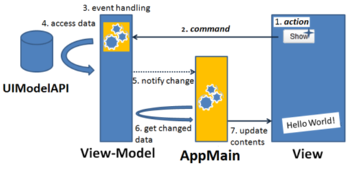
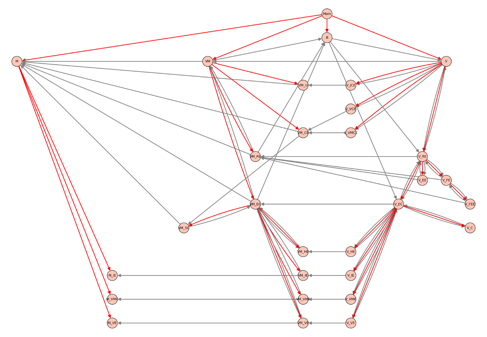
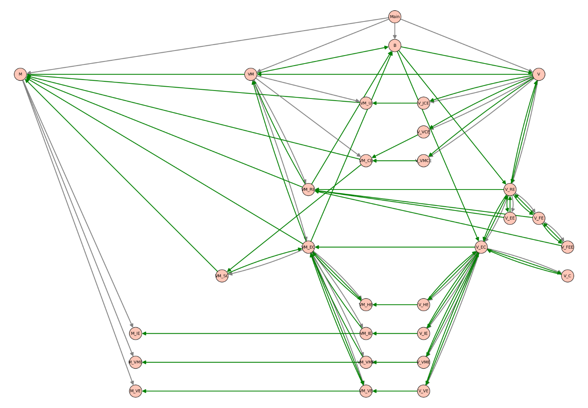

= Functionality

The EPTF Web GUI feature provides the following functionality:

* Provides the framework, which is responsible for the loading and unloading of web applications
* Web Applications: `CustomizableApp`, `RequestTester`, `GuiEditor`
* `CustomizableApp` can show highly customizable GUIs.
* Custom requests can be issued directly to the server with the `DsRestAPI` Console web application.
* The setups that customize the `CustomizableApp` can be edited in `GuiEditor`.

== `DsRestAPI`

The javascript API of `DsRestAPI` is used to communicate with the server. It is taken form the CLL <<5-references.adoc#_3, [3]>>. For more information on the API functions please see <<5-references.adoc#_4, [4]>>.

The API can be easily replaced with another one, so connecting to other services is also possible.

== `WebGUI` Framework

=== General Functionality

When started, the framework will create the application buttons and load the default application if specified. The list of available applications and the default application’s name is contained in _MainConfig.json_.

The framework also handles the loading and unloading the applications. The applications are given the `WebAppModel` at start that can be used to interact with the main configuration and the configuration of the application. It also contains the `SetupModel` which can create, load, and save setups.

[[web_application_interface]]
=== Web Application Interface

The applications must provide the following interface so that they can be integrated into the framework:

* `info()` +
This must return an object with an icon and name property. These will be displayed on the buttons.
* `load(p_webAppModel, p_params, p_framework)` +
This method is called when the application should start. The `webAppModel` is a model which can be used to access the configuration, the API and other useful functions. The parameters contain the application parameters specified in the main configuration or set by other applications. The framework can be used to switch to other applications and to change the parameters of other applications.
* `unload(callback)` +
This method is called when the application should be unloaded (when switching applications).The callback must be called with a boolean `_true_` value for the unload to be completed or `_false_` to cancel the unload.

[[the_setup_descriptor]]
=== The Setup Descriptor

The `CustomizableApp` is used to display setups. Setups describe the user interface that is displayed in the application.

A setup consists of the following files:

* _Request.json_ - contains the request <<5-references.adoc#_4, [4]>>, <<5-references.adoc#_5, [5]>>.
* _ViewModelInstances.json_ - contains the list of viewmodel descriptors.
* _ViewInstances.json_ - contains the list of view descriptors.
* _Imports.json_ - contains the list of import descriptors.
* _Setup.css_ - contains the css of the setup. A normal css file.
* _Setup.html_ - contains the html of the setup. A html snippet which will be inserted into the main html when loading the setup.
* _Desktop.json_ - contains data of the editors in `GuiEditor` (e.g. position, visibility)

The descriptors are json objects with the following members:

* Viewmodel descriptor:
** `class`: +
"the viewmodel class name"
** `dataPathList`: +
[[0,0], [0,1]]: The list of data connections. The data connections point to a request in the request tree.
** `dataPathStrList`: +
the list of data paths represented by strings (e.g. "EntityGroups.Scenarios.ScStart"), used to make it more human readable
** `selectionToControlPathList`: +
same as dataPathList but for selection connections
** `selectionToControlPathStrList“`: +
same as dataPathStrList but for selection connections
** `customData`: +
\{}: an object that can be used to customize the viewmodel instance
* View descriptor:
** `class`: +
"the view class name"
** `viewModelIndexes`: +
[13, 28]: the index of the connected viewmodels
** `parentID`: +
"the parent id of the view"
** `idsCreating`: +
["id13", "id28"]: the list of ids that are the parentIds of other views
** `customData`: +
\{}: an object that can be used to customize the view instance
* Import descriptor:
** `setupName`: +
"the setup name we want to import"
** `parentID`: +
"the parent id where the setup view will be inserted"
** `setupParams`: +
[]: a list of setup parameters
** `requetsPath`: +
[0,1]: the path of a request whose child the setup’s request will become; when undefined, the imported setup’s request will be added to the root request list

=== Models

The framework contains models which can be used to interact with the server.

==== `WebAppModel`

The `webAppModel` is created at start and is given to the applications in their load functions.

It contains functions to interact with the configuration files.

==== `SetupModel`

The setup model handles every setup operation from listing setups to creating new ones and saving them.

It uses the `ImportResolver` when loading a setup that contain imported setups. When importing a setup:

* The setup parameters have to be resolved.
* The request path has to be shifted by the number of new requests.
* The viewmodel indexes have to be shifted by the number of new viewmodel instances.
* The view ids have to be made unique.
* The imported setup html must be inserted as a view.
* The css files have to be merged.

==== `WebAppBase`

A class that can be used as a base class of applications.

Its load function can be called with a list of javascript files, a start function and the API. It will import the javascript files and call the start function with a callback that must be called when it is finished.

=== Common Viewmodels

==== `FileSelector`

The `FileSelector` viewmodel can be used to create a file browser.

=== Common Views

Framework provides common view elements that all applications can use.

==== Aligners

* Base Aligner is responsible for orienting its child views horizontally or vertically, based on the custom data, the child views are positioned proportionately according to the custom data or equally if it is not given. It also provides jQuery UI resizable functionality.
* ElementAligner is derived from the Base Aligner, implementing the same functionality, difference is the subviews given in custom data are the ones aligned, not the child views.

[[autoGUI]]
==== `AutoGUI`

`AutoGUI` is a minimalist display generator for responses. Tree-based display which uses indentation and different colors to separate different levels of the tree, children are nested.

Nodes can be collapsed. Initially the root’s first child subtree is fully expanded.

When a node (or a separator line) which is not a leaf node is clicked the following happens:

* If all of the children are expanded, then they will be collapsed
* If all children collapsed, or only one is expanded then all will be expanded, but only the immediate children, their children may be expanded or not based on if it was previously expanded or not.

When a node which is a leaf node on the lowest level is clicked, a prompt pops up with an input box to change values.

==== Basic Button

Standard HTML Button element with or without image and/or text.

==== Checkbox or Switch

Standard HTML Checkbox element with or without an image of Switch and/or text.

==== ComboBox

Regular combobox, which can have a predefined list and a default value.

==== Condition

A view that only shows one of its connected child views based on the state of the connected viewmodel.

==== Div

Regular container element for other visual elements.

==== Labels

Label: Standard HTML Input element displaying value of a `DataSource` element. Based on custom data it may or may not be changed.

==== Scroll

A scroll bar view that can be used to scroll data that is not currently present in the html.

==== Status LED

Displays an image assigned for certain members of enumerated Status LED `DataSource` types with or without a Label.

==== Tables

* Vertical Table: A table visual element, where rows may be subviews. Data sorting and filtering can be set up.
* Element Table: Based on the Vertical Table. The columns may be subviews.
* Element Table for Large Data: Based on Element Table and Scroll class. Implements streaming data from a larger collection.

==== Tabs

* Base Tabs: A jQuery UI Tabs view.
* Tabs with Data: Either a horizontal or vertical tabs view that display data received from a connected viewmodel.

==== Json editor

A Json editor view that can be used to edit json objects with a json schema.

==== Code editor

A text editor with syntax highlighting, validation and formatting.

==== Context menu

A context menu view.

[[fileselector-0]]
==== `FileSelector`

A file browser view that can be used to browse the http server.

=== Utilities

The framework contains common functions, classes and resources that can be used anywhere.

[[utilities-0]]
==== Utilities

Contains useful functions, like object copying, string operations, etc.

==== `TaskUtils`

Contains several classes and functions that make it easier to manage asynchronous operations

==== `FileLoader`

A small class that makes it easier to load and save a text file.

==== `JsonLoader`

A small class that makes it easier to load and save json files.

==== `JsTreeUtils`

Contains useful functions for dealing with jsTrees.

[[line_drawer]]
==== `LineDrawer`

A utility class that draws svg arrows. Needs two endpoints to draw the arrow. The endpoints are javascript objects that can have the following members:

* `getOffset`- the only required function, which returns the endpoint's offset
* `multiple`- whether multiple offsets are given; the nearest two will be connected by the arrow
* `getOffsets`- if multiple offsets are given, this function must return them
* `getZIndex`- the z-index of the endpoint: the arrow will choose the biggest from its two endpoints + 1
* style: either horizontal or vertical
* `isEnabled`- whether the endpoint is visible: if one of them is not visible, the arrow is not drawn

==== `ViewUtils`

Contains utilities that deal with views. Also contains the dialog classes.

Common functions usable by views:

* `checkVisibility(conditionViewmodel, id)`: +
Hides or shows the element depending on the condition viewmodel’s state.
* `addLabel(id, text, class)`: +
Adds a label at the top of the element.
* `getViewmodelsFromExpectedInteface(viewmodelList, classname)`: +
Returns the ordered list of viewmodels for the given view class. The view class must implement the static `expectsInterface` function.
* `processCss(customData, parentId)`: +
It will insert css rules that only apply below the element with `parentId`.
* `applyCss(customData, id)`: +
Adds the customData.css to the element style attribute.
* `jumpToEditor(id)`: +
Scrolls the viewport so the element with the id becomes visible.

==== `DataSourceUtils`

Contains functions that convert the help and request to a `jsTree` specific data structure.

Also contains functions that check response structure equality and whether a given response corresponds to a given request.

[[requestbuilderfromhelp-full]]
==== `RequestBuilderFromHelp_full`

Creates a large request from the `DataSource` help.

[[requestbuilderfromhelp-manual]]
==== `RequestBuilderFromHelp_manual`

This is a utility class that is used to edit the whole request and the filters as well. It uses the help to validate requests and to automatically guess parameters when their typedescriptor is given in the help.

[[help_tree_builder]]
==== `HelpTreeBuilder`

Creates a tree from the flat help.

== `CustomizableApp`

`CustomizableApp` can display a setup.

=== MVVM Pattern Synopsys

MVVM stands for Model-View-View Model. This pattern reverses the coupling direction, which allows multiple View Models to use a Model, multiple Views use a View Model. This approach also enables swapping components dynamically, and introducing isolated unit testing.

The ``CustomizableApp`` uses a component called Binder whose main task is to connect the views and viewmodels. The Binder also feeds the Models with the data from the server and notifies the Views to refresh themselves; hence it accompanies the application in the _Main.js_ file.

The file and folder structure is straight forward, in the root of ``CustomizableApp`` the main, model and base view and viewmodel files are placed, and all the other views and viewmodels are located in a subfolder named accordingly.

[[general-functionality-0]]
=== General functionality

The main viewmodel and view is first initialized: this will create the view and viewmodel instances based on the setup.

After the initialization, the `applicationCreated` function of all viewinstances is called. Finally, the main loop starts in the binder which periodically calls the refresh method of the view instances.

WARNING: If there are asynchronous calls in `applicationCreated`, it will not necessarily be completed before the first refresh.

[[view_interface]]
=== View Interface

A view is a JavaScript class that has the following public methods:

1.  A Constructor accepting the following arguments:
a.  List of connected viewmodels
b.  Node ID to incorporate into the emitted HTML
c.  Node ID of the container element
d.  Custom Data
2.  `applicationCreated`
3.  refresh(`fullRefresh`)

The method `applicationCreated` is called when the View can start emitting actual HTML into its container element.

The method refresh is called when new data is available in the Model, and the View can fetch it from a viewmodel to refresh the display. The parameter `fullRefresh` will indicate if the structure of the data changed, so the visual element can be rebuilt accordingly.

If the view implements certain static functions, then better integration is provided into `GuiEditor`. See 2.4.2.2.8 for more information.

[[viewmodel_interface]]
=== Viewmodel Interface

A viewmodel is a JavaScript class that has the following mandatory public methods:

1.  A Constructor accepting the following arguments:
1.  Base viewmodel
2.  Options
2.  Functions that get called on creation:
1.  setSelectionToControl(object): sets the selection connections object (the request pointed to by the selection path) one at a time
2.  setReponseDataPath(index, path): sets the data connections one at a time
3.  setBinder(binder): sets the binder whose notifyChange method can be called
3.  An interface for the Views implementing functions such as:select(index), getTable(), getList()

If the viewmodel implements certain static functions, then better integration is provided into GuiEditor. See <<sanity_checker, Sanity Checker>> for more information.

=== Available Viewmodels

[[autogui-0]]
==== `AutoGUI`

Simply offers the raw response to be drawn by the view. Its primary aim is a predictable display of data. Not meant for usage other than development. It feeds the `AutoGUI` view with data containing every element below its data connection point, recursively.

[[condition-0]]
==== Condition

The viewmodel serving the same named view. If the response was filtered its state will be false. If it was a Boolean value, it will use it as its state.

==== `DynamicTable`

`DynamicTable` can change its headers in runtime. This is necessary, as the headers are set (when the views are initialized) before the first response arrives.

It also has options for data manipulation and separator insertion.

==== Element Relay

This viewmodel expands fields from an element. In fact, it turns an element enumeration into a list, which can be fed into views that are `getList` capable.

==== Filter and Sort

Altering data for view with filtering and/or sorting.

==== Flex Aligner

Providing percentages to position the connected views.

==== Scroll for RangeFilter

Extra scrollbar handling for windowing tables from the response.

==== Table for Large Data

This viewmodel is streaming rows from the response to the view on the fly, speeding up display on view side.

== `GuiEditor`

The `GuiEditor` application can be used to create and edit the setups which are displayed on the `CustomizableApp` GUI (for more information, see <<web_application_interface, Web Application Interface>>).

WARNING: Editing these files manually will cause undetermined behavior both in `GuiEditor` and in the `CustomizableApp` GUI.

`GuiEditor` also contains small tools to create or edit available views and viewmodels, and to edit the configuration file of the GUI.

=== Architecture

`GuiEditor` uses an MVVM-like architecture similarly to `CustomizableApp`.

Figure: Class hierarchy

Figure: Class interactions

=== Classes and Their Roles

The Main module creates the main components and initializes them when the load function gets called by the framework.

[[models-0]]
==== Models

Models contain the parsed setup data and functions that manipulate them directly.

Every single view, viewmodel and import descriptor has its own model. Every model has a corresponding editor. The model also contains the editor's desktop data read from the _Desktop.json_ file.

They handle changes which apply only to their part of the setup but happen elsewhere.

For example, when a request gets deleted, the data path will no longer be correct in the viewmodel descriptors, so we have to update them.

The main model also handles resources and loading / saving / deleting / creating setups.

===== Model (M)

Config, setup, view and viewmodel files handling. It creates the editor models at startup and when adding new editors.

===== Viewmodel Editor (M_VME)

Handles request data and selection connections and the custom data for the viewmodel descriptor.

Connections are references to the nodes of the request tree, for example, [1,2,3] means the 4th child of the 3rd child of the 2nd request.

Logic:

* adding, deleting, reordering connections
* `deleteConnectionsWithPrefix`: +
When deleting a request, we have to remove all connections that point to it or one of its descendants.
* `updateConnections`: +
When a request is deleted or added, we have to update the references to the tree.e.g: we delete [1,2,3], then [1,2,7,8] becomes [1,2,6,8]e.g: we add [1,2,3], then [1,2,7,8] becomes [1,2,8,8]
* moving requests: +
consists of three parts:
** we change the `fromPrefix` to `toPrefix`
** or update the prefix: a node was deleted and a new node was added, we already know how to update it using the `updateConnections`

===== View Editor (M_VE)

Handling viewmodel connections, subviews and the custom data for the view descriptor.

Viewmodel connections are represented as an index, the view has a `parentID` and an `idsCreating` list.

Logic:

* adding, deleting, reordering viewmodel connections
* `viewModelDeleted`: +
when deleting a viewmodel, the index of the preceeding viewmodels has to be decreased in the descriptor
* the logic for handling subviews is in the corresponding viewmodel

===== Import Editor (M_IE)

Import descriptor handling. Similarly to viewmodels, the request path needs to be kept up-to-date.

==== Viewmodels

Viewmodels create an interface between the models and the views. They contain the logic for handling changes in the setup.

They handle the events that occur in the views (for example, creating a request after a drag and drop).

They also convert the descriptors to a format that the views can visualize.

===== Main viewmodel (VM)

Handling the setups, mainly a proxy to the model, refreshes the views through the binder on setup switching and creating a new setup.

===== Request Editor (VM_RE)

Mainly a proxy for utility classes that handle editing the request and filters (see <<requestbuilderfromhelp-manual, RequestBuilderFromHelp_manual>>) and creating the help tree (see <<help_tree_builder, HelpTreeBuilder>>).

It converts the request, filters and help trees into a format that can be used with `jsTree`.

It can be used to find requests that have selection or filter (so we can highlight them in the view).

It also contains convenient functions that convert a request to a `sizeOf` or a `dataElementPresent` request.

===== Editor Container (VM_EC)

Handles creating, editing and deleting the view, viewmodel, import and html editor viewmodels (both in the beginning and one at a time).

It is also a proxy to the `SanityChecker`.

It handles listing available view and viewmodel classes, and the available setups.

Handles deleting a view-view connection (before connections are replaced with a new one)

Handles renaming view-view connections.

Logic:

* When a view or import gets deleted, we have to delete the following connections:
** The connections to the subviews (only in case we deleted a view)
** The connection to the parent view

===== Import Editor (VM_IE)

Only a proxy to its model.

===== Viewmodel Editor (VM_VME)

Mainly a proxy to its model. Also contains functions that the view can use to show a tooltip, create the jsTree, and to check if it is valid based on its custom data and connections.

===== View Editor (VM_VE)

In addition to being a proxy to its model and providing similar functions as the viewmodel editor, it also handles the logic behind view-view connections:

* Child id generation: +
The child ids will always have the form: `parentId_classname_connectionIndex`.
* Renaming child ids: +
This is used to keep the ids valid. When an id changes, it means we have to change the ids of the connected subviews.
* Child view order changed (from, to): +
This happens when inserting, removing or reordering the child views. We rename the connections betweeen the two indexes. We actually simulate the renaming, since only the indexes of the child connections change by either `_+1_` or `_-1_` depending on the relation of the indexes.
* Cycle detection: +
When connecting this view to another, the parentId will change. If one of the original child ids is a prefix of the new `parentId`, then we have created a cycle.

===== Html Editor (VM_HE)

Handles accessing the html and css of the setup and the view connections.

When the html changes, the ids are collected. These can be used for view connections. In order to keep existing connections, we create a mapping between the old ids and the new ones.

[[sanity_checker]]
===== Sanity Checker (VM_SC)

Handles the validation of views, viewmodels, their connections and custom data based on descriptors that are obtained by static functions of the classes.

These descriptors are the following:

* `class.getHelp`: +
return the help info as a string
* `class.getCustomDataSchema`: +
return the json schema that describes the custom data of the view or viewmodel
* `viewmodelClass.providesInterface`: +
return a list of function names that can be called by the connected views
* `viewmodelClass.expectsConnection`: +
return a description of connections, see `CViewModel_TableForLargeData.expectsConnection` for a complex example
* `viewClass.expectsInterface`: +
return a list of expected interfaces, see `CView_BasicButton.expectsInterface` for an example

In the beginning, it imports all available javascript files of the viewmodels and views.

It can also be used to import files one at a time. This is used when saving javascript files in content editor, which validates the syntax and updates the validation functions.

===== Content Editor (VM_CE)

Handles the creation, loading and saving of the files for views and viewmodels.

We store the open files in a hashmap. Each entry contains the file loader, the file name, whether the file was edited, and whether it is already saved. When an action happens (a file gets saved for example), we simply update the appropriate parts (the file becomes saved in this example).

Most actions, like content changes, saving or closing an editor use the hashmap ids. However, the id is not always known (for example, when creating a new file), so we also store the name-id pairs. This is useful when we try to open or delete an already opened file.

When saving a file, we use the sanity checker to try to import the file. This shows if the file has syntax errors.

===== UIConfig Editor (VM_U)

Handles the loading and saving of the _UIConfig.json_. The json schema descriptor of the `UIConfig` can also be found here.

==== Views

The views display the setup.

The request appears as a `jsTree`.

The view, viewmodel, import and html editors are draggable boxes which can be collapsed and also contain jsTrees that represent the corresponding part of the setup.

The settings of the editor boxes are stored in the _Desktop.json_ file of the setup.

Common view functions include the searching, handling the z-index changes and pressing the delete key.

===== Main view (V)

The main view of `GuiEditor`. It is responsible for switching between `GuiEditor` applications and handling setups (loading, creating, saving, etc).

Also stores the currently focused editor which can handle delete key press and z-index changes.

===== Request Editor (V_RE)

The view that is used to edit the request. The help and request jsTrees and their event handling functions can be found here.

There are also functions for handling changes that happens to the request outside this view.

===== Element Editor (V_EE)

A JSON editor for requests that also implements the common editor functions.

Trick: since the editor can be closed both from outside and from the editor itself, we bind a handler to the "remove" event of the editor.

===== Filter Editor (V_FE)

The filter editor for requests. It contains the jsTree which represents the filter and the functions that handle the events that occur on the tree.

Trick: copying a node in the `jsTree` will call a callback. If we recreate (delete and create again) the tree in this callback we get errors, since `jsTree` will try to call other methods on the now non-existing tree. So we use a zero timer to recreate the tree as the event queue will only be processed when all function calls complete.

===== Filter Element Editor (V_FEE)

Similarly to `V_EE` it is a JSON editor that edits a single part of a filter.

===== Editor Container (V_EC)

This is the central view that handles communication between the different editors. It is also a proxy to the connections view. The context menu, and custom data editor views and their options are also located here.

===== Base Editor

The base view for the small editors: view, viewmodel, import, html.

It contains as much common functionality as possible: the common view and editor functions, the context menu and custom data editing functions.

===== View (V_VE), Viewmodel (V_VME), Import (V_IE) and Html (V_HE) Editors

They are the editor boxes that visualize the corresponding parts of the setup.

===== Connections View (V_C)

Handles the connections between objects. A connection consists of its two endpoints and a `LineDrawer` instance (see <<line_drawer, LineDrawer>>). The connections are stored in a list.

When adding a connection, we only know one of its endpoints directly and have some information about the other end. So the endpoint we add will contain the connection type and an identifier that Editor Container will use to find the other endpoint. The identifier can be a completely different data type across connection types.For example in View-Viewmodel connections, the identifier is simply the viewmodel index that the view is connected to. But the identifier of a `Reuqest-Viewmodel` connection is actually a function that returns a path to the request which will be the other endpoint of the connection.

Endpoints also store the object from which they originate, so after deleting (or moving) an object (for example a view editor), we simple delete (or refresh) those connections whose either endpoint's object is the deleted (or moved) object.

A method where we hide all objects and show only those that can be reached from the given object or from which the given object is reachable is also implemented here.

===== Base Content Editor

The base class for view and viewmodel content editors. It handles the tab and panel manipulations and saving the edited content.

Trick: the tab ids are the same as the keys of the hashmap of the Content Editor viewmodel.

===== View and viewmodel content editors (V_VCE, V_VMCE)

These views handle the visualization of the view and viewmodel content editors that edit the javascript, html and css files.

===== Json Content Editor (V_JCE)

A JSON configuration editor view that is used to edit the application configuration files.
