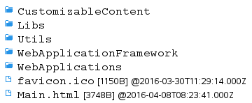

= Usage

== Overview

The EPTF Web GUI is developed as a framework for web applications. Currently available web applications include the new DataSource <<5-references.adoc#_6, [6]>>, <<5-references.adoc#_7, [7]>> GUI client, the `DsRestAPI` Console and `GuiEditor`.

The framework uses the pull model based `DsRestAPI` javascript API <<5-references.adoc#_4, [4]>>, <<5-references.adoc#_5, [5]>>. However, applications can provide their own implementation so it is possible to create user interfaces for other services as well in the framework.

== Description of Files in the Feature

The feature includes the following structure:

* `CustomizableContent`: +
Contains custom content for applications. This directory should be writable by the user for some applications to work correctly.
* `Libs`: +
Contains the 3^rd^ party solutions listed in <<<<1-introduction.adoc#3rd_party_libraries, 3^rd^ Party Libraries>>
* `Utils`: +
Contains the `DsRestAPI` (Utils/DsRestAPI/_DsRestAPI.js_) and other useful implementations intended for common usage.
* `WebApplicationFramework`: +
Provides the base models for the `WebApplications` and the framework functionality.

`WebApplications`: Contains the applications.

== Installation

Installation is not needed. Instead, an http server that can serve the resources and handle the API requests is required.

The CLL `DsRestAPI` feature provides such http server, see <<5-references.adoc#_5, [5]>> on how to use it.

[[configuration]]
== Configuration

The main config of the framework, _MainConfig.json_, is located in the `CustomizableContent` directory.

Application specific options are contained in their respective customization directories as _AppConfig.json_.

Specific options will be explained in the descriptions of the components that use them.

The config files can be edited manually or using `GuiEditor` (see section <<UIConfig_Editor, UIConfigEditor>>).

== Using the Framework

Figure: Available applications

The framework provides functionality to load the available web applications as well as common and useful functions and classes.

The framework will create the buttons that can be used to switch applications. The currently loaded web application is displayed with a green background.

=== Options

The available applications are contained in the _MainConfig.json_ file in the availableApps array. Each application descriptor must contain a "directory" member, which is the directory where the application _Main.js_ can be found.

If present the `defaultApp` option, which should be the name of an application, will be used to load the specified application at start.

=== Creating a New Application

A web application must have a Main.js file in a directory that can be served by the http server. The folder must be present in the `availableApps` array. This way, the _Main.js_ file will be imported at start.

In the _Main.js_ file, do the following:

1.  Create the WebApplications array if it does not exist yet: +
`var WebApplications = WebApplications || [];`
2.  Add a new instance of your application to this array: +
`WebApplications.push(new Your_Application());`
3.  The instance must implement the web application interface functions described in section <<2-functionality.adoc, Functionality>>.

== Using the `CustomizableApp`

Figure: The `CustomizableApp`

The `CustomizableApp` is used to display setups. Setups describe the user interface that is displayed in the application. The structure of the setups is described in section <<2-functionality.adoc, Functionality>>. A basic overview can be found below.

The aim of this application is to provide very high customizability. Setups can be edited to change the layout or use other view elements. It is even possible to create new views and viewmodels. All this can be done with the `GuiEditor` application (see section <<using_the_GUIEditor, Using the GuiEditor>>).

=== Basic Overview

The setup contains a *request* <<5-references.adoc#_4, [4]>>, <<5-references.adoc#_5, [5]>> which will periodically be sent to the server.

The data will be displayed by different *views*, like buttons and checkboxes. Views, like tables and aligners, are also responsible for the layout.

*Viewmodels* convert the response received to a data structure that the views can display. They also handle events which interact with the request, like selection changes or `setData` commands.

[[options-0]]
=== Options

The following `CustomizableApp`-specific options are available:

1.  `setup`: +
The default loaded setup
2.  `overlayEnabledOnSelect`: +
Whether an overlay with a loading sign is shown when changing the selection on a `requestThe` overlay is displayed until a valid response arrives.
3.  `overlayEnabledOnSetData`
4.  `overlayOpacity`: +
The opacity of the overlay, it must be between `_0_` and `_1_`
5.  `refreshInterval`: +
The frequency in milliseconds with which requests are sent to the server, or `_-1_` to disable periodic update (requests are still sent after selection change or `setData` requests)
6.  `filesToInclude`: +
The list of additional javascript files that will be loaded. The `DsRestAPI` files (or something implementing the `DsRestAPI` interface) must be included here.

== Using the `DsRestAPI` Console

Figure: The DsRestAPI Console application

The `DsRestAPI` Console Application consists of two editor boxes, one for creating requests, and one to display the response. Below these for help there is a tree to show the relations of the elements of the `DataSource`. Above that is a text box to search in the tree.

The Search textbox will filter and highlight all the nodes which match the given text. Searching is not case sensitive, and partially matched nodes are listed as well. The result tree will show not just the matching nodes but all the nodes included in the path to get to that node.

After a request is constructed, by pressing the *Send Request* button a response can be received if it has a correct JSON syntax. If the request is syntactically incorrect an alert will inform the user. When the request is semantically incorrect, the response will be a JSON object containing an error message.

When the *Full Help to Request* button is clicked the Request editor box is filled with a request to get data from the full help tree.

With the *Get help in JSON format* button in the Response editor box the help tree will appear as a JSON object.

When a correct request is given indentation can be added with the *Prettify request JSON* button.

If the response is not an error, a visual element <<2-functionality.adoc#autoGUI, `AutoGUI`>> will show the result.

[[using_the_GUIEditor]]
== Using the `GuiEditor`

The `GuiEditor` application can be used to create and edit the setups, viewmodels and view elements which are displayed in the `CustomizableApp`.

=== Editors

The tabs at the top can be used to switch between different editors in the application.

The available editors are:

* Setup Editor: +
it can be used to create and edit setups.
* View Setup as Text: +
shows the edited setup as a JSON string, which can't be directly edited.
* Viewmodel Editor: +
it can be used to create and edit viewmodel classes which can then be used in the Setup Editor.
* View Editor: +
it can be used to create and edit views including their html, css and javascript files.
* UIConfig Editor: +
some GUI settings can be edited here.

=== Setup Editor

Figure: Setup Editor

The Setup Editor is where the GUI descriptors (the setups) can be edited <<2-functionality.adoc#the_setup_descriptor, The Setup Descriptor>>.

The editor contains the following elements:

1.  The editor switching tab.
2.  Buttons to create, load and save setups.
3.  Buttons that interact with the currently edited setup.
4.  The `DataSource` help tree, which lists all known `dataElements` that can be queried in a `getData` request <<5-references.adoc#_6, [6]>>, <<5-references.adoc#_7, [7]>>.
5.  The request represented as a tree <<5-references.adoc#_4 [4]>>, <<5-references.adoc#_5, [5]>>.
6.  The viewmodels of the setup.
7.  The views of the setup.
8.  The imported setups.
9.  The setup html and css editor.
10. The filter editor.
11. A legend is available by clicking in the bottom right corner.

==== General GUI Elements and Operations

===== Drag and Drop

Figure Drag and drop: insert as child, sibling or not allowed

Drag and drop is allowed between certain trees. A checkmark will show whether the operation is allowed.

A small triangular marker will indicate the position to which the node will be dropped.

If it points directly at the target node, it will be inserted as the child of the target.

If it points above or below the target node, then it will be inserted as a sibling of the target.

===== Context Menu

Right-clicking some elements will bring up a context menu that contains useful options for editing the setup.

===== JSON Editor

Figure: The JSON editor

Json editor can edit json data based on a json schema.

To add or remove members of an object, the *Object Properties* button can be used to toggle a list of available members or to create new ones when the schema allows it.

===== Code Editor

Figure: The code editor

It can be used to edit textual data with syntax highlighting where available.

==== Editing the Request

The request will be used to query the server for data, which can be shown on the GUI. To get more familiar with `DsRestAPI` requests, please see <<5-references.adoc#_4, [4]>> and <<5-references.adoc#_5, [5]>>.

Requests that have selection have a red left border. Request with filters have a violet top border. Request with `rangeFilters` have a green bottom border. Requests with writable info have blue right border.

When hovering over a request tree node, the request json will be displayed in a small popup as text.

===== Methods of Editing the Request

1.  Drag and drop: +
The fastest way to edit the request is to use drag and drop from the help tree to the request tree. A darker background will show the area of the request tree. `GuiEditor` will try to guess the values of the parameters if the reference type name is given in the help descriptor of the parameter. It will not allow the request to be inserted if a parameter with a reference type is missing. To force insert a request, hold down the ctrl key while dropping the node.

WARNING: The parameter values will be left undefined, they have to be filled in manually. To delete a request, drag and drop it to the help tree.

2.  *Add empty request* button and *Add child request* menu element: +
If the help is not available or not complete, these buttons can be used to insert empty requests which can then be edited with a json editor.

===== Menu Options

When right-clicking on a single request, the following options are available:

* `Edit request`: +
Open a json editor that can be used to edit the request.
* `Edit filter`: +
Open the filter editor to edit the filter of the request.
* `Add child request`: +
Adds an empty child request.
* `Copy`: +
Inserts the same request again. This is useful when only a single parameter must be changed but everything else is the same.
* `Delete`: +
Removes the request.
* `Convert to sizeOf / dataElementPresent`: +
The `sizeOf` and `dataElementPresent` requests are hard to create using the drag and drop or manual methods. These options make it easy.
* `Expand / Collapse all`: +
Opens or closes all nodes of the tree.

==== Editing the Filters

Filters are used to disable some parts of the request. To get more familiar with `DsRestAPI` filters, please see <<5-references.adoc#_4, [4]>>.

On the filter editor, the *Create* button will create the filter whose `dataValue` is `_true_` by default.

Help tree elements can be dragged to the nodes of the filters. This will convert a `dataValue` to a request.

Request tree elements can also be dragged to the filter to create a reference to the parent requests.

Similarly to editing a request, the filter parts can also be edited with a json editor using the *"Edit filter"* option of the context menu.

Manual editing of the filter structure is possible with the other options in the context menu.

The button next to the close button will open the context menu of the root of the filter.

==== Editing the Viewmodel Instances

Viewmodels are used to convert the data returned for the request to something that views can understand. For example, a table viewmodel will convert the response, which is a tree, to a two-dimensional array.

Data connections are used to tell a viewmodel where to get its data. Selection connections are used to control the selection of the given request.

Viewmodels can be customized using their so called *custom data*. The custom data is a json object that can be used by the viewmodel to define or alter its behavior. For example, a table viewmodel might be customized to transpose the table or make the first row of the table the header. Most viewmodels provide a json schema which describe the available custom data options.

Viewmodels can be added with the *Add viewmodel…* button. A dialog will appear where the viewmodel class must be chosen. Some classes have help information which can also be viewed here.

To create a viewmodel connection, simply drag a request below the *Data* or *Selection connections* node.

WARNING: The order of the connections matter.

Data and selection connections will be represented with black and red arrows respectively.

The custom data of the viewmodel can be edited using the code editor with the *Edit* button or using the json editor with the appropriate context menu option.

Right clicking on the viewmodel editor title will show a context menu. The following options are available:

* `Edit with schema`: +
Edit the custom data with the json editor.
* `Copy`: +
Create a new viewmodel with the same class and custom data.
* `Change class`: +
Change the class of the viewmodel.
* `Show only this`: +
Hides all editors that are not connected to this one.
* `Show all`: +
Show all hidden editors.
* `Delete`: +
Remove the viewmodel.

==== Editing the View Instances

Views are the GUI elements that will appear on the screen. Views can be nested into each other. For example, connecting a button to an aligner will insert that button into the aligner on the GUI.

The custom data of a view can be used to alter how the view behaves or looks. For example, the custom data of all views can contain a `css` field that can be used to alter the look of that single view instance.

Views can be added with the *Add view…* button similarly to adding a viewmodel.

To connect a viewmodel to a view, simply drag the viewmodel's *View connection point* below the *Viewmodel connections* of the view.

To connect another view as a subview, drag the other view's *Child of…* node to the view's *Parent of…* node.

The connections between views are shown as green arrows.

WARNING: The order of both the viewmodel and view connections matter.

The custom data can be edited the same way as for the viewmodels. The context menu also contains the same options.

==== Editing the Setup html and css

The setup html and css can be used to define the base of the GUI. Views can only appear inside the setup html, so at least one div with an id is required.

The html editor can be used to edit the html and css of the setup using the code editor.

The ids of the html will be shown in the tree. Views can be connected to these ids by dragging their *Child of…* node and dropping it on a node in the tree. These connections are represented as light green arrows.

==== Importing Setups

Setups can be imported using the *Import setup…* button.

The imported setup must be connected to a view or the setup html. This can be done by dragging the *Import into…* node to the *Parent of…* node of a view or a node of the html editor.

A request can also be connected to the import by dragging a request to the *Request connection* node. This way, the request of the imported setup will be inserted below the connected request, so it is possible to write generic setups, which do not work by themselves, but can be imported.

The context menu contains options to delete the import or change the imported setup.

==== Searching

The *Search…* button can be used to search for any kind of string in the setup. When the string is found somewhere, that part of the GUI will be highlighted.

For example, searching for the string ``button'' will find all requests that query a button but also all views that are buttons.

The *Clear search* button will clear the search results.

==== Validating

Some views and viewmodels implement validating functions which are checked when their custom data or connections change. Description of these functions can be found in section <<2-functionality.adoc, Functionality>>.

Invalid views and viewmodels will have a red border. When hovering over their title, the cause of the invalid state will be shown.

=== Viewmodel Editor

image:images/vmeditor.png[vmeditor]

Figure: The Viewmodel Editor

The Viewmodel Editor makes it possible to create and edit custom viewmodel classes. The interface that viewmodels must implement are described in <<2-functionality.adoc#viewmodel_interface, Viewmodel Interface>>.

The following buttons can be found in the editor:

* New / Load / Save / Save as: +
They all function as expected. Unsaved files will be shown with red letters.
* Load template: +
With the load template button, a built-in viewmodel can be loaded and saved as a custom viewmodel.

WARNING: The viewmodel class name must be changed, otherwise either the original or the new one will be imported but not both.

For the custom viewmodel to appear in the Setup Editor the following conditions must be met:

* The edited file must be syntactically correct. This will be checked after saving it.
* The first line must contain the class definition: +
`function ClassName(p_viewmodel, p_customData) \{`

=== View Editor

Figure: The View Editor

The Viewmodel Editor makes it possible to create and edit custom views including their html, css and javascript files which appear on another tab as three different editors. The interface that views must implement are described in <<2-functionality.adoc#view_interface, View Interface>>.

Everything else works the same way as in the Viewmodel Editor.

The first line of the javascript file of the view must be something like: +
`function ClassName(p_viewmodels, p_viewId, p_parentId, p_customData) \{`

[[UIConfig_Editor]]
=== UIConfig Editor

This editor can be used to edit the config files of the applications and the _MainConfig.json_. For details about the config file, please see section <<configuration, Configuration>>.

== Online Help

The Online help regarding the configuration and usage of `DsRestAPI` can be found http://ttcn.ericsson.se/TitanSim/Help/StartUp_and_Use/Controlling_TitanSim/Using_TitanSim_Data_Source_REST_API.html[here].

== Structure of the source code

The source code is organized into the following structure:

* htdocs

Contains the files of the EPTF Web GUI. See 3.2 for more details.

* project

A placeholder.

* doc

A placeholder.

License files:

[width="100%"cols="30%,70%",options="header",]
|====================================================
|*Name* |*Purpose*
|_license.txt_ |File containing the license information
_|epl-v10.html_ |The Eclipse Public License
|====================================================
