= Procedures

[[general]]
== General

XTDP connections shall be set up in a server-client manner, i.e. one of the entities shall passively wait for an incoming connection request, while (the) other entit(ies) shall initiate the connection establishment. XTDP entities can use either connection oriented (for example, TCP) or connectionless (for example, UDP) underlying transport services, depending on the application area. The designer of an application using XTDP may also decide to use both connection-oriented and connectionless transports, but the type of the transport shall not be changed during an XTDP session, i.e. between the `XTDPHandshakeRequest` and the `XTDPBye` messages.

Procedures in this document describe the possible types of interactions between the communicating entities. The concrete transactions initiated by one or another entities are the instances of procedures. Once an XTDP session has been set-up by establishing the underlying transport connection and by completing the Handshake procedure, XTDP becomes a simple transaction-oriented protocol, i.e. one or several transactions may be carried out at the same time and the order of the transactions is not specified, except the limitation in clause ‎<<handshake, Handshake>> (at the XTDP level, of course, but the order may be determined at the application logic level). Several procedures are allowed to be started both by the client or the server entities; this is identified by the "peer-to-peer" direction in the procedures’ description.

In case of all acknowledged procedures the initiating entity shall include a unique `transactionID` attribute (field) into the sent XTDP message. The `transactionID` value shall be unique on the given transport connection, among the active transactions of the initiating entity; i.e. transactions started by different entities or transactions started on different transport connections may use identical transaction IDs. The receiving entity shall include the received `transactionID` into the responding XTDP message. If it responds to one received initiating message by several responses, it shall include the `transactionID` of the initiating message into each responding message.

In case of unacknowledged procedures, the initiating entity may include a `transactionID` attribute (field) into the sent XTDP message, but in this case the receiving entity shall silently ignore it.

NOTE: In this way, if an unacknowledged procedure becomes acknowledged in a later version of this protocol, the initiating entity still will be able to interwork with elder implementations if the use case also allows unacknowledged communication.

[[handshake]]
== Handshake

Direction: client-server

Procedure type: acknowledged

The purpose of the handshake procedure is to assure that the peer entities have compatible capabilities both in terms of supported XTDP messages and procedures and supported XTDL information.

The handshake procedure shall be the first procedure of an XTDP connectivity session. It shall be initiated by the entity initiating the session (i.e. the client entity). In specific applications, if the application designer decides differently, the handshake procedure may be started by any of the entities; however, in this case the application designer shall assure seamless initiation of this procedure.

No other procedure shall be initiated by any of the peers until the handshake procedure has been finished.

See the handshake procedure in the figure below:

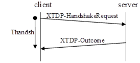

The `XTDPHandshakeRequest` message shall contain at least the XTDP protocol version minimally required from the receiving entity, in the `xtdpRequiredVersion` element (field). If the initiating entity will send any XTDL information (i.e. will use any other procedures except Handshake and User data transport) during the session, it shall also include, in the `xtdlRequiredVersion` element (field) the XTDL version minimally required from the receiving entity.

NOTE: If the initiating entity has no information about the protocol information and procedures that will be used during the session, it shall include its own versions into the above element (fields).

Optionally, the initiating entity may include the highest supported XTDP and XTDL versions (its own version) into `xtdpMyVersion` and `xtdlMyVersion`.

NOTE: Though this information is used for logging/debugging purposes only, it is recommended to always send this information, unless bandwidth or other concerns preventing this.

The initiating entity, on sending the `XTDPHandshakeRequest` message, shall start timer Thandsh. If the corresponding `XTDPOutcome` message is received before Thandsh expiry, it shall cancel timer Thandsh. If the `XTDPOutcome` message contains the `_"error"_` value in the `responseCode` element (field), the entity shall invoke closing the XTDP session (see clause <<closing_the_session, Closing the Session>>) and shall report a version compatibility check failure to the user and/or to a management entity, including also the protocol(s) which failed the check (XTDP or XTDL or both). If Thandsh expires, the initiating entity shall shall invoke closing the XTDP session (see clause <<closing_the_session, Closing the Session>>) and report a communication error result to the user and/or to a management entity.

On receiving an `XTDPHandshakeRequest` message, the receiving entity shall carry out an XTDP version compatibility checking: it shall decide if it can support the version identified in `xtdpRequiredVersion` of the received `XTDPHandshakeRequest` message. If it can support the version identified by `xtdpRequiredVersion`, the XTDP version check is successful, otherwise it is failed.

NOTE: In both XTDP and XTDL version numbers, a minor number change in the protocol version indicates backward compatible extension, while a major version number change indicates nonbackward compatible change.

If the received message contains an `xtdlRequiredVersion` element (field), the receiving entity shall also make an XTDL version compatibility checking as well. In this case, if the receiving entity does not support XTDL or the version of the supported XTDL is lower than the version identified by `xtdlRequiredVersion`, the XTDL version checking fails; if the version of the supported XTDL is higher than the version identified by `xtdlRequiredVersion` and the identified version is acceptable for the receiving entity, the version checking is successful.

NOTE: It shall be decided by the application designer if the fallback to the given lower version is acceptable or not.

The actual communication during the session shall be carried out at the protocol version(s) agreed between the entities in the handshake procedure.

Optionally, if the receiving entity knows apriori that the user of XTDP services will use XTDP protocol data and procedures and XTDL information complying with a lower version of XTDP and/or XTDL respectively, it may use these version information, instead of its own versions, in the above XTDP and XTDL version compatibility checking.

Any other information (i.e. future extensions of the handshake procedure) in the received `XTDP-HandshakeRequest` message shall silently be ignored by the receiving entity.

On completing the version checking(s), the receiving entity shall send an `XTDP-Outcome` message containing elements (fields) as follows:

* If both of the XTDP and XTDL version compatibility checks are successful, the value of `responseCode` shall be set to `_"success"_` and neither `errorCode`, nor `errorMessage` shall be included;

* If the received message did not contain an `xtdlRequiredVersion` element (field) and the XDTP version checking is successful, the value of `responseCode` shall be set to `_"success"_` and neither `errorCode`, nor `errorMessage` shall be included.

* If any or both of the above version compatibility checks fail(s), the value of `responseCode` shall be set to _``error''_ and one `errorCode` element (field) shall be included for each failed version check; a failed XTDP version check shall be identified by the `__`xtdpIncompatibleVersion`__` value of the `errorCode` element (field) and a failed XTDL version check shall be identified by the `__`xtdlIncompatibleVersion`__` value. Including the `errorMessage` element (field) is optional and the receiving entity may include any useful additional information into it (e.g. reporting its own version).

[[handling_of_unsupported_procedures]]
== Handling of Unsupported Procedures

Direction: both (peer-to-peer)

Procedure type: n/a

This procedure is not designed to handle version incompatibility, i.e. to handle unknown procedure requests, as the handshake procedure assures that the peers are supporting compatible versions of the protocol, before this procedure can be invoked. It allows graceful handling of known, but unsupported procedures and cases, when an application supports only the initiating side of a peer-to-peer procedure.

See Handling of unsupported procedures below:

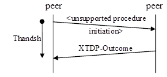

When an entity is receiving an XTDP message, which is initiating a procedure, not supported by it, the receiving entity shall send an `XTDPOutcome` message in which the value of the `responseCode` is set to `_"error"_` and containing one `errorCode` element (field) with the value `_procedureUnsupported_` or `_directionUnsupported_`, whichever is appropriate. Including the `errorMessage` element (field) is optional and the receiving entity may append any further useful information into it.

NOTE: The Unacknowledged action requests `*Error! Reference source not found.*` and the Acknowledged action requests `*Error! Reference source not found.*` are different procedures, therefore this clause also apply if the `XTDPRequests` message itself is supported but the required acknowledgement form is not.

[[authentication]]
== Authentication

Direction: server-client

Procedure type: acknowledged

The procedure allows the server side to ask authentication from the connecting client.

See Authentication procedure in the figure below:

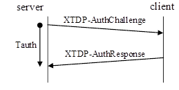

The procedure is invoked by the server on sending an `XTDPAuthChallenge` message stating a simple string challenge question. On sending the message, the entity shall start timer Tauth. If the corresponding `XTDPAuthResponse` message is received before Tauth expiry, it shall cancel timer Tauth. If Tauth expires, the initiating entity shall invoke closing the XTDP session (see clause Closing the session) and report the authentication failure to the user and/or to a management entity.

The receiving entity shall respond with an `XTDPAuthResponse` message containing a simple string challenge response.

NOTE: The challenge question and the challenge response are beyond the scope of this document, the authentication algorithm shall be specified by the application designers.

[[layout_information]]
== Layout Information

Direction: both (peer-to-peer)

Procedure type: acknowledged

The procedure allows to an entity to request the sub-tree belonging to a given parent widget.

See Layout change procedure in the figure below:

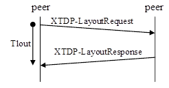

The initiating entity shall invoke the procedure by sending an `XTDPLayoutRequest` message. The message may contain the identifier of the parent widget, included into the `widgetId` element (field). If `widgetId` is missing from the message, the layout information of the whole display is requested.

The initiating entity, on sending the `XTDPLayoutRequest` message, shall start timer Tlout. If the corresponding `XTDPLayoutResponse` message is received before Tlout expiry, it shall cancel timer Tlout. If Tlout expires, the initiating entity shall invoke closing the XTDP session (see clause Closing the session) and report the error to the user and/or to a management entity.

The receiving entity, on receipt of an `XTDPLayoutRequest` message, shall respond with an `XTDPLayoutResponse` message, containing the widget-children, i.e., the XTDL tree belonging to the requested parent widget.

[[acknowledged_action_requests]]
== Acknowledged Action Requests

Direction: both (peer-to-peer)

Procedure type: acknowledged

This procedure is related to manipulating existing elements of one or several widget(s). The initiating entity demands reporting the results of execution for each requested actions.

See Unacknowledged information change procedure in the figure below:

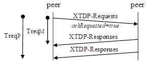

To invoke this procedure the initiating entity shall send an `XTDPRequests` message with the `ackRequested` attribute set to the value `_true_`. Each message shall contain at least one `XTDPRequest` element (field) but may contain more. Though, the protocol allows bunching several requests into a single `XTDPRequests` message, the strategy of grouping the requests is application dependent (i.e. an application designer may decide to send each request in separate messages but may also decide e.g. to collect all requests for a given time period into one message).

Each `XTDPRequest` element (field) in the message contains:

* A mandatory `requestId` element (field), which shall contain a value, unique within the given message_;_
* a `mandatory_action` element (field) that shall define the action requested;

The following actions are defined:

* `get` - the requestor wants to query the current value or status of a widget; this action shall be used with the Acknowledged action requests procedure only
* `put` - the requestor wants to update the current value or status associated to a widget
* `disable` - the requestor wants a widget to be disabled, i.e., it is rendered as such (greyed out and/or set to be non-editable
* `enable` - the opposite of disable, e.g. the widget is un-greyed and/or set to be editable
* `increase` - the requestor wants to increase the value stored in the widget, i.e., it is meaningful only for widgets supporting it (e.g., numerical widget with a spinner
* `decrease` - the requestor wants to decrease the value stored in the widget, i.e., it is meaningful only for widgets supporting it (e.g., numerical widget with a spinner
* `getfocus` - the requestor asks for the ID of the widget, which is associated with the focus (or has the focus on the GUI); the requested widgetID shall be returned in the response (in the `argument` element(field));
* `setfocus` - the requestor wants the associated widget to get focus, i.e., if it is hidden then it shall be raised to be visible, it shall receive keyboard inputs, etc.
* `gettooltip` - the requestor asks the tooltip that is associated to the widget with the identified ID; the requested tooltip shall be returned in the response
* `settooltip` - the requestor wants indicate associated widget to get a new tooltip value associated
* `replaceimage` - the requestor wants to replace the image rendered on the associated widget (such as a button pixmap).

In actions, where the `widgetID` is optional, an omitted `widgetID` identifies the whole display area. Where the `widgetID` is not allowed (no `widgetID` element is included into the XSD definition of the given action), a widget ID is not applicable for the given action.

NOTE: This document does not specify, which actions should be supported by the applications, nor the allowed action directions, applicability of actions to the different kind of widgets and arguments. Application developers shall unambiguously define this information in the documentation of the given application.

The initiating entity, on sending the `XTDPRequests` message, shall start timers Tactm and Tactp. If all outstanding requests have been acknowledged with any of the result codes (i.e. some requests may be in the `pending` state, see the values of the `responseCode` element (field)) in one or more `XTDPResponses` message(s) before `*Error! Reference source not found.*` expiry, it shall cancel timer ``*Error! Reference source not found.*`. If no `XTDPResponses` message has been received or not all outstanding requests has been acknowledged before the expiry of `*Error! Reference source not found.*`, the entity shall cancel timer Tactp and invoke closing the XTDP session according to clause‎4.11 Closing the session and report the error to the user and/or to a management entity. If all outstanding requests have been acknowledged with the `_"success"_` or `_"error"_` result before the expiry of Tactp, Tactp shall be cancelled. If not all outstanding requests have been acknowledged with the `_"success"_` or `_"error"_` result before the expiry of Tactp, the action taken is application dependent.

When the receiving entity receives an `XTDPRequests` message with the `ackRequested` attribute set to `_true_`, it shall send the result of each requested action in one or more `XTDPResponse` message. Each result shall be reported in one `XTDPResponse` element (field) with the following content:

* `requestId` - mandatory, shall have the same value as the `requestId` of the action request, the result of which is being reported by the given `XTDPResponse`
* `responseCode`-  mandatory, shall be one of the `_"success"_`, `_"pending" _`or `_"error"_` values, depending on the status of executing the given action
* `argument` optional, included if the given action specifies a return value.
* `errorSource` - conditional, shall be used, if the value of `responseCode` is `_"error"_`; it shall specify the location of the source of the error
* `errorCode` - conditional, shall be used, if the value of `responseCode` is `_"error"_`; it shall specify the reason of the error
* `errorMessage` - optional, may be included to report any further useful information regarding the cause of the error

== Unacknowledged Action Requests

Direction: both (peer-to-peer)

Procedure type: unacknowledged

This procedure has the same purpose as the Acknowledged action requestsAcknowledged action requestsAcknowledged action requests procedure with the difference, that the initiating entity does not request reporting the results of the requested actions.

See Unacknowledged information change procedure in the figure below:

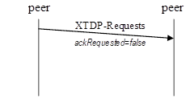

To invoke the procedure the initiating entity shall send an `XTDPRequests` message with the `ackRequested` attribute set to the value `_false_`. The `XTDPRequests` message shall contain information as specified in clause ‎<<acknowledged_action_requests, Acknowledged Action Requests>>. Acknowledged action requests with one exception: the `get` action shall not be used with the unacknowledged procedure.

[[add-requests]]
== Add Requests

Direction: both (peer-to-peer)

Procedure type: acknowledged

This procedure allows to set the widget-children, i.e. the XTDL tree to be associated to a parent widget, dynamically; in one transaction several such additions may be requested.

See The Add procedure in the figure below:

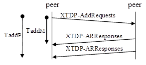

To invoke the procedure the initiating entity shall send an `XTDPAddRequests` message. Each `XTDPAddRequest` element (field) in the message shall contain

* `requested` - mandatory contains a value, unique within the given message
* `parentWidgetId` - optional, if present shall identify the parent widget; a missing `parentWidgetId` identifies the whole display area.
* a mandatory widget description (an XTDL full or partial tree)

The initiating entity, on sending the `XTDPAddRequests` message, shall start timers Taddm and Taddp. If all outstanding requests have been acknowledged with any of the result codes (see the values of the `responseCode` element (field)) by one or more corresponding `XTDPARResponses` message(s) before Taddm expiry, it shall cancel timer Taddm. If all outstanding requests have been acknowledged with a `_"success"_` or `_"error"_` result before the expiry of Tactp, timer Tactp shall be cancelled. If no `XTDPARResponses` message has been received or not all outstanding requests has been acknowledged before the expiry of Taddm, , the entity shall invoke closing the XTDP session (see clause Closing the session) and report the error to the user and/or to a management entity. If not all outstanding requests have been acknowledged with the `_"success"_` or `_"error"_` result before the expiry of Taddp, the action taken is application dependent.

When the receiving entity receives an `XTDPAddRequests` message, it shall send the result of each requested addition in one or more `XTDPARResponses` message. Each result shall be reported in one _XTDPARResponse element (field)_ with the following content:

* `requestId` - mandatory, shall have the same value as the requested addition, the result of which is being reported by the given `XTDPARResponse`
* `responseCode` - mandatory, shall be one of the `_"success"_`, `_"pending"_` or `_"error"_` values, depending on the status of executing the given addition
* `errorSource` - conditional, shall be used if the value of `responseCode` is `_"error"_`; it shall specify the location of the source of the error
* `errorCode` - conditional, shall be used if the value of `responseCode` is `_"error"_`; it shall specify the reason of the error
* `errorMessage` - optional, may be included to report any further useful information regarding the cause of the error

[[remove_requests]]
== Remove Requests

Direction: both (peer-to-peer)

Procedure type: acknowledged

This procedure allows deleting the widget-children, i.e. the XTDL tree belonging to a parent widget, dynamically; in one transaction several such removal may be requested.

See The Remove procedure in the figure below:

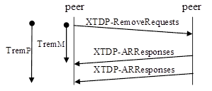

To invoke the procedure the initiating entity shall send an `XTDPRemoveRequests` message. Each `XTDPRemoveRequest` element (field) in the message contains:

* `requested` - mandatory, shall contain a value, unique within the given message
* `widgetId` - optional, if present shall identify the parent widget; a missing `widgetId` identifies the whole display area.

The initiating entity, on sending the `XTDPRemoveRequests` message, shall start timers Tremm and Tremp. If all outstanding requests have been acknowledged with any of the result codes (see the values of the `responseCode` element (field)) by one or more corresponding `XTDPARResponses` message(s) before Tremm expiry, it shall cancel timer Tremm. If all outstanding requests have been acknowledged with a `_"success"_` or `_"error"_` result before the expiry of Tremp, timer Tremp shall be cancelled. If no `XTDPARResponses` message has been received or not all outstanding requests has been acknowledged before the expiry of Tremm, the entity shall invoke closing the XTDP session (see clause Closing the session) and report the error to the user and/or to a management entity. If not all outstanding requests have been acknowledged with the `_"success"_` or `_"error"_` result before the expiry of Tremp, the action taken is application dependent.

When the receiving entity receives an `XTDPRemoveRequests` message, it shall send the result of each requested removal in one or more `XTDPARResponses` message. Each result shall be reported in one `XTDPARResponse` element (field) with the following content:

* `requestId` mandatory, shall have the same value as the requested removal, the result of which is being reported by the given `XTDPARResponse`
* `responseCode` mandatory, shall be one of the `_"success"_`, `_"pending"_` or `_"error"_` values, depending on the status of executing the given removal
* `errorSource` conditional, shall be used if the value of `responseCode` is `_"error"_`; it shall specify the location of the source of the error
* `errorCode` conditional, shall be used if the value of `responseCode` is `_"error"_`; it shall specify the reason of the error
* `errorMessage` optional, may be included to report any further useful information regarding the cause of the error

== User Data

Direction: both (peer-to-peer)

Procedure type: unacknowledged

This procedure allows transparent transport any textual or binary information to the peer, not specified by XTDP and XTDL. It allows using XTDP as the transport protocol for any user-defined protocols.

See User data transport procedure below:

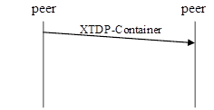

The sending entity shall send the `XTDP-Container` message to use this service. The sending entity may include the `contentType` element (field) into the message to help processing the received message at the receiving side: it may identify the TTCN-3 type of the content as well as for example, the name and/or the version of the user-defined protocol or the name of the message of the user-defined protocol (for example, when there are several top level messages) to allow correct decoding at the receiving side etc.

The `XTDP-Container` message shall include either the `textual` element (field), if the encapsulated information is of charstring or universal charstring TTCN-3 types or the `binary` element (field), if it is of bitstring, hexstring or octetstring TTCN-3 types.

NOTE: The user data transport procedure does not provide acknowledge of receipt or successful processing at the XTDP level. These services, if needed, shall be included into the user-defined protocol.

[[closing_the_session]]
== Closing The Session

Direction: both (peer-to-peer)

Procedure type: acknowledged

This procedure allows closing the XTDP session

See Closing procedure below:

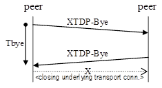

To close the XTDP session, the initiating entity shall cancel all running procedures and timers, if any, then send an `XTDP-Bye` message, start timer Tbye and enter the `Pending Closing` state. The message may contain a textual information on the reason of closing. In the `Pending Closing` state the initiating entity shall ignore all other incoming messages then `XTDP-Bye`. If no concurrent closing is initiated by the remote entity, and the responding `XTDP-Bye` message is received, the initiating entity shall cancel timer Tbye and shall initiate closing of the underlying transport connection. If Tbye expires, the entity shall resend the `XTDP-Bye` message Nbye-1 times and re-start Tbye at each resending. If no responding `XTDP-Bye` message is received after sending the initiating `XTDP-Bye` message Nbye times (including the one starting the procedure), the entity shall close the underlying transport connection and report a communication failure to the user and/or to a management entity.

NOTE: It is proposed to set Nbye to 1 in case of an acknowledged underlying transport connection (e.g. TCP) and 3 for unacknowledged underlying transport means (for example, UDP).

The receiving entity, if not in the _Pending Closing_ state, on receipt of an _XTDP-Bye_ message shall not initiate any further procedure (including session closing), shall stop all running procedures, cancel all running timers and send an empty _XTDP-Bye_ message. In case of a connectionless underlying network transport (e.g. UDP) it shall close the transport association after sending the _XTDP-Bye_ message (e.g by closing the UDP socket).

See Concurrent closing procedures below:

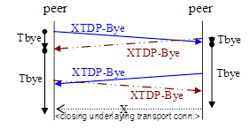

In case of concurrent closing procedures, i.e. when the initiating entity in the `Pending Closing` state receives and `XTDPBye` message with a `transactionID` different from the `transactionID` of the `XTDPBye` message sent by it before, shall restart timer Tbye, and respond to the incoming `XTDPBye` message with an empty `XTDPBye` message. However, it shall not close the underlying transport connection before Tbye expires.

NOTE: In the concurrent closing procedure resending of the initiating `XTDPBye` message does not apply.

When Tbye expires:

* if the entity has received an `XTDPBye` message with a `transactionID` identical to the value in the `XTDPBye` message sent by it before, it shall close the underlying transport connection, if yet exists;
* if the entity has not received an `XTDPBye` message corresponding to the `XTDPBye` message sent by it before, it shall close the underlying transport connection, if yet exists, and report a communication failure to the user and/or to a management entity.

When Tbye is running and the underlying connection is closed by the other entity:

* if the entity has received an `XTDPBye` message with a `transactionID` identical to the value in the `XTDPBye` message sent by it before, it shall cancel timer Tbye;
* if the entity has not received an `XTDPBye` message corresponding to the `XTDPBye` message sent by it before, it shall cancel timer Tbye, and report a communication failure to the user and/or to a management entity.

== Underlying Connection Lost

If the underlaying connection is lost (for example, a TCP connection is lost or the UDP socket used is closed) without the XTDP session closing procedure (see clause ‎<<closing_the_session, Closing the Session>>), the entity stops all running procedures and timers and reports a communication failure to the user and/or to a management entity.

== Timer and Counter Values

The default values in the table below are used for the timers and counters of the XTDP protocol. Depending on the application in which the protocol is used, the default values may be changed by the application designer (and, if needed based on an a-priori mutual agreement between the peers).

See table Counter and timer default values below:name: value

[width="100%",cols="20%,20%,20%,40%",options="header",]
|========================================================================================================================================================================================================================================================================
|Counter/timer |Default value |Reference clause |Note
|`Thandsh` |`_1_` sec. |‎<<handshake, Handshake>> |
|`Tauth` |`_1_` sec. |‎<<authentication, Authentication>> |
|`Tlout` |`_1_` sec. |‎<<layout_information, Layout Information>> |
|`*Error! Reference source not found.*` |`_2_` sec. |‎<<acknowledged_action_requests, Acknowledged Action Requests>> |
|`Tactp` |`_10_` sec. |‎<<acknowledged_action_requests, Acknowledged Action Requests>> |Basically, the timer value is application-dependent. It may also be changed dynamically, based on the number of requests bunched into the `XTDP-Requests` message, hovewer, in this case the algorithm shall be unambiguously known by both sides.
|`Taddm` |`_2_` sec. |‎<<add-requests, Add Requests>> |
|`Taddp` |`_10_` sec. |<<add-requests, Add Requests>> |Basically, the timer value is application-dependent.
|`Tremm` |`_2_` sec. |<<remove_requests, Remove Requests>> |
|`Tremp` |`_10_` sec. |<<remove_requests, Remove Requests>> |Basically, the timer value is application-dependent.
|`Tbye` |`_1_` sec. |<<closing_the_session, Closing the Session>> |
|`Nbye` |`_1..3_` |<<closing_the_session, Closing the Session>> |It is proposed to set Nbye to 1 in case of an acknowledged underlying transport connection (for example, TCP) and 3 for unacknowledged underlying transport means (for example, UDP).
|========================================================================================================================================================================================================================================================================
